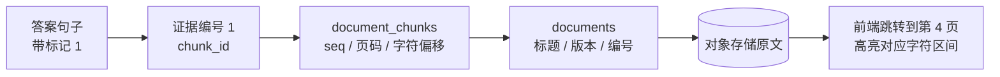
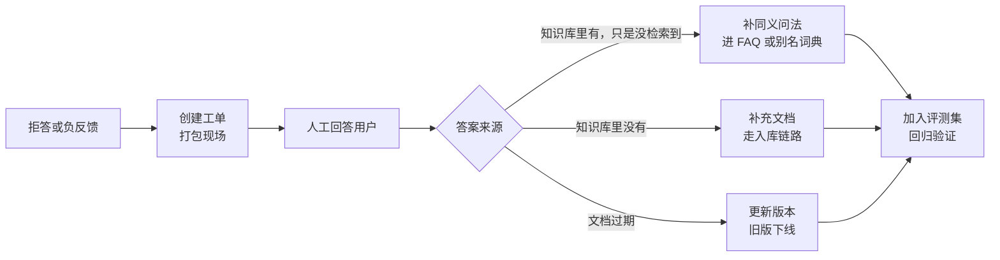
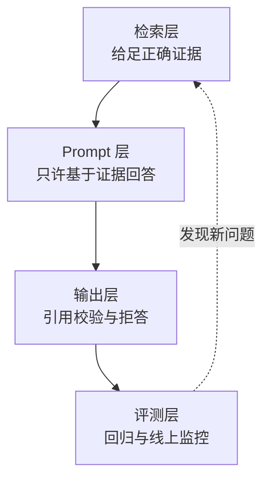

# 引用溯源、拒答与降级

> 在企业制度库和政策法规库里，"答案对但没有出处"和"答错了"的后果是一样的——都没人敢用。这一篇讲怎么让每句结论都能指回原文的某一页某一条，以及在证据不足时怎么体面地不回答。

## 为什么引用是 RAG 的生命线

三个现实原因：

- **用户必须能核对。** 涉及金额、时限、审批层级的问题，用户不会凭一段生成文本去做事，他要点开原文确认。
- **责任必须能落地。** 答案出错时，如果能指到"依据是某文件第十二条"，问题就变成文档过期或条款理解偏差，可追可改；没有出处，就只能说"AI 说的"。
- **引用本身能压制幻觉。** 要求模型逐句标注来源编号，等于强制它在生成前先对齐证据。凭空编造的句子标不出来源，会在校验环节被拦下。

| 维度 | 无引用 | 有引用且可校验 |
|---|---|---|
| 用户信任 | 只能全信或全不信 | 可抽查，逐步建立信任 |
| 错误定位 | 无法判断错在检索还是生成 | 看引用就知道是召回错了还是理解错了 |
| 幻觉 | 无约束 | 编造内容标不出来源，会被校验拦住 |
| 合规审计 | 无法留痕 | 每条回答都有证据链 |
| 运营闭环 | 无法回收问题文档 | 能统计哪些文档被引用最多、哪些从未被引用 |

::: tip 引用不是展示功能，是一条数据链路
它从入库时的元数据开始，经过检索的证据编号，到生成时的标记约定，最后由代码校验兜底。任何一环缺失，前端那个角标就只是装饰。
:::

---

## 引用的数据结构

一个引用要能从 chunk 一路反查到原文位置：



| 字段 | 来源 | 前端用途 |
|---|---|---|
| `index` | 生成时分配的证据序号，从 1 开始 | 正文角标 |
| `chunk_id` | 检索结果 | 校验与埋点的主键 |
| `doc_id` / `title` | `documents` | 引用卡片标题 |
| `version` / `doc_no` | `documents` | 显示"v3""某某号"，避免看错版本 |
| `issue_dept` / `published_at` | `documents` | 展示发布方与时间 |
| `heading_path` / `clause_no` | `document_chunks` | 面包屑与"第十二条"这类定位 |
| `page_from` / `page_to` | `document_chunks` | 跳转到 PDF 指定页 |
| `char_start` / `char_end` | `document_chunks` | 在原文里高亮字符区间 |
| `snippet` | chunk 的 `raw_content` 截断 | 悬浮预览 |
| `score` | 精排分或向量相似度 | 内部排序与拒答判定，通常不展示 |
| `preview_url` | 签名后的对象存储地址 | 点击打开原文，带有效期 |

用 Pydantic v2 把结构固定下来，它同时是接口契约和校验器：

```python
from pydantic import BaseModel, Field, field_validator


class Citation(BaseModel):
    index: int = Field(ge=1)                  # 与答案正文里的 [n] 对应
    chunk_id: int
    doc_id: int
    title: str
    version: int
    doc_no: str | None = None
    issue_dept: str | None = None
    heading_path: str | None = None
    clause_no: str | None = None
    page_from: int | None = None
    page_to: int | None = None
    char_start: int | None = None
    char_end: int | None = None
    snippet: str = Field(max_length=300)      # 预览片段，必须来自原文
    score: float
    preview_url: str | None = None


class AnswerPayload(BaseModel):
    answer: str
    citations: list[Citation]
    refused: bool = False                     # 是否拒答
    refuse_reason: str | None = None          # no_hit / low_score / out_of_scope ...
    degraded: list[str] = []                  # 本次触发了哪些降级
    trace_id: str

    @field_validator("citations")
    @classmethod
    def index_must_be_unique(cls, v: list[Citation]) -> list[Citation]:
        idxs = [c.index for c in v]
        assert len(idxs) == len(set(idxs)), "引用编号重复"
        return v
```

返回给前端的结构：

```json
{
  "answer": "一类城市住宿费每人每晚不超过 500 元 [1]。超标部分需部门负责人书面批准 [2]。",
  "citations": [
    {
      "index": 1, "chunk_id": 90231, "doc_id": 771,
      "title": "差旅费管理办法", "version": 3, "doc_no": "ZD-2024-008",
      "issue_dept": "财务部", "heading_path": "第三章 住宿费 > 第十二条",
      "clause_no": "第十二条", "page_from": 4, "page_to": 4,
      "char_start": 5120, "char_end": 5268,
      "snippet": "第十二条 差旅住宿费限额标准：一类城市每人每晚不超过 500 元……",
      "score": 0.87, "preview_url": "https://.../ZD-2024-008.pdf?sig=...&page=4"
    }
  ],
  "refused": false, "degraded": [], "trace_id": "01J8Z..."
}
```

---

## 让模型规范输出引用：三种做法

| 做法 | 实现 | 可靠性 | 流式友好 | 代价 |
|---|---|---|---|---|
| Prompt 约定标记 | 要求模型在句末写 `[1]` | 中，会漏标、错标、编号越界 | 好，边生成边显示 | 最低 |
| 结构化输出 | 用 JSON Schema 约束成 `{claims: [{text, refs}]}` | 高，格式基本不会错 | 差，JSON 未闭合前难渲染 | 中，token 变多、模型支持度不一 |
| 生成后代码回填 | 模型只管答，代码把句子和证据做相似度匹配 | 取决于匹配算法 | 中 | 中，可能匹配错 |

### 做法一：Prompt 约定标记

```python
ANSWER_PROMPT = """你是企业制度问答助手。只允许依据【证据】回答，不得使用自身知识补充。

要求：
1. 每个结论句末标注证据编号，格式为 [1]，多个证据写作 [1][3]。
2. 证据不足以回答时，直接输出：INSUFFICIENT_EVIDENCE
3. 不要复述证据原文，用简洁中文归纳。
4. 证据之间冲突时，优先采用版本号更高、发布日期更新的那一条，并说明存在差异。

【证据】
{evidence}

【问题】
{question}
"""


def build_evidence(hits: list[dict]) -> str:
    """证据编号就是引用编号，这里的顺序必须和 citations 列表一致"""
    blocks = []
    for i, h in enumerate(hits, start=1):
        blocks.append(
            f"[{i}] 来源：{h['title']} v{h['version']}｜{h.get('heading_path') or ''}"
            f"｜第 {h.get('page_from', '?')} 页\n{h['raw_content']}"
        )
    return "\n\n".join(blocks)
```

### 做法二：结构化输出

```python
from pydantic import BaseModel, Field


class Claim(BaseModel):
    text: str = Field(description="一句结论，不带引用标记")
    refs: list[int] = Field(description="支撑这句话的证据编号")


class StructuredAnswer(BaseModel):
    claims: list[Claim]
    insufficient: bool = Field(default=False, description="证据不足时置 true")


# with_structured_output 会把 schema 作为约束下发，返回已解析的对象
chain = llm.with_structured_output(StructuredAnswer)
result: StructuredAnswer = await chain.ainvoke(ANSWER_PROMPT.format(...))

# 句子与引用是分开的，渲染时再拼回去，天然避免"标记写错位置"
answer_text = "".join(
    c.text + "".join(f"[{r}]" for r in c.refs) for c in result.claims
)
```

**适用场景：** 需要逐句追溯、要做逐句校验、或者答案会被下游系统结构化消费（比如自动生成工单摘要）。**不适用：** 需要打字机效果的对话场景，JSON 在闭合前无法安全渲染。折中方案是流式输出纯文本给用户看，同时后台再跑一次结构化抽取用于存档与校验。

### 做法三：生成后代码回填

模型只负责回答，代码把答案拆句，逐句和候选证据算相似度，超过阈值才挂引用。

```python
def backfill_citations(answer: str, hits: list[dict], threshold: float = 0.55) -> list[tuple[str, list[int]]]:
    """返回 [(句子, [证据编号])]。适合模型不听话或不支持结构化输出的情况
    char_ngram_similarity 的实现见下一节"""
    sentences = [s for s in re.split(r"(?<=[。；！？\n])", answer) if s.strip()]
    result = []
    for s in sentences:
        refs = [i for i, h in enumerate(hits, start=1)
                if char_ngram_similarity(s, h["raw_content"]) >= threshold]
        result.append((s, refs[:3]))       # 一句最多挂三个引用，多了没有阅读价值
    return result
```

**结论：三种做法都不能省掉代码侧校验。** Prompt 约定会漏标错标，结构化输出会给出"格式正确但编号不存在"的引用，代码回填本身就是启发式匹配。真正决定引用可信度的不是让模型多听话，而是生成之后那一遍程序化检查。

---

## 引用校验

两类错误，处理方式完全不同。

| 错误类型 | 表现 | 处理 |
|---|---|---|
| 引用了不存在的编号 | 只送了 5 条证据，答案里出现 `[7]` | 直接剥离该标记；若剥完某句一个引用都不剩，标记为"未支撑句" |
| 引用存在但内容对不上 | 答案说"限额 800 元"，`[1]` 里写的是 500 元 | 回验失败，触发降级：要么重生成一次，要么改为返回纯检索结果 |

### 编号越界与内容回验

```python
import re

CITE_RE = re.compile(r"\[(\d{1,2})\]")


def strip_invalid_refs(answer: str, valid: set[int]) -> tuple[str, list[int]]:
    """剥离越界引用，返回清洗后的答案和被剥离的编号"""
    removed: list[int] = []

    def repl(m: re.Match) -> str:
        n = int(m.group(1))
        if n in valid:
            return m.group(0)
        removed.append(n)
        return ""          # 越界编号直接删掉，不要留给用户看

    return CITE_RE.sub(repl, answer), removed


def char_ngram_similarity(a: str, b: str, n: int = 3) -> float:
    """字符 3-gram 的 Jaccard 相似度。中文不用分词，够稳且没有额外依赖"""
    def grams(s: str) -> set[str]:
        s = re.sub(r"\s+", "", s)
        return {s[i:i + n] for i in range(max(len(s) - n + 1, 1))}

    ga, gb = grams(a), grams(b)
    if not ga or not gb:
        return 0.0
    # 用较小集合做分母：答案句通常远短于证据，标准 Jaccard 会被长度差压低
    return len(ga & gb) / min(len(ga), len(gb))


def verify_sentence(sentence: str, evidence: str, threshold: float = 0.5) -> bool:
    """先看是否直接是子串（模型抄了原文），再退回相似度"""
    core = re.sub(r"[\s\[\]\d，。；：]", "", sentence)
    if len(core) >= 8 and core in re.sub(r"\s+", "", evidence):
        return True
    return char_ngram_similarity(sentence, evidence) >= threshold
```

把两步串起来，输出一份可以入库的校验报告：

```python
from dataclasses import dataclass


@dataclass
class CiteReport:
    answer: str                  # 清洗后的答案
    cited_count: int             # 有引用的句子数
    sentence_count: int          # 需要引用的句子数（排除寒暄与过渡句）
    invalid_refs: list[int]      # 越界编号
    unverified: list[str]        # 引用了但回验不通过的句子
    coverage: float              # 引用完整率


def verify_citations(answer: str, hits: list[dict]) -> CiteReport:
    valid = set(range(1, len(hits) + 1))
    cleaned, invalid = strip_invalid_refs(answer, valid)
    sentences = [s.strip() for s in re.split(r"(?<=[。；！？\n])", cleaned) if len(s.strip()) >= 8]

    cited, unverified = 0, []
    for s in sentences:
        refs = [int(x) for x in CITE_RE.findall(s)]
        if not refs:
            continue          # 无引用句，计入分母但不算通过
        cited += 1
        # 只要有一条证据能支撑就算通过
        if not any(verify_sentence(s, hits[r - 1]["raw_content"]) for r in refs):
            unverified.append(s)

    return CiteReport(
        answer=cleaned, cited_count=cited, sentence_count=len(sentences),
        invalid_refs=invalid, unverified=unverified,
        coverage=cited / len(sentences) if sentences else 0.0,
    )
```

### 引用完整率怎么定义和统计

```txt
引用完整率 = 带有效引用的结论句数 / 需要引用的结论句数

需要引用的结论句：长度 >= 8 个字、且不是寒暄或过渡句
有效引用：编号存在，且回验通过
```

**生产推荐：** 把每次问答的 `coverage`、`invalid_refs` 数量、`unverified` 数量写进日志表，按天统计。这三个数是最直接的幻觉监控指标：`coverage` 下滑通常意味着召回变差或 Prompt 被改坏，`invalid_refs` 突然上升往往是证据编号和 citations 列表顺序不一致的代码 bug。

```sql
-- 按天看引用质量趋势
SELECT date_trunc('day', created_at) AS day,
       count(*)                                    AS qa_count,
       avg(cite_coverage)                          AS avg_coverage,
       sum((invalid_ref_count > 0)::int)           AS with_invalid_ref,
       sum((unverified_count > 0)::int)            AS with_unverified,
       avg(refused::int)                           AS refuse_rate
FROM qa_logs
WHERE created_at > now() - INTERVAL '14 days'
GROUP BY 1 ORDER BY 1;
```

::: warning 回验阈值不要设太高
模型会对原文做归纳改写，这是我们希望的行为。阈值设到 0.8 会把大量正确的归纳判成"未支撑"，反而逼着模型去抄原文。0.5 左右配合"子串优先"判断是比较稳的组合，具体值要用评测集校准。
:::

---

## 前端怎么呈现

三层递进，工作量从小到大，价值也从小到大：

| 层级 | 交互 | 实现要点 |
|---|---|---|
| 角标 | 正文里 `[1]` 可点击 | 把 `[n]` 替换成锚点元素，映射到 `citations[n-1]` |
| 悬浮预览 | 悬停显示 `snippet` 与来源信息 | 数据已在响应里，纯前端渲染，无额外请求 |
| 跳转高亮 | 点击打开原文第 4 页并高亮 | 需要 `page_from` 与 `char_start/end`，以及签名 URL |

```ts
// 把答案文本里的 [n] 渲染成可交互角标；answer 与 citations 来自同一响应
function renderWithCitations(answer: string, citations: Citation[]) {
  return answer.split(/(\[\d{1,2}\])/).map((part) => {
    const m = part.match(/^\[(\d{1,2})\]$/);
    if (!m) return { type: "text", value: part };
    const cite = citations[Number(m[1]) - 1];
    // 编号越界时降级为纯文本，绝不渲染成死链
    return cite ? { type: "cite", value: m[1], cite } : { type: "text", value: part };
  });
}
```

跳转高亮的接口约定：后端返回带页码参数与有效期的签名地址，前端用 PDF 预览组件打开并把 `char_start/char_end` 转成文本层的选区。

::: tip 一个体验细节
引用卡片上一定要显示**版本号和发布日期**。用户看到"差旅费管理办法 v3 · 2024-06 发布"，才会相信这不是三年前的旧文件。这个信息来自入库时的元数据，见 [./rag-pipeline](./rag-pipeline)。
:::

---

## 拒答策略

宁可不答，不能乱答——这是制度与政务场景的底线。

### 什么条件下必须拒答

| 条件 | 判断方式 | 说明 |
|---|---|---|
| 召回为空 | 融合后候选数为 0 | 可能是知识库没有相关内容，也可能是权限为空 |
| 权限为空 | `allowed_kb_ids` 为空 | 直接拒答，不发起检索 |
| top1 分数过低 | 精排分或余弦相似度低于阈值 | 最常见的拒答触发点 |
| 证据与问题不相关 | top1 达标但关键实体不匹配（问 A 部门，证据全是 B 部门） | 加一次轻量实体校验 |
| 多路全部失败 | `degraded` 包含所有检索通道 | 属于故障，话术要和"无答案"区分 |
| 超出知识库范围 | 问题类型明显不在覆盖范围，如闲聊、代码、时事 | 前置意图判断 |
| 模型自述证据不足 | 输出 `INSUFFICIENT_EVIDENCE` | 尊重模型的判断，别改写成硬答 |
| 引用校验不通过 | `coverage` 过低或全部句子未通过回验 | 生成后拒答，返回检索结果 |

### 阈值怎么定：用评测集反推，不要拍脑袋

拍一个 0.8 出来是最常见的错误做法。不同 Embedding 模型的相似度分布完全不同，同一个 0.8 在一个模型上是"很相关"，在另一个模型上可能连标题都对不上。

正确流程：准备一批标注数据，其中一半是知识库能回答的问题，一半是故意问库外内容的问题，然后扫阈值：

```python
def tune_threshold(samples: list[dict], candidates: list[float]) -> list[dict]:
    """samples: [{"top1_score": 0.83, "answerable": True}]
    answerable 为 False 表示这个问题本就该拒答"""
    rows = []
    for th in candidates:
        # 该答且答了
        tp = sum(1 for s in samples if s["answerable"] and s["top1_score"] >= th)
        # 不该答但答了（最危险的一类错误）
        fp = sum(1 for s in samples if not s["answerable"] and s["top1_score"] >= th)
        # 该答却拒了（体验损失）
        fn = sum(1 for s in samples if s["answerable"] and s["top1_score"] < th)
        rows.append({
            "threshold": th,
            "answer_rate": (tp + fp) / len(samples),          # 回答率
            "precision": tp / (tp + fp) if tp + fp else 1.0,  # 回答里有多少是该答的
            "miss_rate": fn / max(sum(1 for s in samples if s["answerable"]), 1),
        })
    return rows
```

| 阈值 | 回答率 | 回答准确率 | 该答却拒了 | 判断 |
|---|---|---|---|---|
| 0.50 | 96% | 71% | 2% | 乱答太多，不可接受 |
| 0.60 | 88% | 83% | 6% | 偏激进 |
| 0.68 | 79% | 94% | 12% | **推荐区间** |
| 0.75 | 61% | 98% | 33% | 太保守，用户会觉得"什么都不知道" |

**生产推荐：** 政务、制度这类高风险场景，把"回答准确率"卡在 95% 以上再看回答率；内部工具类可以放宽到 85%。阈值随模型和知识库变化，每次换 Embedding 模型或大批量新增文档后都要重新扫一遍。

```python
REFUSE_THRESHOLD = 0.68          # 由上面的扫描结果确定，不是猜的


def should_refuse(hits: list[dict], degraded: list[str], allowed_kbs: list[int]) -> str | None:
    """返回拒答原因，None 表示可以正常回答"""
    if not allowed_kbs:
        return "no_permission"
    if not hits:
        return "no_hit"
    if {"vector", "bm25"} <= set(degraded):
        return "retrieval_failed"                     # 故障，而非无答案
    top = hits[0]
    if top.get("rerank_score", top.get("score", 0)) < REFUSE_THRESHOLD:
        return "low_score"
    return None
```

### 拒答话术要给出下一步

"我不知道"是最差的拒答。用户的诉求没有消失，只是被堵住了。好的拒答话术包含三件事：**说明没找到什么、给出可操作的下一步、把出路做成按钮。**

| 拒答原因 | 话术模板 | 附带操作 |
|---|---|---|
| `no_hit` | 当前知识库里没有检索到与"住宿费上浮"相关的内容。可以尝试换用文件里的正式说法，例如"住宿费限额"。 | 相关问题推荐、转人工 |
| `low_score` | 找到了几份可能相关的文件，但没有一条能直接回答这个问题。你可以先看看这些原文，或换个更具体的问法。 | 展示 top3 检索结果 |
| `no_permission` | 这个问题涉及的知识库你当前没有访问权限。 | 申请权限入口 |
| `out_of_scope` | 我目前只覆盖企业制度与政策文件，这个问题超出范围了。 | 引导到其他入口 |
| `retrieval_failed` | 检索服务暂时不可用，已经记录（编号 01J8Z…）。请稍后重试。 | 重试按钮、转人工 |
| `unverified` | 我找到了相关条款，但无法确认答案的准确性，直接给你原文更稳妥。 | 展示证据原文 |

```python
REFUSE_TEMPLATES = {
    "no_hit": "当前知识库里没有检索到与「{q}」相关的内容。可以试试文件里的正式说法，或者换个更具体的问法。",
    "low_score": "找到了几份可能相关的文件，但没有一条能直接回答这个问题。下面是最接近的原文，供你参考。",
    "no_permission": "这个问题涉及的知识库你当前没有访问权限，可以联系管理员申请。",
    "out_of_scope": "我目前只覆盖企业制度与政策文件，这个问题超出了范围。",
    "retrieval_failed": "检索服务暂时不可用，问题已记录（编号 {trace}），请稍后重试。",
    "unverified": "我找到了相关条款，但无法确认归纳是否准确，直接给你原文更稳妥。",
}


def build_refusal(reason: str, question: str, hits: list[dict], trace_id: str) -> AnswerPayload:
    text = REFUSE_TEMPLATES[reason].format(q=question[:30], trace=trace_id)
    # 低分拒答仍然把检索结果给出去：用户自己判断的能力比我们强
    cites = to_citations(hits[:3]) if reason in ("low_score", "unverified") else []
    return AnswerPayload(answer=text, citations=cites, refused=True,
                         refuse_reason=reason, trace_id=trace_id)
```

**踩坑：** 拒答时把检索结果一并返回，能挽回大量体验。很多"低分"其实是问法差异，用户看到 top3 原文标题往往立刻就知道该点哪一份。反过来，一句干巴巴的"未找到相关内容"会让用户直接放弃这个功能。

---

## 降级矩阵

把所有失败点和对应行为列成一张表，是这类系统最值得写的一份文档。

| 失败点 | 用户看到什么 | 系统行为 | 是否告警 |
|---|---|---|---|
| 文档解析失败 | 该文档标记为"处理失败"，不参与检索 | 重试 2 次；仍失败置 `failed` 并通知上传者 | 按天汇总 |
| Embedding 服务失败（入库） | 文档停留在 `embedding` 状态 | 指数退避重试 5 次，进死信队列 | 是 |
| Embedding 服务失败（查询） | 降级为纯 BM25，答案质量下降 | 记录 `degraded=["vector"]` | 降级率超阈值时告警 |
| 关键词检索超时 | 降级为纯向量 | 记录 `degraded=["bm25"]` | 同上 |
| 两路都失败 | "检索服务暂时不可用" + 重试与转人工 | 拒答，原因 `retrieval_failed` | 立即告警 |
| 精排超时 | 答案质量略降，用户无感 | 退回 RRF 顺序取 top5 | 按天汇总 |
| 生成模型超时 | 返回检索结果原文 + 提示 | 不重试（会二次超时），直接降级 | 是 |
| 生成被截断 | 答案末尾提示"内容较长已截断" | 保留已生成部分，剥离不完整的引用标记 | 按天汇总 |
| 引用校验不通过 | "无法确认准确性，给你原文" | 拒答 + 返回证据；可选重生成一次 | 比例超阈值时告警 |
| 全部证据均已失效 | "相关规定已废止，请查阅最新文件" | 拒答并展示替代文件 | 否 |

```python
async def answer_question(session, es, user, question: str, history=None) -> AnswerPayload:
    trace_id = new_trace_id()
    result = await hybrid_search(session, es, user, question, history)   # 见 ./rag-retrieval
    hits, degraded = result["hits"], result["degraded"]

    if (reason := should_refuse(hits, degraded, result.get("allowed_kbs", [1]))):
        return build_refusal(reason, question, hits, trace_id)

    try:
        raw = await asyncio.wait_for(
            generate(question, build_evidence(hits)), timeout=25)
    except asyncio.TimeoutError:
        degraded.append("generation")
        # 生成超时不重试：同样的输入很可能再超时一次，直接给检索结果
        return AnswerPayload(answer=REFUSE_TEMPLATES["unverified"], citations=to_citations(hits[:3]),
                             refused=True, refuse_reason="generation_timeout",
                             degraded=degraded, trace_id=trace_id)

    if "INSUFFICIENT_EVIDENCE" in raw:
        return build_refusal("low_score", question, hits, trace_id)

    report = verify_citations(raw, hits)
    if report.coverage < 0.5 or len(report.unverified) == report.cited_count > 0:
        degraded.append("citation_check")
        return build_refusal("unverified", question, hits, trace_id)

    return AnswerPayload(answer=report.answer, citations=to_citations(hits),
                         degraded=degraded, trace_id=trace_id)
```

---

## 转人工：怎么接，怎么闭环

### 触发条件

| 触发方式 | 条件 |
|---|---|
| 自动 | 同一会话连续 2 次拒答 |
| 自动 | 原因是 `retrieval_failed` 或 `generation_timeout` |
| 自动 | 用户对答案点了"没帮助" |
| 手动 | 用户主动点击"转人工" |
| 规则 | 问题命中敏感词表（投诉、举报、法律纠纷）直接转人工，不经模型 |

### 上下文打包

转人工最容易做砸的地方是"只把最后一句话丢给客服"。要打包的是完整现场：

```python
class HandoffTicket(BaseModel):
    trace_id: str
    user_id: int
    kb_ids: list[int]
    question: str                     # 原始问题
    rewritten_question: str | None    # 改写后的检索式
    history: list[dict]               # 最近若干轮对话
    retrieved: list[Citation]         # 已召回的证据，含分数
    refuse_reason: str | None
    degraded: list[str]               # 哪些环节降级了
    model_answer: str | None          # 如果生成过，把草稿也带上
    created_at: datetime


async def create_handoff(session, payload: AnswerPayload, ctx: dict) -> int:
    ticket = HandoffTicket(**ctx, trace_id=payload.trace_id,
                           refuse_reason=payload.refuse_reason,
                           degraded=payload.degraded, retrieved=payload.citations)
    row = await session.execute(
        insert(Ticket).values(payload=ticket.model_dump(mode="json"), status="open")
        .returning(Ticket.id))
    await session.commit()
    # 工单创建走异步通知，别把用户的响应挂在 IM 推送上，见 ./background-worker
    await queue.enqueue("ticket.notify", {"ticket_id": row.scalar()})
    return row.scalar()
```

```sql
CREATE TABLE tickets (
    id           BIGSERIAL PRIMARY KEY,
    trace_id     VARCHAR(32) NOT NULL,
    user_id      BIGINT      NOT NULL,
    payload      JSONB       NOT NULL,        -- 完整现场，便于复盘
    status       VARCHAR(16) NOT NULL DEFAULT 'open',   -- open/assigned/resolved
    assignee_id  BIGINT,
    human_answer TEXT,                        -- 人工答案，回流知识库的原料
    feed_back_doc_id BIGINT,                  -- 回流后生成或更新了哪份文档
    created_at   TIMESTAMPTZ NOT NULL DEFAULT now(),
    resolved_at  TIMESTAMPTZ
);
CREATE INDEX idx_ticket_status ON tickets (status, created_at);
```

### 闭环回收

人工答完就结束的话，同样的问题下周还会再来一次。闭环是把人工答案变成知识：



**生产推荐：** 每条被人工解决的问题都要打上一个标签：`召回缺失` / `内容缺失` / `文档过期` / `问法差异`。这四类分别对应改检索、补文档、更新版本、补 FAQ，是产品迭代最靠谱的输入来源。同时把这些问题加入评测集，避免下次改动又退化，见[效果评测](./agent-eval)。

---

## 幻觉的分层防御

单点措施都会漏，必须四层叠加。



| 层 | 具体措施 | 拦住哪类幻觉 |
|---|---|---|
| 检索层 | 混合检索 + 精排 + 版本与有效期过滤 | 因为证据没找到而"自己编" |
| 检索层 | 证据不足直接拒答，不硬凑 | 用不相关证据强行作答 |
| Prompt 层 | 明确"只用证据"、允许输出证据不足、要求逐句标引用 | 混入模型自身的过时知识 |
| Prompt 层 | 证据冲突时要求说明差异而不是二选一 | 新旧条款混答 |
| 输出层 | 编号越界剥离、内容回验、`coverage` 阈值 | 引用看似完整但对不上原文 |
| 输出层 | 数字与日期额外精确校验 | 金额、期限被改写错 |
| 评测层 | 固定评测集回归 + 线上引用完整率与拒答率监控 | 版本迭代造成的静默退化 |

**踩坑：** 只在 Prompt 里写"不许编造"是最弱的一层。模型会在证据模糊时"合理推测"，而推测出来的内容读起来非常通顺。真正拦得住的是输出层那次机械校验和拒答判定。

数字类校验值得单独做一条，因为它出错的代价最大：

```python
NUM_RE = re.compile(r"\d+(?:\.\d+)?")


def verify_numbers(sentence: str, evidences: list[str]) -> list[str]:
    """答案里出现的数字必须在被引用的证据里出现过，否则列为可疑"""
    joined = "".join(evidences)
    return [n for n in NUM_RE.findall(sentence)
            if len(n) >= 2 and n not in joined]     # 一位数噪声太多，跳过
```

---

## 全链路日志

一次问答要能被完整复盘，靠的是一条 `trace_id` 串起所有环节。

| 分组 | 字段 | 复盘时回答什么问题 |
|---|---|---|
| 请求 | `trace_id`、`user_id`、`kb_ids`、`session_id`、`created_at` | 谁在什么范围里问的 |
| 查询 | `question`、`rewritten_question`、`route_plan` | 改写有没有改坏、走了哪条策略 |
| 检索 | 每路 `top_k`、耗时、返回数、`chunk_ids`、`top1_score` | 是没召回还是排序不对 |
| 融合与精排 | `rrf_top_ids`、`rerank_scores`、精排耗时 | 精排有没有帮上忙 |
| 生成 | 模型名、输入 token、输出 token、首 token 延迟、总耗时、`finish_reason` | 是否截断、成本多少 |
| 引用 | `cite_coverage`、`invalid_ref_count`、`unverified_count` | 引用质量 |
| 结果 | `refused`、`refuse_reason`、`degraded`、用户反馈 | 拒答与降级归因 |

```python
log.info("rag_qa", extra={
    "trace_id": trace_id, "user_id": user.id, "kb_ids": allowed,
    "question": question, "rewritten": result.get("query"),
    "vector_ms": t_vec, "bm25_ms": t_kw, "rerank_ms": t_rr, "gen_ms": t_gen,
    "vector_hits": len(channels.get("vector", [])), "bm25_hits": len(channels.get("bm25", [])),
    "top1_score": hits[0]["score"] if hits else None,
    "chunk_ids": [h["chunk_id"] for h in hits],          # 复盘时直接按 id 捞原文
    "cite_coverage": report.coverage, "invalid_refs": report.invalid_refs,
    "refused": payload.refused, "refuse_reason": payload.refuse_reason,
    "degraded": degraded, "finish_reason": finish_reason,
})
```

**踩坑：** 别把证据全文写进日志。一是量太大，二是知识库内容可能是敏感的，日志系统的权限通常比知识库宽松。记 `chunk_ids` 就够了，复盘时按 id 去库里取。

```sql
-- 高频被拒答的问题聚类：产品迭代的第一优先级输入
SELECT refuse_reason, count(*) AS cnt,
       array_agg(DISTINCT left(question, 30) ORDER BY left(question, 30)) FILTER (WHERE true) AS samples
FROM qa_logs
WHERE refused AND created_at > now() - INTERVAL '7 days'
GROUP BY refuse_reason ORDER BY cnt DESC;

-- 从未被引用过的文档：可能是切分有问题，也可能本就不该入库
SELECT d.id, d.title, d.chunk_count
FROM documents d
WHERE d.status = 'ready' AND d.is_deleted = FALSE
  AND NOT EXISTS (
    SELECT 1 FROM qa_citations c WHERE c.doc_id = d.id
      AND c.created_at > now() - INTERVAL '90 days')
ORDER BY d.chunk_count DESC;
```

---

## 面试高频问题

### 1. 怎么保证 RAG 的答案有可靠出处？

- 出处是一条完整链路，不是展示功能：入库时存 `doc_id`、版本、页码、条款号、字符偏移；检索时把编号带进证据块；生成时要求逐句标注；最后由代码校验。
- 三种让模型输出引用的做法：Prompt 约定 `[n]`、结构化输出（Pydantic + JSON Schema）、生成后代码回填，各有取舍。
- 结论要明确说出来：**无论哪种做法都必须有代码侧校验**，因为模型会漏标、错标、标不存在的编号。
- 校验两件事：编号是否存在，内容是否对得上（子串优先，退回字符 3-gram 相似度）。
- 引用卡片要显示版本和发布日期，这是用户判断可信度的关键信息。

### 2. 模型引用了不存在的 chunk 怎么办？

- 先剥离越界标记，不要把 `[7]` 这种死链渲染给用户。
- 剥完之后如果某句一个引用都不剩，这句就是"未支撑句"，计入 `coverage` 分母。
- `coverage` 低于阈值（比如 0.5）就整体拒答，改为返回检索到的原文。
- 排查方向：`invalid_refs` 突然升高，通常是证据块编号和 `citations` 列表顺序不一致的代码 bug，而不是模型变差。
- 顺带说清指标定义：引用完整率 = 带有效引用的结论句数 / 需要引用的结论句数。

### 3. 什么情况下必须拒答？阈值怎么定？

- 必须拒答的条件：权限为空、召回为空、top1 分数低于阈值、证据与问题实体不匹配、多路检索全部失败、超出知识库范围、模型自述证据不足、引用校验不通过。
- 阈值不能拍脑袋，因为相似度分布随 Embedding 模型变化。做法是准备一半可答、一半故意问库外的标注集，扫阈值统计回答率、回答准确率、误拒率，选拐点。
- 高风险场景先卡回答准确率（95% 以上）再看回答率；内部工具可放宽。
- 换模型或大批量新增文档后要重新标定阈值。
- 补一句工程细节：RRF 融合分不能当置信度，要用原始相似度或精排分。

### 4. 拒答话术怎么设计？

- 不要只说"我不知道"。要说明没找到什么、给出下一步、把出路做成按钮。
- 低分拒答时把 top3 检索结果一起返回，很多"低分"其实只是问法差异，用户看到标题就知道点哪一份。
- 区分"无答案"和"服务故障"两类话术：后者要给出 `trace_id` 和重试入口。
- 连续两次拒答、命中敏感词、用户点了"没帮助"，自动转人工。
- 权限不足是单独一类，要给申请入口，而不是让用户以为知识库没有内容。

### 5. 各个环节挂了分别怎么降级？

- 用一张降级矩阵回答，按"失败点 → 用户看到什么 → 系统行为 → 是否告警"四列讲。
- 检索单路失败降级为单路可用，记 `degraded`；两路都失败才是故障，拒答并告警。
- 精排超时退回 RRF 顺序，用户基本无感。
- 生成超时不重试（同样输入很可能再超时），直接返回检索到的原文。
- 输出被截断保留已生成内容，但要剥掉不完整的引用标记。
- 入库侧解析和 Embedding 失败走重试加死信队列，文档标 `failed` 不参与检索。
- 关键一句：降级要记录、要告警、但不要对用户报错，降级率本身是个需要盯的指标。

### 6. 怎么系统性地压制幻觉？

- 四层防御：检索层给足证据、Prompt 层限制只用证据、输出层引用校验与拒答、评测层回归监控。
- 强调只在 Prompt 里写"不许编造"是最弱的一层，模型会在证据模糊时给出通顺的推测。
- 输出层的机械校验才是真正拦得住的：编号越界剥离、内容回验、数字必须在证据中出现过。
- 检索层的贡献常被低估：证据没找到时的"编造"占比很高，混合检索加精排本身就是防幻觉手段。
- 评测层负责防止静默退化，每次改 Prompt、换模型、调切分都跑一遍固定评测集。

### 7. 转人工怎么做到闭环？

- 触发：连续拒答、检索或生成故障、用户负反馈、主动点击、敏感词命中。
- 上下文打包是关键：原始问题、改写后的检索式、最近几轮对话、已召回证据及分数、拒答原因、降级列表、模型草稿，全部进工单 `payload`。
- 工单表用 JSONB 存现场，另存 `human_answer` 与回流后的 `doc_id`。
- 闭环分四类标签：召回缺失、内容缺失、文档过期、问法差异，分别对应改检索、补文档、更新版本、补 FAQ。
- 每条人工解决的问题都要进评测集，防止下次迭代退化。
- 通知走异步任务，不要把用户响应挂在 IM 推送上。

---

## 接下来读什么

- [RAG 入库链路](./rag-pipeline)：引用能指到页码和条款，取决于入库时存了什么元数据。
- [混合检索](./rag-retrieval)：拒答阈值依赖的分数从这里产生。
- [效果评测](./agent-eval)：引用完整率、拒答率、回答准确率的评测方法。
- [后台任务与 Worker](./background-worker)：工单通知与人工答案回流都是异步任务。
- [流式输出](./agent-streaming)：流式场景下引用标记要怎么边生成边渲染。


