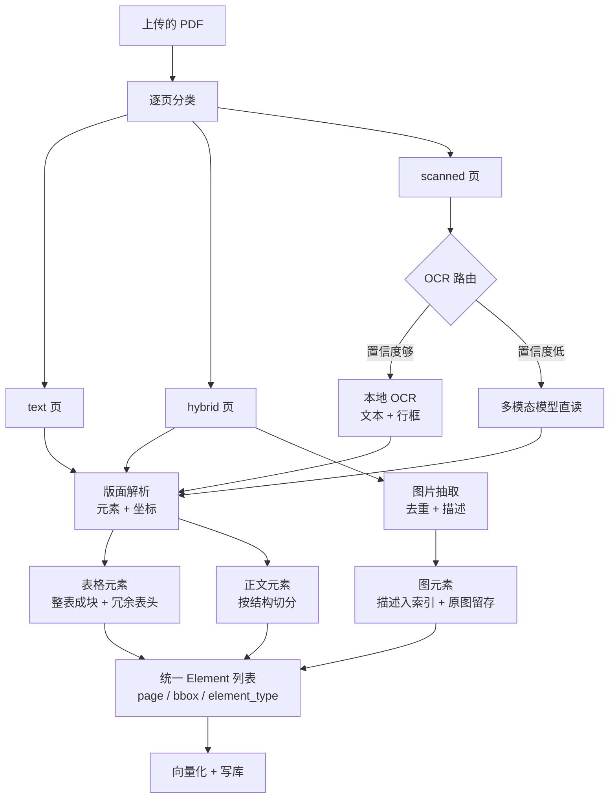
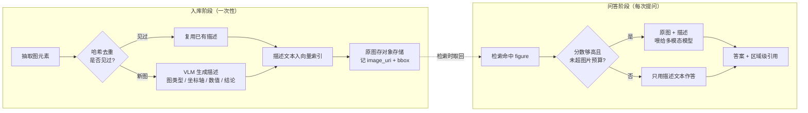

# 多模态文档：扫描件、表格、图表与区域级引用

> [RAG 入库链路](./rag-pipeline) 那条管线只吃干净的纯文本。真实企业知识库里，盖章的红头文件是扫描件、费用标准在跨页表格里、季度结论画在一张折线图上——对这三类内容，纯文本管线不是"效果差"，是**结构性为零**：它们从未进入索引，后面所有的召回调优都碰不到它们。

## 纯文本管线的盲区有多大

先量化，再谈方案。

| 文档类型 | 在企业知识库里的地位 | 纯文本管线拿到什么 | 检索表现 |
|---|---|---|---|
| 可提取文本的 PDF / DOCX | 通常是数量大头 | 完整文本 + 坐标 | 正常 |
| 扫描件 PDF（盖章红头文件、签署版合同） | 制度、公文、合同里占比很高，且往往是最权威的那一份 | **空字符串** | 0 |
| 含关键表格的 PDF（限额表、费率表、附表） | 数值型问题几乎都落在这里 | 错行、串列的一堆数字 | 接近 0，且会答错数 |
| 含图表的 PDF（趋势图、流程图、组织架构图） | 结论型内容常只存在于图里 | **什么都拿不到** | 0 |
| PPT | 汇报材料、培训材料 | 文本框顺序错乱，图里的信息全丢 | 很差 |
| Excel / CSV 大表 | 台账、明细、指标表 | 被按字符切碎，行列语义全丢 | 很差，应走结构化查询 |
| 图片附件（拍照上传） | 工单、报销凭证 | 空字符串 | 0 |

**核心判断：** 后面几类的问题不是"排名不够靠前"，而是**候选集里根本没有它**。这类失败在纯文本指标上完全看不出来——你的 Recall@5 可能一直是 0.8，因为评测集里全是能提取文本的文档。

### 先建一个"毒文档集"跑裸基线

在写任何代码之前，先做这件事：从真实知识库里专门挑 30～50 份**最难的**文档——盖章扫描件、跨页大表、只有图表没有文字结论的报告、拍照上传的图片——配 60～100 道必须依赖这些内容才能答对的题，用现有的纯文本管线跑一次。

裸基线通常低到让人清醒，而这个数字有四个用处：它是后面所有优化的分母；它让"加了某个机制涨了多少"有了标尺；它防止你被整体 Recall 0.8 这种平均数误导；它还能划定范围——某些文档类型在你的库里其实只有两份，看清了就可以直接不做。题集的建法、标注规范和版本化和普通评测集完全一样，见 [Agent 效果评测](./agent-eval#评测集怎么建)。

### 全文有两条主线

**主线一：每个决策都是成本-精度交换。** OCR 渲染多少 dpi、要不要升级到多模态大模型、图片要不要逐张生成描述、表格要不要送云端解析——没有一个是"开了更好"的免费选项，每一个都在拿入库成本和入库时长换召回。这篇里每张表都会带成本列。

**主线二：溯源要跟着升级。** [RAG 答案生成与引用](./rag-citation) 那套引用建立在 `char_start / char_end` 上，而扫描件**没有字符偏移**，表格里的数字也不是一段连续文本。引用必须从"chunk 文本"升级到"文档 + 页码 + 区域坐标"，否则用户没法核对答案——而在扫描件场景里，"没法核对"等于不敢用。

---

## PDF 的三层结构与分类路由

PDF 是个容器格式，同一个后缀名底下有三种完全不同的东西：

| 层 | 页面里实际存了什么 | 纯文本抽取的结果 | 处理方式 |
|---|---|---|---|
| 文本层 | 字符对象 + 字体 + 坐标 | 完整文本 | 直接抽，按坐标重排 |
| 图像层 | 字符对象 + 嵌入的图片对象 | 文本完整，但图里的信息全丢 | 抽文本 + 单独处理图 |
| 无内容层 | 整页就是一张位图 | **空字符串** | 必须 OCR |

判定一页属于哪一层，用三个信号：

| 信号 | 怎么算 | 参考阈值 | 说明 |
|---|---|---|---|
| 单页字符数 | `len(page.get_text().strip())` | < 20 判为扫描页 | 最可靠的单一信号，和 [入库链路](./rag-pipeline#各类文件的真实难点) 用的是同一条判据 |
| 图像面积占比 | 所有图片矩形面积 / 页面面积 | > 0.35 判为图像重页 | 排除页眉小 logo 需要先按尺寸过滤 |
| 字符密度 | 字符数 / 有文本区域面积 | 异常低时怀疑是水印或艺术字 | 辅助信号，用来发现"有几个字但正文其实是图"的页 |

```python
import fitz  # pymupdf


def classify_pages(path: str) -> list[dict]:
    """逐页分类，返回每页的 kind: text / hybrid / scanned"""
    doc, out = fitz.open(path), []
    for i, page in enumerate(doc, start=1):
        text = page.get_text("text").strip()
        page_area = abs(page.rect.width * page.rect.height) or 1.0
        img_area = sum(
            abs(r.width * r.height)
            for info in page.get_images(full=True)         # 同一张图可能在页面里摆多次
            for r in page.get_image_rects(info[0])
            if r.width > 60 and r.height > 60              # 过滤 logo、装饰线、二维码
        )
        ratio = img_area / page_area
        kind = "scanned" if len(text) < 20 else ("hybrid" if ratio > 0.35 else "text")
        out.append({"page": i, "kind": kind, "chars": len(text), "img_ratio": round(ratio, 3)})
    doc.close()
    return out
```

**踩坑：** 千万不要按整份文档一刀切分类。真实公文里最常见的形态是"前 3 页是 Word 导出的正文 + 后 10 页是扫描的附件"，按整份判会得出 `text`（因为平均字符数够），于是后 10 页的附件被静默丢弃，没有任何报错。**分类必须是页级的，路由也必须是页级的。**



所有分支最后必须汇成**同一种中间结构**（带 `page`、`bbox`、`element_type` 的元素列表）。这样切分、向量化、写库、检索这四段代码完全复用，新增一种文档类型只是多写一个前置分支。这一条和入库链路里"三条解析分支共用同一份页 → 文本中间结构"是同一个设计原则，只是把中间结构从"页 → 文本"升级成了"页 → 元素"。

---

## 版面解析：按坐标排序，不按文本流顺序

PDF 里的文本对象顺序是**生成时的写入顺序**，不是人类的阅读顺序。四种常见排版会让文本流顺序变成垃圾：

| 排版 | 文本流顺序的表现 | 后果 |
|---|---|---|
| 双栏 | 左栏第一行、右栏第一行、左栏第二行…… | 句子交错，切出来的 chunk 全是碎片 |
| 页眉页脚 | 每页开头或结尾插入文件名、页码 | 污染每个 chunk，还会稀释向量 |
| 脚注 | 正文中间突然插入一段注释 | 把一句话拦腰截断 |
| 水印 / 印章 | 页面中央的大字或图，写入顺序不定 | 常出现在正文正中间 |

双栏检测与页眉页脚剔除的实现在 [入库链路](./rag-pipeline#pdf-的双栏与页眉页脚) 已经给过，这里不重复。要补的是**把页面解析成带类型和坐标的元素**，因为后面的表格处理、图表理解、区域引用全都依赖这个结构。

### Element 数据结构

```python
from enum import StrEnum
from pydantic import BaseModel, Field


class ElementType(StrEnum):
    TITLE = "title"
    PARAGRAPH = "paragraph"
    TABLE = "table"
    FIGURE = "figure"
    CAPTION = "caption"
    HEADER_FOOTER = "header_footer"       # 标出来但不入库，保留是为了调试时看得见丢了什么


class BBox(BaseModel):
    x0: float
    y0: float
    x1: float
    y1: float
    page_w: float                         # 必须连页面尺寸一起存
    page_h: float

    def normalized(self) -> tuple[float, float, float, float]:
        """归一化到 0～1，前端按百分比定位，与渲染 dpi 和缩放比例无关"""
        return (self.x0 / self.page_w, self.y0 / self.page_h,
                self.x1 / self.page_w, self.y1 / self.page_h)


class Element(BaseModel):
    page: int = Field(ge=1)
    order: int                            # 阅读顺序，按坐标排序后赋值
    etype: ElementType
    bbox: BBox
    text: str = ""                        # 表格是序列化后的文本；图是生成的描述
    table_md: str | None = None           # 表格的 Markdown 形态，送模型时用
    image_uri: str | None = None          # 图 / 表的裁剪图在对象存储的位置
    image_hash: str | None = None         # 内容哈希，用于去重和描述缓存
    ocr_conf: float | None = None         # 本页 OCR 置信度，None 表示不是 OCR 来的
    source_mech: str = "text"             # 由哪个机制产出：text / ocr / vlm / table / figure
```

`source_mech` 现在看着多余，到了消融实验那一节它是核心——有了它，你可以一次入库、按机制过滤地跑多组开关，不必为每种配置重新解析一遍全库。

### 抽取元素

```python
import statistics


def extract_elements(path: str, page_no: int) -> list[Element]:
    """把一页解析成元素列表：表格、文本块（区分标题）、图片"""
    doc = fitz.open(path)
    page = doc[page_no - 1]
    w, h = page.rect.width, page.rect.height
    box = lambda r: BBox(x0=r[0], y0=r[1], x1=r[2], y1=r[3], page_w=w, page_h=h)
    blocks = [b for b in page.get_text("dict")["blocks"] if b["type"] == 0]
    els: list[Element] = []

    # 1) 表格先抽，并记住区域，避免表格里的文字又被当成正文入库一遍
    table_rects = []
    for t in page.find_tables().tables:                # pymupdf 1.23+ 自带表格识别
        table_rects.append(fitz.Rect(t.bbox))
        els.append(Element(page=page_no, order=0, etype=ElementType.TABLE, bbox=box(t.bbox),
                           text=serialize_rows(t.extract()), table_md=t.to_markdown(),
                           source_mech="table"))

    # 2) 文本块：字号中位数当正文基准，明显偏大的判为标题
    sizes = [s["size"] for b in blocks for l in b["lines"] for s in l["spans"]]
    body = statistics.median(sizes) if sizes else 10.0
    for b in blocks:
        r = fitz.Rect(b["bbox"])
        if any((r & tr).get_area() > r.get_area() * 0.5 for tr in table_rects):
            continue                                   # 落在表格区域内，跳过
        text = "\n".join(s["text"] for l in b["lines"] for s in l["spans"]).strip()
        if not text:
            continue
        big = max(s["size"] for l in b["lines"] for s in l["spans"]) > body * 1.15
        els.append(Element(page=page_no, order=0, bbox=box(b["bbox"]), text=text,
                           etype=ElementType.TITLE if big else ElementType.PARAGRAPH))

    # 3) 图片：按区域渲染成 PNG 上传，算内容哈希用于去重
    for info in page.get_images(full=True):
        for r in page.get_image_rects(info[0]):
            if r.width < 60 or r.height < 60:           # 小图基本是 logo、线条、二维码
                continue
            uri, digest = save_region(page, r)
            els.append(Element(page=page_no, order=0, etype=ElementType.FIGURE,
                               bbox=box(tuple(r)), image_uri=uri, image_hash=digest,
                               source_mech="figure"))

    doc.close()
    return assign_reading_order(els, page_w=w)          # 复用双栏检测 + 坐标排序
```

**踩坑：** 第 1 步和第 2 步的顺序不能反。表格区域里的文字同时也是普通文本块，先抽表格再按区域重叠率排除，才不会出现"同一份数据既以表格形式入库、又以一堆散乱数字入库"——后者会在检索时挤掉正确的表格块。

### 解析工具选型

| 工具 | 能力 | 速度 | 成本 | 部署 | 适合 |
|---|---|---|---|---|---|
| `pymupdf` | 文本 + 坐标 + 图片 + 基础表格识别 + 渲染 | 最快，纯 CPU | 只有算力 | 一个 wheel 装完 | 主力抽取，坐标与渲染的唯一选择 |
| `pdfplumber` | 表格抽取最细（可调线条 / 文本两种策略） | 比 pymupdf 慢数倍 | 只有算力 | 纯 Python | 表格密集的报表、附表兜底 |
| `unstructured` | 多格式统一入口，自带元素类型 | 慢，依赖重 | 只有算力 | 依赖体积大 | 格式极杂、想少写胶水代码 |
| 版面检测模型（自部署） | 标题 / 正文 / 表格 / 图的区域检测最准 | 慢，建议 GPU | GPU 成本 | 要维护推理服务 | 版面复杂且量大、数据不能出域 |
| 云文档解析 API | 版面 + 表格 + OCR 一站式，通常最准 | 取决于服务 | **按页计费，是这一列里最贵的** | 零运维 | 量不大、精度要求高、允许数据出域 |

**生产推荐：** 主链路 `pymupdf`，表格失败时用 `pdfplumber` 兜底，只对"版面复杂且内容值钱"的少数文档开版面模型或云 API，并把开关做到知识库级别。不要一上来就全量走云 API——它的账单随页数线性增长，而你的知识库里 80% 的文档用 `pymupdf` 就够了。

::: warning 数据出域是个前置约束，不是技术细节
制度、合同、公文类文档送第三方解析 API，先过合规。这个约束一旦成立，选型表里最后两行直接划掉，讨论就只剩"自部署精度到哪算够"。面试里主动提这一条，比对比精度更能显示你做过真实项目。
:::

---

## 表格处理：整表成块，冗余表头

表格是多模态里**投入产出比最高**的一块：实现成本远低于 OCR 和图表理解，而数值型问题几乎全落在表格上。

### 抽取

```python
import pdfplumber


def extract_tables(path: str, page_no: int) -> list[list[list[str]]]:
    """pdfplumber 兜底抽表：有框线的表用 lines，无框线（靠空格对齐）的用 text"""
    with pdfplumber.open(path) as pdf:
        page = pdf.pages[page_no - 1]
        for strategy in ("lines", "text"):
            tables = page.extract_tables({"vertical_strategy": strategy,
                                          "horizontal_strategy": strategy})
            if tables:
                return [normalize_rows(t) for t in tables]
    return []


def normalize_rows(rows: list[list[str | None]]) -> list[list[str]]:
    """两件必须做的清洗：补齐列数、向下填充合并单元格"""
    width = max(len(r) for r in rows)
    out: list[list[str]] = []
    for r in rows:
        cells = [(c or "").replace("\n", " ").strip() for c in r]
        cells += [""] * (width - len(cells))           # 列数补齐，否则后面全部错位
        if out:                                        # 合并单元格抽出来是空串，继承上一行
            cells = [c if c else out[-1][i] for i, c in enumerate(cells)]
        out.append(cells)
    return out
```

**踩坑：** `normalize_rows` 里那两行是表格处理里最容易漏、后果最严重的地方。抽取结果中合并单元格只在第一行有值（"一类城市"只出现一次，下面三行是空串），不做向下填充，后面三行的数据就完全失去了归属，模型会把二类城市的限额当成一类城市的。列数不齐则直接导致列错位——数字对到了错误的列名上，答案会**错得很自信**。

### 三种表示，各有各的用途

同一张表可以序列化成三种形态，它们在**检索**和**问答**上的表现完全不同：

| 表示 | 样例 | token 开销 | 向量检索 | 关键词检索 | 模型读数准确率 | 能表达合并单元格 |
|---|---|---|---|---|---|---|
| Markdown | `\| 城市类别 \| 住宿限额 \|` | 最省 | 中 | 中 | 高 | 不能 |
| HTML | `<td rowspan="2">` | 约 1.5～2 倍 | 中 | 中 | 高，复杂表更稳 | 能 |
| 串行文本 | `城市类别=一类；住宿限额=500元/晚` | 最贵，行数多时明显 | 高 | **最高** | 中 | 不需要 |

差别的根源是：**检索是按行匹配的，问答是按整表理解的。** 用户问"一类城市住宿限额多少"，串行文本那一行里同时出现了"一类"和"住宿限额"两个词，无论向量还是 BM25 都容易命中；而 Markdown 形态里"住宿限额"只在表头出现一次，与"一类"那一行在文本上是分离的。反过来，把整张表交给模型让它读某个交叉格的值时，Markdown 的二维结构比一堆等号更不容易读错。

**生产推荐：** 两份都存，各用其所长。这正好对上 [入库链路](./rag-pipeline#postgresql-建表) 里 `content` 与 `raw_content` 的双列设计：

```python
chunk = {
    "content": f"【{doc_title} / {el_caption}】\n" + serialize_rows(rows),  # 串行文本，参与检索
    "raw_content": table_to_markdown(rows),      # Markdown，送进 Prompt 给模型读数
    "element_type": "table",
    "bbox": el.bbox.model_dump(),
}
```

合并单元格特别多的复杂表（比如三级表头的统计表）单独走 HTML，多付的 token 是值得的——这种表用 Markdown 表达时结构已经失真了。

### 整表成一块，并冗余表头

**核心规则：一张表就是一个 chunk，不按字符长度切。** 按 600 字符切一张 20 行的表，会得到"表头 + 前 8 行"和"后 12 行"两块，第二块里全是没有列名的裸数字，它既检索不到也读不懂。

表格实在超长（几百行）必须切时，每一块都要重复三样东西：

```python
def split_table(caption: str, header: list[str], body: list[list[str]],
                max_rows: int = 20) -> list[str]:
    """超长表格切块：每块都带 表标题 + 表头 + 行区间说明"""
    blocks = []
    for start in range(0, len(body), max_rows):
        part = body[start:start + max_rows]
        blocks.append(
            f"【{caption}】（第 {start + 1}～{start + len(part)} 行，共 {len(body)} 行）\n"
            + "\n".join(serialize_row(header, r) for r in part)   # 每行自带列名
        )
    return blocks
```

行区间说明不是装饰。用户追问"还有别的吗"时，模型能从"第 1～20 行，共 87 行"这句话知道自己只看到了一部分，从而回答"该表共 87 行，这里列出前 20 行"，而不是把不完整的清单当成全部答出去。

### 跨页表格合并

一张表被 PDF 分页切成两半，是表格处理里第二个高频坑。判定为"续表"要同时满足四个条件，缺一个就不合：

| 条件 | 判据 |
|---|---|
| 上一页的表贴着页面底部 | 表格 `y1` 距页面底边小于阈值（约 10% 页高） |
| 下一页的表贴着页面顶部 | 表格 `y0` 距页面顶边小于阈值，中间不能夹着正文段落 |
| 列数一致 | 归一化后列数相同 |
| 下一页首行不是表头 | 与上一页表头文本相似度低，才判为续表 |

实现上就是按 `(page, order)` 排序后逐个比对相邻表格元素：命中四个条件就把续表的数据行追加到上一个元素，并把它的 bbox 记进 `extra_regions`（引用要能同时高亮两页的区域）；否则当成新表另起一块。

**踩坑：** 下一页的续表通常**没有表头**。追加行时必须把上一页的表头补给它，否则这些行序列化出来还是没有列名的裸数字。反过来，如果下一页首行看起来就是表头（相似度高），说明这是新的一张表，不能合。

### 超大表格：别硬塞进 RAG

几百行以上的台账、明细表，无论怎么切都不适合走向量检索——用户问"哪些部门超标了"需要的是**聚合**，不是相似度。

| 表规模 | 做法 |
|---|---|
| 20 行以内 | 整表一块，直接入向量库 |
| 20～100 行 | 整表一块 + 超长时按行区间切块，每块冗余表头 |
| 100 行以上 | 生成一段**表摘要**（表名、列含义、行数、数值范围、几行样例）入向量库用于召回，同时把原表结构化落库，问答时走 SQL |
| Excel / CSV 台账 | 直接结构化落库，不进向量库 |

摘要负责"让用户问到这张表时能被检索到"，SQL 负责"算出准确的数"。让模型直接从几百行文本里做聚合，几乎必然算错——这也是 [Text2SQL 工程实践](./agent-text2sql) 存在的原因。

**适用场景：** 判断分界线很简单——问题里出现"多少个、总计、平均、超过、排名、趋势"这类词，就该走 SQL 而不是向量检索。

---

## 扫描件 OCR：三条路线的成本-精度交换

这是全篇最典型的成本-精度交换案例，也是面试里最容易问深的一处。

| 路线 | 精度 | 单页耗时量级 | 成本量级 | 版面复杂时 | 部署 | 适合 |
|---|---|---|---|---|---|---|
| 本地 OCR 引擎 | 中到高（印刷体清晰件很好） | 百毫秒到秒级（GPU 更快） | 只有算力，边际成本接近零 | **脆**：双栏、印章压字、手写、倾斜都会明显掉 | 要装引擎和模型，可能要 GPU | 量大、以清晰印刷件为主 |
| 多模态大模型直读 | 高，且能顺带理解版面与表格结构 | 秒级到十秒级 | **按 token 计费，是本地的很多倍** | 强 | 只要一个 API Key | 量小、版面复杂、精度要求高 |
| 置信度混合路由 | 接近 VLM | 大部分页走快路线 | 只为低置信页付高价 | 强 | 两套都要接 | **生产默认** |

### 混合路由实现

```python
async def ocr_page(pdf_path: str, page_no: int, cfg: "MMConfig") -> dict:
    """三路 OCR 的统一入口，返回文本、置信度、实际走的路线"""
    key = (cfg.content_hash, page_no, cfg.ocr_route, cfg.ocr_dpi)
    if (cached := await ocr_cache.get(key)):
        return cached                                      # OCR 的钱只付一次
    img = render_page(pdf_path, page_no, dpi=cfg.ocr_dpi)   # 200～300 dpi 足够

    if cfg.ocr_route == "vlm_only":
        res = {"text": await vlm_read(img), "conf": 1.0, "route": "vlm"}
    else:
        text, conf, lines = await local_ocr(img)            # 返回逐行文本 + 逐行置信度
        if cfg.ocr_route == "local_only" or not should_escalate(text, conf, cfg):
            res = {"text": text, "conf": conf, "route": "local", "lines": lines}
        else:
            # 升级时把本地结果当提示一起给，能降低专有名词的识别错误
            res = {"text": await vlm_read(img, hint=text), "conf": 1.0, "route": "vlm_fallback"}

    await ocr_cache.set(key, res)
    return res


def should_escalate(text: str, conf: float, cfg: "MMConfig") -> bool:
    """置信度不是唯一信号，四个条件任一命中就升级"""
    return (conf < cfg.ocr_conf_threshold                   # 引擎自报的加权平均置信度
            or garbled_ratio(text) > 0.05                   # 生僻字符 / 乱码占比过高
            or len(text) < cfg.min_chars_per_page           # 抽出来太少，大概率漏了区域
            or (has_dense_table(text) and cfg.table_needs_vlm))  # 表格页最容易串行
```

**生产推荐：** `ocr_route` 默认 `hybrid`，`ocr_conf_threshold` 从 0.85 起调，`ocr_dpi` 用 240。dpi 提到 400 以上通常只增加成本不提精度，只有小字号密集或印章压字严重的文档才值得。这三个参数应该是知识库级配置，而不是全局常量。

混合路由的成本是可以提前算的：`总成本 ≈ 页数 × 本地单价 + 页数 × 低置信占比 × VLM 单价`，而低置信占比能在毒文档集上直接测出来。上线前能给出成本区间，比上线后看账单强得多。

### OCR 错字对检索的伤害被严重低估

一个字识别错，影响远不只是"读起来别扭"：

| 错误类型 | 对关键词检索 | 对向量检索 | 缓解 |
|---|---|---|---|
| 专有名词错一字（部门名、制度名） | **直接搜不到**，BM25 是精确词匹配 | 有一定容错，但相似度明显下降 | 术语词表模糊纠错 |
| 数字错一位（500 → 50O） | 搜不到，且答案错得离谱 | 同样答错 | 数字列强制走 VLM 复核 |
| 编号错（第十二条 → 第十一条） | 命中错的条款 | 命中错的条款 | 编号格式正则校验 |
| 标点与空格噪声 | 影响小 | 影响小 | 不用管 |

**踩坑：** 把 OCR 文本直接当 `content` 去做 Embedding 和索引，等于把错字永久固化进索引。更稳的做法是三层：`raw_content` 存 OCR 原文（引用回验用，要能对得上原图），`content` 存术语纠错后的版本（参与 Embedding 与关键词索引），`ocr_conf` 存本页置信度（供拒答阈值和前端提示使用）。

术语纠错本身很朴素：拿知识库里的部门名、制度名、专有名词建一张词表，对 OCR 结果做模糊匹配，编辑距离在 1 以内且长度大于 2 的直接替换。它便宜、可解释、收益立竿见影——比换 OCR 引擎划算得多。

置信度还有一个下游用途：低置信度页面产出的 chunk，在拒答判定时要抬高阈值，并在答案里注明"该内容识别自扫描件，建议核对原文"。拒答阈值怎么定见 [RAG 答案生成与引用](./rag-citation#阈值怎么定-用评测集反推-不要拍脑袋)。

---
## 图表理解：入库时生成描述，问答时现场看图

图表是唯一需要**两段式**处理的元素类型，而且两段都不能省。



**为什么不能只靠描述：** 描述是有损压缩。"图中显示三月起呈上升趋势"这句描述很好，但用户问"三月具体是多少"时它答不上来，而且模型会倾向于从趋势里**推一个数字出来**，这是最难被发现的一类幻觉。

**为什么不能只靠现场看图：** 检索是文本对文本的。图片如果没有任何文本表示进入索引，它永远不会出现在候选集里——"现场看图"这一步压根不会被触发。

### 入库：生成可检索的描述

```python
DESC_PROMPT = """描述这张来自企业文档的图片，供检索使用。必须包含：
1. 图类型（折线图 / 柱状图 / 流程图 / 组织架构图 / 印章 / 照片 / 截图）
2. 标题、坐标轴名称、图例项
3. 关键数值：极大值、极小值、首尾值、明显拐点，带上对应的横轴标签
4. 一句话结论
看不清的数字写"无法辨识"，不要估算。图注：{caption}；所在小节：{section}"""


async def index_figure(el: Element, caption: str, section: str) -> Element:
    """入库时生成描述。同一张图（公章、logo、模板底图）只描述一次"""
    if (cached := await desc_cache.get(el.image_hash)):
        el.text, el.source_mech = cached, "figure_cached"
        return el
    if await is_boilerplate(el.image_hash):           # 多份文档里反复出现 → 装饰性图
        el.etype = ElementType.HEADER_FOOTER           # 标出来但不入索引
        return el
    desc = await vlm_describe(el.image_uri,
                              prompt=DESC_PROMPT.format(caption=caption, section=section))
    await desc_cache.set(el.image_hash, desc)
    el.text = f"【{section} / {caption}】\n{desc}"     # 拼图注和小节标题，理由同"标题进 chunk"
    el.source_mech = "figure"
    return el
```

Prompt 里第 3 条和最后那句"不要估算"是关键。没有第 3 条，模型给的描述会停留在"展示了各季度的销售情况"这种检索不到、也答不出数的空话；没有最后那句，模型会把模糊的图硬编出具体数字。

### 问答：把原图现场喂给模型

```python
async def answer_with_figures(question: str, hits: list[dict], cfg: "MMConfig") -> dict:
    """命中图元素时带原图作答，并严格限制图片数量"""
    figs = [h for h in hits
            if h["element_type"] == "figure" and h["score"] >= cfg.figure_score_min]
    figs = figs[:cfg.max_images_per_answer]                # 硬上限，通常 1～2 张
    if not figs:
        return await answer_text_only(question, hits)      # 没命中图就走普通链路
    content = [{"type": "text", "text": build_prompt(question, hits)}]
    for f in figs:
        content.append({"type": "image_url",
                        "image_url": {"url": await signed_url(f["image_uri"])}})
    # 提示词里要写明：图里读不出来的就说读不出来，不要用文字段落去补图里的数
    return await vlm_answer(content, figs)
```

### 成本控制

图表理解的成本几乎全在入库阶段的 VLM 调用上，五个手段按性价比排序：

| 手段 | 说明 | 省下的量级 |
|---|---|---|
| 尺寸过滤 | 宽或高小于 60px、面积占比小于 1% 的图直接跳过 | 最大，这类图常占图片总数一半以上 |
| 哈希去重 | 公章、logo、模板底图每页重复出现，按内容哈希只描述一次 | 大 |
| 描述缓存 | 缓存键用 `image_hash`，跨文档、跨重建都能命中 | 大，重建索引时尤其明显 |
| 只描述"有名分"的图 | 有图注、或正文出现"如图/见下图"引用的图优先 | 中，可能漏图，要在毒文档集上验证 |
| 问答侧限图 | 每次回答最多带 1～2 张图，且只带高分图 | 直接决定线上单次问答成本 |

**踩坑：** 别把"图片描述"做成同步入库流程的一部分。一份 40 页的报告可能有 60 张图，逐张调 VLM 会让入库耗时从秒级变成十几分钟，前端轮询状态会以为卡死了。它必须是独立的异步阶段，且失败只影响图元素、不影响正文入库。

---

## 多模态检索：加权路由，不要硬过滤

图和表进了索引之后，检索侧要做两件事。

### 按问题意图给元素类型加权

```python
TABLE_HINTS = ("多少", "标准", "限额", "比例", "占比", "费率", "几档", "表")
FIGURE_HINTS = ("趋势", "变化", "增长", "图", "曲线", "流程", "架构")


def rerank_by_type(fused: list[dict], question: str) -> list[dict]:
    """在 RRF 融合之后做类型加权，不改变融合本身的语义"""
    w = {"paragraph": 1.0, "table": 1.0, "figure": 1.0}
    if any(k in question for k in TABLE_HINTS):
        w["table"], w["figure"] = 1.25, 0.95
    if any(k in question for k in FIGURE_HINTS):
        w["figure"] = 1.25
    for h in fused:
        h["score"] *= w.get(h["element_type"], 1.0)
    return sorted(fused, key=lambda h: h["score"], reverse=True)
```

**踩坑：** 一定是**加权**，不是硬过滤。很多看起来像表格问题的问题，答案其实在正文里（"住宿标准见附表，特殊情况按第十五条执行"——第十五条是正文）。按 `element_type = 'table'` 硬过滤会直接丢掉正确答案，而加权只是让表格排前一点。融合阶段（RRF）本身怎么做见 [RAG 检索与重排](./rag-retrieval#rrf-只看排名-不看分数)，类型加权是加在它之后的一层，不要混进 RRF 的分数计算里。

### 图文双塔（CLIP 类）什么时候才值得

把图片和文本编码到同一个向量空间、直接用文字搜图，听起来比"先生成描述再搜描述"优雅，实际边界很窄：**它适合素材库、产品图、照片这类整体视觉语义为主的检索**，不适合中文文档里的图表问答——图表的语义在数值和文字标签上，双塔模型抓不住这种细粒度信息，流程图和组织架构图更是全靠节点文字。

**生产推荐：** 企业文档知识库直接用描述索引，不要上双塔。理由不只是精度——多一套向量空间意味着混合检索的融合逻辑、维度管理、重建流程全部要复制一遍，运维成本翻倍而收益在文档场景里并不明显。

---

## 区域级引用：从字符偏移升级到页码 + 坐标

引用的可核对性在多模态场景里会断裂，因为不同元素能提供的定位粒度不一样：

| 元素来源 | 有字符偏移 | 有页码 | 有区域坐标 | 前端能做什么 |
|---|---|---|---|---|
| 纯文本 chunk | 有 | 有 | 有（文本块 bbox） | 高亮字符区间，见 [引用](./rag-citation#引用的数据结构) |
| 表格 | 无意义 | 有 | 有 | 在页面上框出整张表 |
| 扫描件 OCR | **无** | 有 | 有（OCR 行框） | 只能靠框，或返回区域裁剪图 |
| 图表 | 无 | 有 | 有 | 框出图，或直接展示裁剪图 |

所以引用结构要在 chunk 级之上加一层区域信息：

```python
class RegionCitation(Citation):                # 继承 rag-citation 里的 Citation
    element_type: ElementType
    page: int = Field(ge=1)
    bbox_norm: tuple[float, float, float, float]   # 归一化 0～1，与渲染尺寸无关
    extra_pages: list[dict] = Field(default_factory=list)  # 跨页表格的其余区域
    region_image_url: str | None = None            # 区域裁剪图，扫描件与图表必备
    ocr_conf: float | None = None                  # 低置信度要在前端标注来源
    rotation: int = 0                              # 页面旋转角度，前端换算时要用
```

坐标这件事有三个必踩的坑：

| 坑 | 现象 | 处理 |
|---|---|---|
| 原点不一致 | PDF 规范原点在左下，`pymupdf` 的坐标原点在左上 | 全链路统一用 `pymupdf` 的坐标系，入库时就换算完，不要在前端换 |
| 页面旋转 | `page.rotation` 为 90 / 270 的扫描件，框会画到旁边去 | 存 `rotation`，或渲染时统一转正后再取坐标 |
| 渲染缩放 | 后端按 240 dpi 渲染，前端按容器宽度缩放，绝对像素对不上 | **只存归一化坐标**，前端用百分比定位 |

前端实现很轻：渲染页图片，外层容器 `position: relative`，每个引用区域一个 `position: absolute` 的半透明框，`left/top/width/height` 全部用百分比。扫描件场景更实用的是第二种做法——后端直接按 bbox 裁剪出区域小图返回，用户在答案卡片里就能看到"原文长什么样"，一次点击都不需要。

chunk 级引用的输出约定、校验和拒答策略在 [RAG 答案生成与引用](./rag-citation) 已经讲完，这里只补区域这一层，不重复。

### 表结构怎么扩

在 [入库链路](./rag-pipeline#postgresql-建表) 的 `document_chunks` 上加五列就够，不需要新表：

```sql
ALTER TABLE document_chunks
    ADD COLUMN element_type VARCHAR(16) NOT NULL DEFAULT 'paragraph',
    ADD COLUMN bbox         JSONB,        -- {page, x0, y0, x1, y1, page_w, page_h, rotation}
    ADD COLUMN image_uri    TEXT,         -- 图 / 表的裁剪图
    ADD COLUMN image_hash   CHAR(64),     -- 去重与描述缓存
    ADD COLUMN ocr_conf     REAL,         -- NULL 表示非 OCR 来源
    ADD COLUMN source_mech  VARCHAR(16) NOT NULL DEFAULT 'text';

CREATE INDEX idx_chunk_etype ON document_chunks (kb_id, element_type) WHERE is_active;
CREATE INDEX idx_chunk_mech ON document_chunks (doc_id, source_mech);  -- 消融与机制回滚靠它
```

---

## 评估：逐机制收益表

多模态机制是**一个一个加**的，所以收益也必须一个一个量。做法是开关矩阵 × 毒文档题集，用留一法（全开做基线，每次只关掉一个机制）——它比"逐个加"更能反映边际贡献，因为机制之间存在互补关系。

```python
MECHANISMS = ["layout", "table_merge", "ocr_local", "ocr_vlm_fallback",
              "figure_desc", "figure_live", "type_weight"]


async def ablation(kb_id: int, base: "MMConfig",
                   toxic: list[dict], plain: list[dict]) -> list[dict]:
    """留一法消融：全开基线 + 每次关掉一个机制。
    plain 是纯文本对照题集，用来抓退化——这一项不能省"""
    rows = [await run_suite(kb_id, base, toxic, plain, tag="all_on")]
    for m in MECHANISMS:
        cfg = base.model_copy(update={m: False})       # Pydantic v2 复制并改一个字段
        rows.append(await run_suite(kb_id, cfg, toxic, plain, tag=f"minus_{m}"))
    return rows
```

结果表长这样（**数字是示例形状，你必须在自己的题集上跑出真实值**）：

| 配置 | 毒文档集 Recall@5 | 毒文档集端到端正确率 | 纯文本对照集正确率 | 入库耗时 / 千页 | 相对入库成本 |
|---|---|---|---|---|---|
| 全开（基线） | 0.78 | 0.71 | 0.85 | 基线 | 基线 |
| 关掉 layout | −0.06 | −0.05 | −0.01 | −15% | −5% |
| 关掉 table_merge | −0.09 | −0.13 | 0 | −5% | −2% |
| 关掉 ocr_local | −0.31 | −0.30 | 0 | −60% | −40% |
| 关掉 ocr_vlm_fallback | −0.07 | −0.09 | 0 | −10% | **−45%** |
| 关掉 figure_desc | −0.11 | −0.08 | 0 | −20% | −30% |
| 关掉 figure_live | −0.01 | −0.10 | 0 | 0 | 0（成本在问答侧） |
| 关掉 type_weight | −0.03 | −0.02 | **−0.02** | 0 | 0 |

这张表的读法比表本身重要：

- **`ocr_local` 那一行**说明本地 OCR 是最大的单点收益，也是入库耗时的主要来源——它是必开项。
- **`ocr_vlm_fallback` 那一行**是典型的成本-精度交换：只涨 7～9 个点，却占了 45% 的成本。它值不值得，取决于你的场景能不能接受这个精度差。
- **`figure_live`（问答时喂原图）对 Recall 几乎无影响，但端到端掉 10 个点**——因为它影响的是"检索到了图之后答得准不准"，只看检索指标会误判它没用。分层看指标的道理见 [Agent 效果评测](./agent-eval#分层评测-只看端到端等于没测)。
- **`type_weight` 那一行的纯文本对照集掉了 2 个点**，这就是防退化对照要抓的东西：类型加权把表格排前了，代价是某些正文答案被挤下去。这类退化在只看毒文档集时完全隐形。

### 一次入库跑多组开关

上面的消融如果每组都重新入库一遍全库，时间和 OCR 费用都不可接受。技巧是**一次入库把所有机制的产物都生成并打上 `source_mech`，检索时按白名单 mask 过滤**：配置翻译成一组允许的 `source_mech`（`table_merge` 开则允许 `table`，`figure_desc` 开则允许 `figure`、`figure_cached`，以此类推），检索 SQL 里加一条 `AND source_mech = ANY(:allow)`。

这样七组配置只需要一次入库。代价是"关掉某机制"模拟的是**检索侧关闭**，而不是入库侧真的没跑——对 Recall 和正确率的评估是准确的，对入库耗时和成本要单独用小样本实测补上。这个取舍要在报告里写清楚。

**生产推荐：** 把毒文档集的消融跑进 CI，门禁设两条：毒文档集指标不得下降超过 1 个点，**纯文本对照集不得下降超过 1 个点**。第二条比第一条更重要——多模态机制是增量功能，让原来能答对的题变差是不可接受的回退。门禁阈值怎么定见 [Agent 效果评测](./agent-eval#门禁阈值怎么定)。

---

## 工程落地建议

### 默认全关，按知识库开

```python
class MMConfig(BaseModel):
    """多模态开关，落在 knowledge_bases 表的 JSONB 列里，按库配置"""
    layout: bool = False              # 版面解析（元素 + 坐标）
    table_merge: bool = False         # 表格抽取与跨页合并
    ocr_local: bool = False           # 本地 OCR
    ocr_vlm_fallback: bool = False    # 低置信度升级到多模态模型
    figure_desc: bool = False         # 入库生成图片描述
    figure_live: bool = True          # 问答时带原图（前提是有 figure 元素）
    type_weight: bool = True          # 检索侧类型加权，零成本，可默认开
    ocr_route: str = "hybrid"         # local_only / vlm_only / hybrid
    ocr_dpi: int = Field(default=240, ge=150, le=400)
    ocr_conf_threshold: float = Field(default=0.85, ge=0.5, le=1.0)
    min_chars_per_page: int = 40
    table_needs_vlm: bool = False
    max_images_per_answer: int = Field(default=2, ge=0, le=4)
    figure_score_min: float = 0.5
```

**生产推荐：** 除了零成本的 `type_weight`，其余默认 `False`。多模态机制会把入库成本和耗时抬高一个量级，而大部分知识库并不需要它们。让业务方在建库时勾选"这个库含扫描件 / 含关键表格"，比让所有库统一承担成本合理得多。

### 成本要提前算，不要上线后看账单

| 机制 | 相对入库成本（纯文本抽取 = 1） | 主要成本项 |
|---|---|---|
| 纯文本抽取 + 切分 | 1 | CPU |
| 版面解析（pymupdf 元素级） | 1～2 | CPU |
| 表格抽取（pdfplumber 兜底） | 2～4 | CPU，慢在大页面 |
| 本地 OCR | 10～50 | 算力（GPU 显著更快） |
| 多模态模型直读 | 100 以上 | **按 token 计费的 API 调用** |
| 图片描述（逐张 VLM） | 与图片数量线性相关 | API 调用，靠去重和缓存压 |
| Embedding | 与 chunk 数线性相关 | 见 [入库链路](./rag-pipeline#embedding-工程) |

给业务方的报价公式可以很简单：`总成本 ≈ 页数 × (本地 OCR 单价 + 低置信占比 × VLM 单价) + 有效图片数 × 描述单价 + chunk 数 × Embedding 单价`。低置信占比和有效图片数都能在毒文档集上先测出来。

### 异步链路怎么承接

[入库链路](./rag-pipeline#四阶段拆分与状态机) 的四阶段状态机不用推翻，在解析阶段内部插几个子阶段就行：

| 新增阶段 | 队列 | 幂等键 | 失败重跑代价 |
|---|---|---|---|
| 页级分类 | 复用解析队列 | `(doc_id)` | 极低，纯 CPU |
| OCR | **独立队列**，并发受 GPU / 供应商 QPS 限制 | `(content_hash, page, route, dpi)` | **高，要花钱，必须缓存** |
| 图片描述 | 独立队列 | `(image_hash)` | 高，要花钱，缓存跨文档共享 |
| 表格抽取 | 复用解析队列 | `(doc_id, page, table_idx)` | 低，注意大页面内存 |

**OCR 和 VLM 必须走独立队列。** 它们是慢任务（秒级到十几秒），和文本入库抢同一批 worker 会让普通文档的入库延迟被拖垮。队列隔离与并发上限的做法见 [后台任务与定时调度](./background-worker) 和 [消息队列](./message-queue)。

**要允许"部分成功"。** 一份 50 页的文档里第 37 页 OCR 失败，不该让整份文档卡在 `failed`。正确做法是页级状态：失败页记下来，其余页正常入库，文档状态置为 `ready_partial`，前端标注"3 页未能识别"。全有或全无的策略在多模态场景下会让可用性变得很差。

**前端必须告知内容来源。** 引用了 OCR 来源的 chunk 时，展示"该内容识别自扫描件，建议核对原文"并给出区域裁剪图。这不是产品文案问题——扫描件的错字率客观存在，把不确定性显式暴露给用户，比让用户以为它和文本文档一样可靠要安全得多。

::: warning 上线顺序建议
按投入产出比排：先做表格（成本最低、收益明确），再做本地 OCR（收益最大、成本可控），再做图片描述，最后才考虑 VLM 兜底。每上一个机制都跑一遍消融并留下那张收益表——这张表就是你下次汇报和面试时最有说服力的材料。
:::

---

## 面试高频问题

### 1. 纯文本 RAG 管线在多模态文档上会怎么失败？你怎么发现的？

- 不是"效果差"，是**结构性为零**：扫描件抽出来是空字符串，图表内容压根没进索引，任何检索调优都碰不到。
- 表格更隐蔽：能抽出文本，但错行串列，模型会**答错数字而不是拒答**，比答不出来危险。
- 发现方式是专门建"毒文档集"——挑扫描件、跨页表格、图表 PDF，配必须依赖这些内容的题，跑一次裸基线。
- 不建毒文档集会误判形势：整体 Recall@5 看着 0.8，因为评测集里全是能提取文本的文档。
- 裸基线这个数字后面一直有用，它是每个机制收益的分母。

### 2. 怎么判断一份 PDF 该走哪条处理管线？

- 三个信号：单页字符数（< 20 判扫描页，最可靠）、图像面积占比（> 0.35 判图像重页）、字符密度（识别水印和艺术字）。
- **分类和路由必须是页级的**，不能整份一刀切——"前 3 页文本 + 后 10 页扫描附件"是公文最常见的形态，整份判会静默丢掉附件且不报错。
- 三层结构对应三条链路：文本层直接抽、图像层抽文本 + 单独处理图、无内容层必须 OCR。
- 所有分支最后要汇成同一种中间结构（带 page / bbox / element_type 的元素列表），后面的切分、向量化、写库完全复用。
- 图像面积统计前要按尺寸过滤小图，否则页眉 logo 会把占比拉高造成误判。

### 3. 表格怎么切、怎么表示？

- **一张表就是一个 chunk**，不按字符长度切；必须切时每块都冗余表标题、表头和行区间说明。
- 三种表示各有用途：串行文本（每行自带列名）检索命中率最高，Markdown 送模型读数最准，HTML 才能表达合并单元格。
- 生产做法是两份都存，正好对上 `content`（串行文本，参与 Embedding）和 `raw_content`（Markdown，进 Prompt）的双列设计。
- 两个必做清洗：列数补齐（否则列错位，数字对到错的列名上）、合并单元格向下填充（否则后续行失去归属）。
- 跨页表格要按四个条件合并（贴底、贴顶、列数一致、首行不像表头），并把上一页表头补给续表。
- 100 行以上的大表不进向量库：摘要入索引负责召回，原表结构化落库走 SQL 负责算数。

### 4. 扫描件 OCR 你怎么选路线？

- 三条路线：本地引擎（便宜快，对双栏、印章压字、手写脆）、多模态模型直读（贵慢但强）、置信度混合路由（生产默认）。
- 混合路由的逻辑是本地先跑，只有低置信度页面才升级；升级判据不止置信度，还包括乱码率、字符数过少、密集表格页。
- 成本可以提前算：`页数 × 本地单价 + 页数 × 低置信占比 × VLM 单价`，低置信占比在毒文档集上先测出来。
- OCR 的钱只能付一次：按 `(content_hash, page, route, dpi)` 缓存，重新切分、换 Embedding 模型、重建索引都不该重跑。
- 错字对检索的伤害被低估：专有名词错一字，BM25 直接搜不到。缓解是术语词表模糊纠错、原文与纠错文本分两列存、把置信度写进 chunk 供拒答判定和前端提示。

### 5. 图表怎么做到既能被检索到、又能答准？

- 两段式，两段都不能省：入库时生成描述并索引（解决"检索得到"），问答时把原图现场喂多模态模型（解决"答得准"）。
- 只靠描述会丢数值，而且模型会从趋势里推一个数字出来，这是最难发现的幻觉。
- 只靠现场看图则永远不会被触发——检索是文本对文本，没有文本表示的图不会进候选集。
- 描述 Prompt 必须要求图类型、坐标轴与图例、关键数值与拐点、一句话结论，并明确"看不清就写无法辨识，不要估算"。
- 成本靠五招压：尺寸过滤、内容哈希去重（公章 logo 只描述一次）、描述缓存、只描述有图注的图、问答侧限制每次最多带 1～2 张图。

### 6. 多模态场景下引用怎么给？

- 引用要从"chunk 文本 + 字符偏移"升级到"文档 + 页码 + 区域坐标"，因为扫描件根本没有字符偏移。
- 数据结构在 chunk 级引用上加：`element_type`、`page`、归一化 bbox、跨页区域列表、区域裁剪图 URL、`ocr_conf`、`rotation`。
- 坐标三个坑：原点不一致（PDF 左下 vs pymupdf 左上）、页面旋转、渲染 dpi 与前端缩放。解法是入库时就换算并**只存归一化坐标**。
- 前端两种呈现：页面图上用百分比定位画半透明框；或后端按 bbox 裁剪返回区域小图，扫描件场景下这种更实用。
- OCR 来源的引用要显式标注"识别自扫描件，建议核对原文"，把不确定性暴露给用户。

### 7. 加了这么多机制，你怎么证明每个都有用、成本怎么控？

- 开关矩阵 × 毒文档题集，用**留一法**（全开做基线，每次关掉一个），比逐个加更能看出边际贡献。
- 每行同时报四个数：毒文档集 Recall、端到端正确率、入库耗时、相对成本。只报正确率涨了等于隐瞒成本翻倍。
- **必须有纯文本对照集做防退化**：新机制不能让原来能答对的题变差，类型加权就很容易挤掉正文答案。
- 只看检索指标会误判：问答时喂原图对 Recall 几乎无影响，但端到端能差 10 个点，所以要分层看。
- 一次入库、给每条 chunk 打 `source_mech`、检索时按白名单 mask，就能用一次入库跑完多组开关；入库耗时和成本用小样本单独实测补上。
- 落地策略：机制默认关闭、按知识库开、OCR 和 VLM 走独立队列、允许页级部分成功、成本用公式提前报给业务方。

