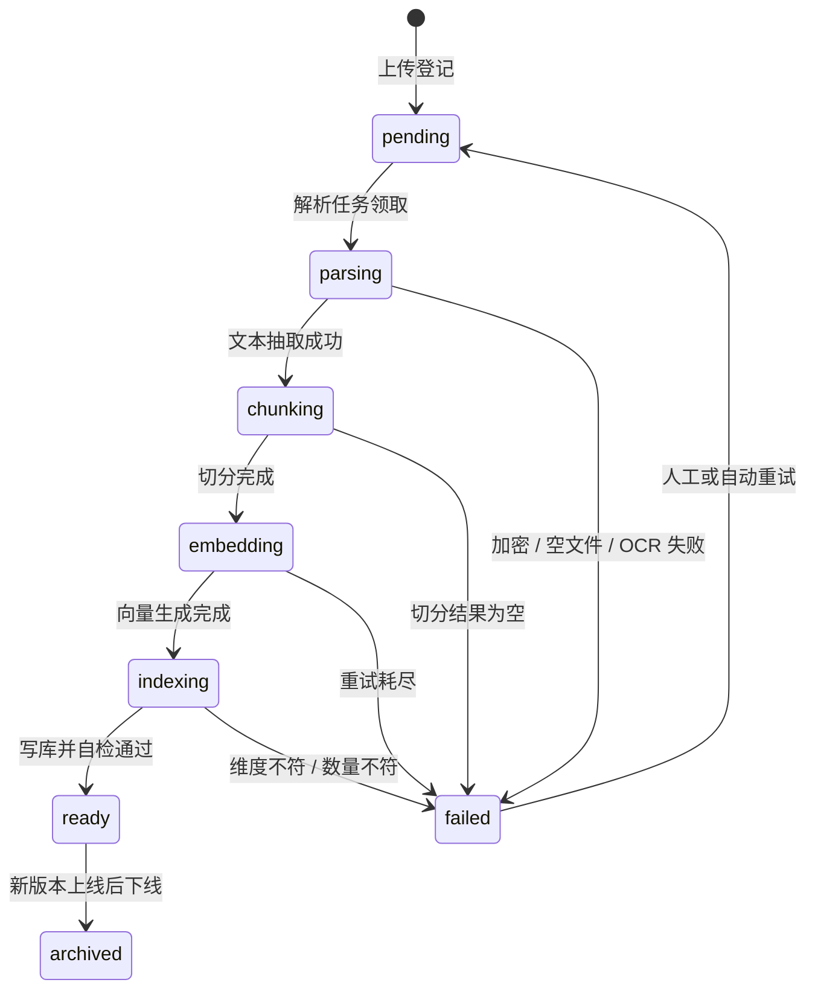
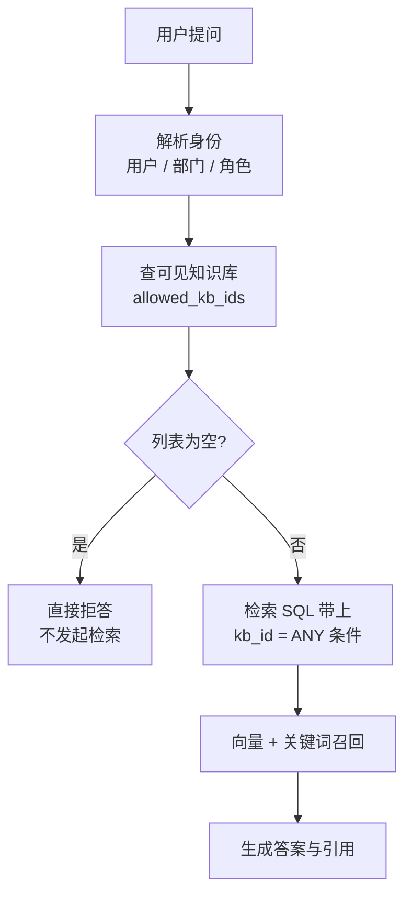

# RAG 入库链路：解析、切分、元数据、增量重建

> 检索答不准，八成不在模型和 Prompt，而在入库阶段：段落被切碎、标题被丢掉、页码没记录、旧版本没下线。入库链路决定了检索质量的上限，后面所有的召回调优都只是在这个上限之下挣扎。

## 为什么不能把文档直接塞给模型

最直觉的写法是把整份文档拼进 Prompt：

```python
# 看起来能跑，规模一上来就废
prompt = f"根据以下文档回答问题：\n{whole_document}\n\n问题：{question}"
```

假设一个企业制度文档库有 800 份文件、平均 20 页，全文约 1200 万字。这个做法会在五个地方同时崩：

| 维度 | 全文塞 Prompt | 检索增强 |
|---|---|---|
| 上下文窗口 | 1200 万字放不进任何模型 | 每次只送 5～10 个片段，约 3000 字 |
| 成本 | 每次提问都为全部无关内容付输入费 | 输入量下降两到三个数量级 |
| 准确率 | 关键句被无关文本稀释，位置越靠中间越容易被漏读 | 证据密度高 |
| 时效 | 过期条款和现行条款一起进 Prompt | 可按版本、生效日期过滤 |
| 溯源 | 无法定位到哪一页哪一条 | 每个片段自带文档、页码、条款号 |

第三行最容易被低估。把 30 段无关内容和 1 段有效证据一起交给模型，它不会自动"只看对的那一段"，而是被无关内容带偏，这就是噪声稀释。所以候选片段从 20 个降到 5 个，准确率经常反而上升。

::: tip 一句话区分
上下文窗口变大解决的是"能不能放进去"，RAG 解决的是"该放哪些进去"。窗口再大也不改变后者。
:::

---

## 整条入库链路长什么样


每一步都可能失败，所以每一步都要满足两个条件：**状态可观测**、**单步可重跑**。

| 阶段 | 输入 | 输出 | 典型失败 | 重跑代价 |
|---|---|---|---|---|
| 存原文 | 上传流 | 对象存储 URI | 上传中断、磁盘满 | 低，重新上传 |
| 解析 | 文件字节 | 纯文本 + 版面结构 | 加密 PDF、扫描件无文字层、编码乱码 | 低，纯 CPU |
| 切分 | 纯文本 | chunk 列表 | 标题识别错、正则误切 | 低，纯 CPU |
| 元数据标注 | chunk + 文档属性 | 带字段的 chunk | 条款编号解析失败 | 低 |
| Embedding | chunk 文本 | 向量 | 限流、超时、超长被截断 | **高，要花钱也花时间** |
| 写库建索引 | 向量 + 元数据 | 可检索行 | 维度不匹配、唯一键冲突 | 中 |

**生产推荐：** 原文必须单独存对象存储，解析后的纯文本也要落盘。理由很实际：解析器会升级、切分策略会改，重新切分时不该让用户重新上传，更不该为同一份扫描件重复付 OCR 的钱。

::: warning 不要把"上传成功"和"入库完成"混在一个接口里
接口返回 200 只代表文件收下了。文档能不能被检索到取决于后面四个阶段，必须用独立的状态字段表达，前端轮询这个状态。
:::

---

## 文档解析：坑几乎都在这一层

### 各类文件的真实难点

| 类型 | 难点 | 处理方式 |
|---|---|---|
| TXT / Markdown | 编码不确定（GBK、UTF-8 with BOM） | 先探测编码；Markdown 的 `#` 层级是天然切分锚点，务必保留 |
| DOCX | 表格、批注、修订痕迹混进正文 | 按段落遍历，跳过批注；表格单独转 Markdown 再插回 |
| PDF（有文字层） | 双栏、页眉页脚、跨页段落、表格错行 | 取 block 坐标后按坐标重排，而不是直接 `get_text()` |
| PDF（扫描件） | 没有文字层，提取结果是空字符串 | 必须 OCR |
| 图片附件 | 同扫描件，且常有旋转 | OCR + 方向矫正 |

**踩坑：** 判断一份 PDF 是不是扫描件，不要看文件名或页数，要看提取出的字符数。可用阈值：平均每页不足 20 个字符就走 OCR 分支，这比任何格式嗅探都可靠。

### PDF 的双栏与页眉页脚

真实政策文件常见的排版是 A4 双栏 + 每页页眉写着文件名、页脚写着页码。直接抽文本会得到"左栏第一行、右栏第一行、左栏第二行……"这样交错的垃圾，而页眉页脚会污染每个 chunk。

```python
import fitz  # pymupdf


def extract_pdf(path: str) -> list[dict]:
    """按页提取文本，顺带处理双栏与页眉页脚"""
    doc = fitz.open(path)
    raw_pages, head_tail = [], {}

    for page in doc:
        # blocks 元素为 (x0, y0, x1, y1, text, block_no, block_type)，type=0 是文本块
        blocks = [b for b in page.get_text("blocks") if b[6] == 0 and b[4].strip()]
        raw_pages.append((page.rect.width, blocks))
        lines = [b[4].strip() for b in blocks]
        # 统计每页首块与末块，重复出现的就是页眉页脚
        for cand in lines[:1] + lines[-1:]:
            head_tail[cand] = head_tail.get(cand, 0) + 1

    total = len(raw_pages)
    # 在 60% 以上页面重复出现 → 判定为页眉页脚，整块丢弃
    noise = {t for t, c in head_tail.items() if total > 2 and c > total * 0.6}

    pages = []
    for idx, (width, blocks) in enumerate(raw_pages, start=1):
        mid = width / 2
        left = [b for b in blocks if b[2] <= mid * 1.05]    # 整块落在左半页
        right = [b for b in blocks if b[0] >= mid * 0.95]   # 整块落在右半页
        if len(left) >= 3 and len(right) >= 3:
            ordered = sorted(left, key=lambda b: b[1]) + sorted(right, key=lambda b: b[1])
        else:
            # 单栏：按行分档再按 x 排序，避免同一行被拆散
            ordered = sorted(blocks, key=lambda b: (round(b[1] / 10), b[0]))
        pages.append({"page": idx,
                      "text": "\n".join(b[4].strip() for b in ordered if b[4].strip() not in noise)})

    doc.close()
    return pages
```

跨页段落要单独合并：遍历页时，若上一页文本结尾不是句末标点（`。！？；` 一类），就把下一页开头直接接上去，并把这段的 `page_to` 记成后一页。不做这一步，一句话会被切成两个 chunk，两半都检索不到。

### 什么时候才需要版面解析和 OCR

版面解析（layout parsing）指的是先识别出标题、正文、表格、图注、页眉页脚这些区域，再按阅读顺序还原文本。它比纯文本抽取贵得多，不要默认开启。

| 情况 | 是否需要版面解析 | 是否需要 OCR |
|---|---|---|
| Markdown、纯文本制度汇编 | 不需要 | 不需要 |
| 单栏 Word 导出的 PDF | 不需要 | 不需要 |
| 双栏排版的政策文件 | 坐标重排够用，不必上模型 | 不需要 |
| 正文里有关键数据表格（费用标准、限额） | 需要，表格错行等于数据错 | 不需要 |
| 盖章扫描的红头文件 | 需要 | 需要 |
| 拍照上传的纸质文件 | 需要 | 需要，且要先矫正方向 |

**适用场景：** 只有当"表格里的数字"或"扫描件"是必须回答的内容时，才引入版面解析与 OCR。它们会把入库耗时从秒级拉到分钟级。

### 解析工具选型

| 工具 | 能力 | 速度 | 适合 | 短板 |
|---|---|---|---|---|
| `pymupdf`（fitz） | 文本 + 坐标 + 图片，可渲染成图 | 最快，纯 CPU | PDF 主力抽取，双栏重排 | 表格结构要自己拼 |
| `pdfplumber` | 文本 + 表格抽取 API | 中等，比 pymupdf 慢数倍 | 表格密集的报表、标准附表 | 大文件慢，内存高 |
| `python-docx` | DOCX 段落、样式、表格 | 快 | Word 原生文档，可读出标题级别 | 不支持旧版 `.doc` |
| `unstructured` | 多格式统一入口，自带分区与元素类型 | 慢，依赖多 | 格式杂乱、想少写胶水代码 | 依赖体积大，行为不易控制 |
| OCR 引擎（PaddleOCR / Tesseract 一类） | 图片转文字，可带版面模型 | 最慢，建议上 GPU | 扫描件、图片附件 | 识别错字需要后处理与校验 |

**生产推荐：** 主链路用 `pymupdf`，表格页单独用 `pdfplumber` 兜底，扫描件走 OCR 队列。三条分支共用同一份"页 → 文本"的中间结构，后续切分逻辑完全复用。不建议一上来就用统一解析框架：省事的代价是解析行为变成黑盒，某天某类文件少抽了一半内容，你分不清是分区模型判错还是编码问题。

---

## 切分策略：检索质量的分水岭

切分是入库链路里唯一"改一行参数、召回率变十个点"的环节。

### 四种策略对比

| 策略 | 做法 | 召回质量 | 实现成本 | 适合的文档 |
|---|---|---|---|---|
| 固定长度 | 每 N 字符一刀 | 差，句子和条款被切断 | 最低 | 日志、无结构长文本 |
| 递归字符 | 按段落 → 句子 → 词依次尝试切，尽量在自然边界断开 | 中上，通用基线 | 低，有现成实现 | 通用文档、说明书 |
| 语义切分 | 逐句 Embedding，相邻句相似度低于阈值处断开 | 好，但不稳定 | 高，入库要多花一遍向量成本 | 无标题的长篇叙述、访谈记录 |
| 结构层级切分 | 按标题层级或条款编号切，一条一 chunk | 最好 | 中，要写规则 | 制度、政策法规、合同、标准 |

**生产推荐：** 制度、政策类文档一律优先按结构层级切分，识别失败再回落到递归字符切分。这类文档的作者已经帮你分好了语义单元——"第十二条"本身就是一个完整语义块，用户的问题也几乎总是落在某一条上。

### 递归字符切分：通用基线

```python
from langchain_text_splitters import RecursiveCharacterTextSplitter

splitter = RecursiveCharacterTextSplitter(
    chunk_size=600,        # 目标长度，中文按字符算
    chunk_overlap=80,      # 重叠，约等于一两句话
    # 分隔符按优先级从粗到细，前面的切不开才用后面的
    separators=["\n\n", "\n", "。", "；", "，", " ", ""],
    keep_separator=True,   # 保留标点，否则句子读起来是断的
    length_function=len,
)
chunks = splitter.split_text(full_text)
```

### 结构层级切分：制度类文档的正确做法

```python
import re

# 常见条款起始形态：第十二条 / 一、 / 1.2.3
CLAUSE_RE = re.compile(r"^\s*(第[一二三四五六七八九十百零〇\d]+条|[一二三四五六七八九十]+、|\d+(\.\d+)+)")
HEADING_RE = re.compile(r"^\s*(第[一二三四五六七八九十]+[章节])\s*(.*)$")


def split_by_structure(text: str, max_chars: int = 800) -> list[dict]:
    """按章节标题 + 条款编号切分，产出带 heading_path 与 clause_no 的块"""
    blocks: list[dict] = []
    stack: list[str] = []       # 当前所处的标题路径
    cur: dict | None = None

    for line in text.split("\n"):
        s = line.strip()
        if not s:
            continue

        if (h := HEADING_RE.match(s)):
            if cur:                       # 遇到标题先结束上一块
                blocks.append(cur)
                cur = None
            level = 0 if "章" in h.group(1) else 1
            stack = stack[:level] + [s]   # 维护层级路径
            continue

        if (c := CLAUSE_RE.match(s)):
            if cur:
                blocks.append(cur)
            cur = {"clause_no": c.group(1), "heading_path": " > ".join(stack), "text": s}
        elif cur:
            cur["text"] += "\n" + s
        else:
            # 条款之前的引言段落也要保留，别丢
            cur = {"clause_no": None, "heading_path": " > ".join(stack), "text": s}

    if cur:
        blocks.append(cur)
    return split_oversized(blocks, max_chars)
```

单条特别长的条款仍要二次切分：`split_oversized` 按 `[。；！？]` 断句累加到 `max_chars`，把同一个 `clause_no` 和 `heading_path` 继承给每个子块，并让后一块带上前一块尾部 80 字作为重叠。这样前端能按条款号把子块合并展示，引用也仍然指向同一条。

### 标题必须拼进 chunk 正文

这是最便宜、收益最大的一个技巧。原始 chunk 长这样：

```txt
出差期间市内交通费按每人每天 80 元标准包干，不再凭票报销。
```

用户问"差旅住宿和交通怎么报"，这段能被召回，但模型不知道它属于哪份制度、哪一章。而且如果知识库里同时有多个部门的差旅规定，模型无法区分。拼上标题路径后：

```txt
【差旅费管理办法 v3 / 第三章 交通费 / 第十二条】
出差期间市内交通费按每人每天 80 元标准包干，不再凭票报销。
```

**为什么有效：** Embedding 是对整段文本编码的，标题里的关键词（差旅、交通费）会进入向量，短 chunk 的语义被显著补全；同时模型在生成时能直接看到出处，引用准确率提升。

::: warning 拼接后的文本要和原文分开存
送去做 Embedding 和送给模型的是拼了前缀的版本，但引用回验、前端高亮要用**原文**。所以库里要有两列：`content`（带前缀）和 `raw_content`（原文）。这一点在[引用溯源](./rag-citation)那篇会直接用到。
:::

### overlap 设多少

| chunk_size | 建议 overlap | 理由 |
|---|---|---|
| 300 字以内 | 30～50 字 | 太小的块本来上下文就少，重叠比例要高些 |
| 500～800 字 | 50～100 字（约 10%～15%） | 通用挡位，够覆盖一两句跨界句子 |
| 1000 字以上 | 100～150 字 | 比例可降到 10% 左右，再高就是纯浪费存储 |
| 结构层级切分 | 0 | 条款本身完整，重叠只会让同一句被反复召回 |

**踩坑：** overlap 不是越大越好。重叠 50% 会让相邻 chunk 高度相似，检索 top5 里出现三个内容重复的块，等于把有效证据位置挤掉，还额外多付存储和向量成本。

### chunk 太小和太大的失败模式

| 问题 | 表现 | 根因 | 处理 |
|---|---|---|---|
| chunk 过小（< 150 字） | 召回一堆碎句，模型答得零散、经常漏条件 | 语义不完整，向量被单个词主导 | 合并相邻小块，或补标题前缀 |
| chunk 过小 | 同一问题的答案散在 5 个 chunk，top5 装不下 | 一条规定被切成多段 | 改结构层级切分 |
| chunk 过大（> 1200 字） | 相似度普遍偏低，明明有答案却排不进 top5 | 关键句被大段无关内容摊薄，向量趋于"平均语义" | 降 chunk_size |
| chunk 过大 | 生成阶段 token 暴涨，延迟和成本上升 | 单块正文太长 | 精排后截断，或二次切分 |

**生产推荐：** 中文场景先用 `chunk_size=500`、`overlap=80` 作基线，再用评测集调。判断切分是否合理有个土办法：随机抽 20 个 chunk 自己读一遍，如果你脱离上下文读不懂它在说什么，模型也读不懂。

---

## 元数据设计：面试里最容易被漏掉的一块

很多人只存了 `content` 和 `embedding`，于是后面所有需求都做不了：不能按部门过滤、不能排除过期文件、不能显示页码、更新文档只能全库清空重建。

### 每个字段为什么存在

| 字段 | 作用 | 不存会怎样 |
|---|---|---|
| `kb_id` | 知识库隔离，权限过滤的落点 | 跨库串答，权限失效 |
| `doc_id` / `title` | 引用展示、按文档重建 | 答案没有出处 |
| `version` | 区分同一文件的多个版本 | 新旧条款混答 |
| `issue_dept` | 发布部门，用于筛选与展示 | 无法回答"这是谁发的" |
| `scope` | 效力范围（全公司 / 某事业部） | 把别的部门的规定答给用户 |
| `published_at` | 发布日期，同类冲突时取新的 | 无法判断哪条更新 |
| `effective_from` / `effective_to` | 有效期，检索时过滤 | 答出已废止的规定，这是政务与制度场景的致命错误 |
| `clause_no` | 条款编号，精确检索与引用定位 | "第十二条"这类查询命中不了 |
| `heading_path` | 标题层级，补全语义与展示面包屑 | 片段脱离上下文 |
| `page_from` / `page_to` | 页码，前端跳转原文 | 用户无法核对 |
| `seq` | chunk 在文档内的序号 | 无法拼回上下文，也无法做相邻扩展 |
| `char_start` / `char_end` | 字符偏移，前端高亮 | 只能整段展示，定位不到句子 |
| `status` | 文档处理状态机 | 前端不知道解析进度，失败也无感 |
| `is_active` / `is_deleted` | 软删除与下线标记 | 只能物理删除，误删无法恢复，且删除瞬间索引抖动 |
| `content_hash` | 文件指纹，去重与幂等 | 重复上传产生重复 chunk，检索结果全是重复项 |
| `token_count` | 组装 Prompt 时做预算控制 | 上下文超限只能靠试 |

### PostgreSQL 建表

三张表：知识库、文档、分块。向量列直接放在分块表上，省掉一次跨库查询。

```sql
CREATE EXTENSION IF NOT EXISTS vector;   -- pgvector

-- 知识库：权限与检索的隔离边界
CREATE TABLE knowledge_bases (
    id              BIGSERIAL PRIMARY KEY,
    name            VARCHAR(128) NOT NULL,
    owner_dept      VARCHAR(64)  NOT NULL,             -- 归属部门，RBAC 下推时用
    embedding_model VARCHAR(64)  NOT NULL,             -- 绑定的向量模型名
    embedding_dim   SMALLINT     NOT NULL,             -- 维度，必须与 vector(n) 一致
    chunk_config    JSONB        NOT NULL DEFAULT '{}',-- 切分参数快照，便于复现与重建
    is_deleted      BOOLEAN      NOT NULL DEFAULT FALSE,
    created_at      TIMESTAMPTZ  NOT NULL DEFAULT now()
);

-- 文档：一份物理文件的一个版本
CREATE TABLE documents (
    id             BIGSERIAL PRIMARY KEY,
    kb_id          BIGINT       NOT NULL REFERENCES knowledge_bases(id),
    title          VARCHAR(512) NOT NULL,
    source_uri     TEXT         NOT NULL,        -- 对象存储路径，原文永久保留
    content_hash   CHAR(64)     NOT NULL,        -- 文件 SHA256，去重与幂等
    mime_type      VARCHAR(64)  NOT NULL,
    version        INTEGER      NOT NULL DEFAULT 1,
    doc_no         VARCHAR(128),                 -- 制度编号 / 发文字号
    issue_dept     VARCHAR(64),                  -- 发布部门
    scope          VARCHAR(64),                  -- 效力范围
    published_at   DATE,
    effective_from DATE,
    effective_to   DATE,                         -- NULL 表示长期有效
    status         VARCHAR(16)  NOT NULL DEFAULT 'pending',
    failed_stage   VARCHAR(16),                  -- 失败发生在哪个阶段，用于定向重跑
    failed_reason  TEXT,
    superseded_by  BIGINT       REFERENCES documents(id),  -- 被哪个新版本取代
    chunk_count    INTEGER      NOT NULL DEFAULT 0,
    is_deleted     BOOLEAN      NOT NULL DEFAULT FALSE,
    created_at     TIMESTAMPTZ  NOT NULL DEFAULT now(),
    updated_at     TIMESTAMPTZ  NOT NULL DEFAULT now()
);

-- 同一知识库内，同一文件的同一版本只允许存在一条
CREATE UNIQUE INDEX uk_doc_hash_ver ON documents (kb_id, content_hash, version);
CREATE INDEX idx_doc_kb_status ON documents (kb_id, status) WHERE is_deleted = FALSE;
```

```sql
-- 分块：检索的最小单位
CREATE TABLE document_chunks (
    id           BIGSERIAL PRIMARY KEY,
    kb_id        BIGINT       NOT NULL,   -- 冗余字段，让权限过滤不必回表
    doc_id       BIGINT       NOT NULL REFERENCES documents(id) ON DELETE CASCADE,
    doc_version  INTEGER      NOT NULL,   -- 冗余，检索时直接判版本
    seq          INTEGER      NOT NULL,   -- chunk 在文档内的序号，从 0 起
    content      TEXT         NOT NULL,   -- 已拼标题前缀，用于 Embedding 与送模型
    raw_content  TEXT         NOT NULL,   -- 原文，用于引用回验与前端高亮
    heading_path TEXT,                    -- 第三章 交通费 > 第十二条
    clause_no    VARCHAR(64),
    page_from    SMALLINT,
    page_to      SMALLINT,
    char_start   INTEGER,                 -- 在解析后全文中的偏移
    char_end     INTEGER,
    token_count  SMALLINT,
    embedding    vector(1024) NOT NULL,   -- 维度与 knowledge_bases.embedding_dim 对齐
    tsv          tsvector,                -- 关键词检索列，见混合检索一章
    is_active    BOOLEAN      NOT NULL DEFAULT TRUE,   -- 旧版下线只翻这个标记
    created_at   TIMESTAMPTZ  NOT NULL DEFAULT now()
);

-- 重跑幂等的关键：同一文档同一序号只能有一行
CREATE UNIQUE INDEX uk_chunk_doc_seq ON document_chunks (doc_id, seq);

-- 向量索引：cosine 距离 + HNSW
CREATE INDEX idx_chunk_embedding ON document_chunks
    USING hnsw (embedding vector_cosine_ops) WITH (m = 16, ef_construction = 64);

-- 部分索引：把已下线的行直接排除在索引之外，索引更小、过滤更快
CREATE INDEX idx_chunk_kb ON document_chunks (kb_id) WHERE is_active;

-- 关键词检索索引
CREATE INDEX idx_chunk_tsv ON document_chunks USING gin (tsv);
```

::: tip 为什么 kb_id 和 doc_version 要冗余在 chunk 表
检索是最高频的路径，每次都 JOIN documents 去判断"这个 chunk 属于哪个库、是不是当前版本"，会让向量检索的过滤条件跨表，索引利用率变差。冗余两列换来单表可完成过滤，是典型的读多写少场景下的合理反范式。关于范式与反范式的取舍，见[表结构设计](./mysql-table-design)。
:::

对应的 SQLAlchemy 2.x 映射只需把 `embedding` 声明成 `mapped_column(Vector(1024))`（来自 `pgvector.sqlalchemy`），其余字段是常规类型。维度写死在模型里是有意的：改维度就是一次数据迁移，不该靠配置悄悄改掉。

---

## Embedding 工程

### 模型选型看什么

| 考量 | 具体问题 | 影响 |
|---|---|---|
| 维度 | 768 / 1024 / 1536 / 3072 | 维度越高存储和索引越大，检索也更慢；1024 是中文场景常见平衡点 |
| 中文效果 | 是否在中文语料上训练过 | 纯英文模型在中文上召回明显下滑 |
| 最大输入长度 | 512 token 还是 8k token | 上限低于 chunk 长度就会静默截断 |
| 部署方式 | API 还是自建 | 政务、内网场景常要求数据不出域，只能自建 |
| 成本 | 按 token 计费还是按算力 | 首次入库是一次性大额支出，重建会再来一次 |
| 稳定性 | 模型会不会被下线或静默更新 | 供应商换权重等于你的向量空间变了 |

| 类型 | 典型维度 | 最大输入 | 部署 | 适用 |
|---|---|---|---|---|
| 商业 API 大维度档 | 3072 | 8k token | 无需运维，需外网 | 公网产品、追求开箱效果 |
| 商业 API 小维度档 | 1536 | 8k token | 同上 | 成本敏感、量大 |
| 开源多语言向量模型（BGE-M3 一类） | 1024 | 8k token | 自建，CPU 可跑但慢 | 内网、需要长 chunk、想同时拿稀疏向量 |
| 开源中文向量模型（bge-large-zh 一类） | 1024 | 512 token | 自建 | 内网、chunk 较短 |
| 轻量开源模型（768 维一档） | 768 | 512 token | 自建，CPU 友好 | 资源受限、可接受精度折损 |

**踩坑：** 512 token 上限的模型搭配 800 字的 chunk，等于每个 chunk 后半段根本没进向量，而且**不报错**。入库前必须校验：`token_count <= model_max_input`，超了就拆或者换模型。

### 批量调用、限流与重试

```python
import asyncio
from tenacity import retry, stop_after_attempt, wait_exponential, retry_if_exception_type

BATCH_SIZE = 32          # 单请求打包条数，受供应商单请求 token 上限约束
sem = asyncio.Semaphore(4)   # 并发请求数，按限流配额调


class RateLimited(Exception):
    pass


@retry(stop=stop_after_attempt(5),
       wait=wait_exponential(multiplier=1, min=2, max=30),      # 指数退避，2s 起
       retry=retry_if_exception_type((RateLimited, TimeoutError)), reraise=True)
async def embed_batch(texts: list[str]) -> list[list[float]]:
    async with sem:
        try:
            return await embedding_client.aembed_documents(texts)
        except Exception as e:
            if "429" in str(e) or "rate" in str(e).lower():
                raise RateLimited(str(e)) from e   # 限流才重试，参数错误立即失败
            raise


async def embed_all(chunks: list[dict]) -> list[list[float]]:
    """分批并发，保持输入顺序"""
    batches = [chunks[i:i + BATCH_SIZE] for i in range(0, len(chunks), BATCH_SIZE)]
    results = await asyncio.gather(*(embed_batch([c["content"] for c in b]) for b in batches))
    vectors = [v for r in results for v in r]      # gather 保序，与 chunks 一一对应
    # 数量对不上说明供应商吞了数据，绝不能继续写库
    assert len(vectors) == len(chunks), f"expect {len(chunks)}, got {len(vectors)}"
    return vectors
```

### 维度、模型和索引是绑死的

```txt
模型 → 决定维度 → 决定 vector(n) 列 → 决定索引结构
```

三者任意一个变，都不是"改配置"，而是一次数据迁移：

| 变更 | 是否需要全量重建 | 原因 |
|---|---|---|
| 换 Embedding 模型（维度相同） | **需要** | 向量空间不同，新旧向量之间的距离没有意义 |
| 换 Embedding 模型（维度不同） | **需要**，且要改列定义 | `vector(1024)` 装不下 1536 维 |
| 同一模型升级小版本 | 需要，除非供应商承诺兼容 | 权重变了就是新空间 |
| 只改切分参数 | 需要重切并重新 Embedding | chunk 文本变了 |
| 只改 HNSW 参数 | 不需要重算向量，重建索引即可 | 向量数据没变 |
| 新增元数据字段 | 不需要 | 与向量无关 |

**踩坑：** 最典型的事故是"顺手把 Embedding 模型换成更好的那个"，只重建了新文档。结果库里两套向量空间混存，检索出来的相似度完全乱掉，而且不报任何错——它只是变得难用。防御手段：`document_chunks` 所属知识库记录 `embedding_model`，入库时校验当前配置与库记录一致，不一致直接拒绝写入。

::: details 全量重建怎么做到不停服
用影子表：新建 `document_chunks_v2`，维度和索引按新模型来；后台按文档批量重灌；灌完对齐 chunk 数量与抽样比对；然后在一次事务里切换视图或表名。检索层读的是视图，切换瞬间完成。重建期间新上传的文档双写两张表。
:::

---

## 异步入库流水线

### 为什么不能在 HTTP 请求里做

一份 200 页的 PDF，解析 8 秒、切出 400 个 chunk、Embedding 分 13 批耗时 20 秒、写库 2 秒，总计半分钟以上；扫描件走 OCR 可能几分钟。放在请求里会同时踩三个坑：网关超时、进程被长任务占满、用户刷新页面就前功尽弃。

上传接口只做三件事：校验、存原文、登记任务。

```python
@router.post("/knowledge-bases/{kb_id}/documents", status_code=202)
async def upload_document(kb_id: int, file: UploadFile, user: User = Depends(current_user)):
    await assert_kb_writable(kb_id, user)          # 权限校验先做
    raw = await file.read()
    digest = hashlib.sha256(raw).hexdigest()

    # 同一知识库内相同文件直接返回已有记录，避免重复解析和重复付费
    existing = await repo.find_by_hash(kb_id, digest)
    if existing and not existing.is_deleted:
        return {"document_id": existing.id, "status": existing.status, "duplicated": True}

    uri = await object_storage.put(f"kb/{kb_id}/{digest}", raw)   # 原文先落地
    doc = await repo.create_document(kb_id=kb_id, title=file.filename,
                                     source_uri=uri, content_hash=digest, status="pending")
    await queue.enqueue("doc.parse", {"doc_id": doc.id}, key=f"parse:{doc.id}")   # key 用于去重
    return {"document_id": doc.id, "status": "pending"}   # 202，前端轮询状态
```

### 四阶段拆分与状态机

四个阶段各自是独立任务，独立重试、独立限流。理由是它们的资源特征完全不同：解析吃 CPU 和内存，Embedding 吃外部配额和网络，写库吃数据库连接。混在一个任务里，只要 Embedding 被限流，解析的 worker 也一起卡住。



| 阶段任务 | 队列 | 并发建议 | 超时 | 失败后 |
|---|---|---|---|---|
| `doc.parse` | cpu 队列 | 按 CPU 核数，2～4 | 5 分钟（OCR 30 分钟） | 重试 2 次，仍失败置 failed |
| `doc.chunk` | cpu 队列 | 4～8 | 1 分钟 | 重试 2 次 |
| `doc.embed` | io 队列 | 受限流配额约束 | 10 分钟 | 指数退避重试 5 次 |
| `doc.index` | db 队列 | 2，避免连接打满 | 2 分钟 | 重试 3 次 |

队列本身的选型、重试语义、死信处理，见[后台任务与 Worker](./background-worker) 和[消息队列](./message-queue)。

### 幂等：重跑不能产生重复 chunk

这是异步流水线里最容易翻车的点。任务队列的投递语义通常是"至少一次"，所以同一个 `doc.embed` 任务可能被执行两次。

三条防线：

```python
async def index_chunks(session, doc_id: int, chunks: list[dict], vectors: list[list[float]]):
    """写入 chunk。同一 (doc_id, seq) 冲突时覆盖，而不是新增"""
    doc = await session.get(Document, doc_id)
    rows = [{"kb_id": doc.kb_id, "doc_id": doc_id, "doc_version": doc.version, "seq": i,
             "content": c["content"], "raw_content": c["raw_content"],
             "heading_path": c.get("heading_path"), "clause_no": c.get("clause_no"),
             "page_from": c.get("page_from"), "page_to": c.get("page_to"),
             "embedding": vectors[i], "is_active": True}
            for i, c in enumerate(chunks)]

    stmt = insert(DocumentChunk).values(rows)
    # 防线一：唯一键 + upsert，重跑只覆盖同一行，不会产生重复 chunk
    stmt = stmt.on_conflict_do_update(
        index_elements=["doc_id", "seq"],
        set_={"content": stmt.excluded.content, "raw_content": stmt.excluded.raw_content,
              "embedding": stmt.excluded.embedding, "is_active": True})
    await session.execute(stmt)
    # 防线二：本轮 chunk 变少时，清掉多余的尾部旧行
    await session.execute(delete(DocumentChunk).where(
        DocumentChunk.doc_id == doc_id, DocumentChunk.seq >= len(chunks)))
    doc.chunk_count, doc.status = len(chunks), "ready"
    await session.commit()
```

防线三是任务级去重：入队时带 `key=f"parse:{doc_id}"`，队列侧对相同 key 的在途任务只保留一个。

::: warning 状态流转要用条件更新，不能无脑赋值
`UPDATE documents SET status='parsing' WHERE id=1` 在两个 worker 同时领任务时会互相覆盖。正确写法是带上前置状态：

```sql
UPDATE documents SET status = 'parsing', updated_at = now()
WHERE id = 1 AND status IN ('pending', 'failed')
RETURNING id;   -- 没有返回行说明别人已经在处理，本次直接放弃
```
:::

---

## 增量更新与失效数据

### 文档更新：新增版本，不要原地改

制度文档最常见的变更是"发了个修订版"。原地覆盖会带来三个问题：正在进行的会话引用的 chunk 突然变了内容、历史问答无法复现、改错了无法回退。

正确做法是把更新建模成"新版本上线 + 旧版本下线"：

```python
async def publish_new_version(session, old_doc_id: int, new_uri: str, digest: str) -> int:
    old = await session.get(Document, old_doc_id)
    new_doc = Document(kb_id=old.kb_id, title=old.title, source_uri=new_uri,
                       content_hash=digest, version=old.version + 1,
                       doc_no=old.doc_no, issue_dept=old.issue_dept, status="pending")
    session.add(new_doc)
    await session.flush()
    # 只登记，不在这里下线旧版：旧版要等新版 ready 之后再下线
    await queue.enqueue("doc.parse", {"doc_id": new_doc.id, "supersedes": old_doc_id})
    await session.commit()
    return new_doc.id
```

```sql
-- 新版 ready 之后，在一个事务里完成切换
BEGIN;
UPDATE document_chunks SET is_active = FALSE WHERE doc_id = :old_doc_id;
UPDATE documents SET status = 'archived', superseded_by = :new_doc_id WHERE id = :old_doc_id;
COMMIT;
```

**为什么顺序是"先入库新版、再下线旧版"：** 反过来的话，中间那段时间知识库缺失这份文件，用户提问会被拒答。先入后下线的代价只是短暂的双版本共存，可以用 `published_at` 排序让新版排前面。

### 删除：软删除 + 检索时过滤

```sql
-- 删除文档：只翻标记
UPDATE documents SET is_deleted = TRUE WHERE id = :doc_id;
UPDATE document_chunks SET is_active = FALSE WHERE doc_id = :doc_id;
```

| 做法 | 优点 | 代价 |
|---|---|---|
| 软删除（推荐） | 可恢复、误删可回滚、历史问答可复现 | 表会持续膨胀，索引里有死行 |
| 物理删除 | 表干净 | 不可恢复；大批量 DELETE 会让向量索引膨胀且需要 VACUUM |

**生产推荐：** 软删除 + 定期物理清理。清理任务只删"软删除超过 90 天且无引用记录"的行，低峰期分批执行，每批几千行，删完 `VACUUM` 一次。

### 有效期过滤

政策法规、制度文件都有生效日和废止日。这个过滤必须在 SQL 里做，不能靠模型自觉。

```sql
SELECT c.id, c.raw_content, c.heading_path, c.page_from,
       d.title, d.version, d.doc_no,
       1 - (c.embedding <=> :query_vec) AS score      -- cosine 相似度
FROM document_chunks c
JOIN documents d ON d.id = c.doc_id
WHERE c.kb_id = ANY(:allowed_kb_ids)     -- 权限：下推为条件
  AND c.is_active                        -- 只查当前版本
  AND d.is_deleted = FALSE
  AND (d.effective_from IS NULL OR d.effective_from <= CURRENT_DATE)
  AND (d.effective_to   IS NULL OR d.effective_to   >= CURRENT_DATE)
ORDER BY c.embedding <=> :query_vec
LIMIT 50;
```

::: tip 一个容易忽略的需求
有时候用户就是要查"去年的报销标准是多少"。所以过滤条件里的 `CURRENT_DATE` 最好参数化成 `:as_of_date`，默认今天，允许上层传历史时间点。加这一个参数，产品就多了一整类能力。
:::

---

## 权限隔离必须前置到检索条件

### 错误做法：查完再过滤

```python
# 反例：先召回 top50，再在应用层剔掉没权限的
hits = await vector_search(query_vec, top_k=50)
visible = [h for h in hits if h.kb_id in user_kb_ids]   # 剩下可能只有 3 条
```

两个问题：一是**召回被污染**，50 个名额被无权限内容占掉，用户能看的反而进不了 top5；二是无权限内容的正文已经进了应用内存和日志，从合规角度就已经算泄露。

### 正确做法：权限即 WHERE 条件



```python
async def resolve_allowed_kbs(session, user: User) -> list[int]:
    """把 RBAC 结果落成一串 kb_id，结果可缓存，见 ./redis-deep"""
    rows = await session.execute(text("""
        SELECT DISTINCT kb.id FROM knowledge_bases kb
        JOIN kb_role_grants g ON g.kb_id = kb.id
        JOIN user_roles ur ON ur.role_id = g.role_id
        WHERE ur.user_id = :uid AND g.permission IN ('read','write','admin')
          AND kb.is_deleted = FALSE
    """), {"uid": user.id})
    return [r[0] for r in rows]


async def search(session, user: User, query_vec: list[float], top_k: int = 50):
    allowed = await resolve_allowed_kbs(session, user)
    if not allowed:
        return []          # 无任何可见知识库，压根不发起检索
    return await session.execute(RETRIEVAL_SQL, {"allowed_kb_ids": allowed,
                                                 "query_vec": query_vec, "top_k": top_k})
```

**踩坑：** 跨库召回被阻断的前提是"检索入口只有一个"。实际项目里最常见的漏洞，是有人为了做管理后台的搜索另写了一条不带权限条件的 SQL。防御方式是把检索封装成唯一的仓储方法，`allowed_kb_ids` 设为必填参数且不给默认值，漏传直接报错。多租户场景可以再叠一层 PostgreSQL 行级安全策略，从数据库侧兜底。

---

## 可观测：入库链路要看哪些指标

| 指标 | 怎么算 | 用来发现什么 |
|---|---|---|
| 各状态文档数 | 按 `status` 分组计数 | 大量 failed 或长期 parsing 的堆积 |
| 阶段耗时 P50 / P95 | 每阶段记录 `started_at` / `finished_at` | 哪一步是瓶颈 |
| 失败原因 Top N | 按 `failed_reason` 归类计数 | 是集中在扫描件还是集中在限流 |
| chunk 长度分布 | 分位数统计 | 切分参数是否失控 |
| 单文档 chunk 数 | 按 doc 聚合 | 异常巨大说明切分把文档打碎了 |
| 空 chunk 比例 | 正文长度小于 30 的占比 | 解析质量差 |
| Embedding 消耗 | 累计 token 数 | 成本归因与重建预算 |

```sql
-- chunk 长度分布：一眼看出切分参数是否生效
SELECT kb_id,
       count(*)                                                   AS chunks,
       percentile_cont(0.5) WITHIN GROUP (ORDER BY length(raw_content))  AS p50,
       percentile_cont(0.95) WITHIN GROUP (ORDER BY length(raw_content)) AS p95,
       min(length(raw_content))                                   AS min_len,
       max(length(raw_content))                                   AS max_len,
       sum((length(raw_content) < 30)::int)                        AS too_short
FROM document_chunks
WHERE is_active
GROUP BY kb_id;
```

另一条必备查询是"失败与卡住"清单：`status = 'failed'`，或状态处于 `parsing/chunking/embedding/indexing` 但 `updated_at` 已超过 30 分钟没变（说明 worker 挂了或死锁）。这两类都是定向重跑的输入。

**生产推荐：** 结构化日志里带 `doc_id`、`stage`、`duration_ms`、`chunk_count`、`token_used`、`trace_id`，一条日志一个阶段。排障时按 `doc_id` 一拉，整条链路的时间线就出来了。

::: details 入库自检清单
文档置为 ready 之前跑一遍断言，任何一条不通过就置 failed，而不是让脏数据进检索：

- chunk 数量 > 0
- 每个 chunk 的 `raw_content` 非空且长度 >= 10
- 向量数量与 chunk 数量一致
- 向量维度等于知识库配置维度
- `seq` 连续无空洞
- 抽样 3 个 chunk，`raw_content` 必须是原文的子串
:::

---

## 面试高频问题

### 1. 上下文窗口已经很大了，为什么还需要 RAG？

- 窗口大小解决"能否放进"，RAG 解决"该放哪些"，是两个问题。
- 成本：每次提问都送全量文档，输入 token 是检索方案的成百倍。
- 准确率：无关内容会稀释证据，候选从 20 降到 5 反而更准。
- 时效与权限：全量塞 Prompt 无法按版本、生效期、部门做过滤。
- 溯源：企业和政务场景要求答案能指到具体文件、页码、条款，全文塞进去做不到。

### 2. 你的切分策略是怎么定的？

- 先看文档类型：制度、法规、合同这类有结构的，按标题层级和条款编号切；无结构长文用递归字符切分做基线。
- 参数基线：中文 `chunk_size=500`、`overlap=80`，再用评测集调。
- 标题路径拼进 chunk 正文，补全短块语义，同时利于引用展示。
- 校验手段：抽样人读 20 个 chunk，脱离上下文读不懂就说明切错了；再看长度分位数是否偏离预期。
- 明确说出两个失败模式：过小导致答案分散在多个 chunk，过大导致关键句被摊薄、相似度反而下降。

### 3. chunk 表里都存了哪些元数据，为什么？

- 隔离类：`kb_id`（权限过滤落点）、`tenant_id`（多租户）。
- 定位类：`doc_id`、`seq`、`page_from/to`、`char_start/end`、`clause_no`、`heading_path`，支撑引用与前端跳转高亮。
- 版本与生命周期类：`doc_version`、`is_active`、文档表的 `version`、`superseded_by`、`is_deleted`。
- 业务过滤类：`issue_dept`、`scope`、`effective_from/to`，把"哪个部门发的、还有没有效"变成 SQL 条件。
- 工程类：`content_hash`（去重幂等）、`token_count`（Prompt 预算）、`status`（状态机）。
- 关键一句：`kb_id` 和 `doc_version` 冗余在 chunk 表，是为了让检索单表完成过滤，避免跨表 JOIN 削弱向量索引效果。

### 4. 文档更新和删除怎么处理？

- 更新：不原地改，走"新版本入库 → ready 后旧版本 chunk 置 `is_active=false` → 旧文档标 archived 并记 `superseded_by`"。顺序必须是先入库后下线，否则中间出现知识库空档。
- 删除：软删除 + 检索时过滤，不物理删。可恢复、可复现历史问答，同时避免大批量 DELETE 造成索引膨胀。
- 物理清理：定期任务只清理软删除超过保留期的行，低峰分批 + VACUUM。
- 失效：政策类靠 `effective_from/to` 在 SQL 里过滤，并把"截止日期"参数化，支持查历史口径。

### 5. 换 Embedding 模型要做什么？

- 必须全量重建。换模型等于换向量空间，新旧向量之间的距离没有可比性；维度变了还要改 `vector(n)` 列定义和索引。
- 只改 HNSW 参数不用重算向量，重建索引即可；只改切分参数要重切并重新 Embedding。
- 防呆：知识库表记录 `embedding_model` 与 `embedding_dim`，入库时校验运行时配置一致，不一致直接拒写。
- 不停服方案：影子表灌新向量，抽样比对后原子切换，重建期间新文档双写。
- 强调这是"静默故障"：混用两套向量不会报错，只会让检索莫名变差。

### 6. 入库为什么要拆成四个异步阶段？

- 不能放 HTTP 请求：大文件解析加 OCR 可达分钟级，会撞网关超时、占满进程、用户刷新即中断。
- 拆阶段的核心理由是资源特征不同：解析吃 CPU，Embedding 吃外部限流配额，写库吃连接。混在一个任务里，一个环节被限流会拖死其他环节。
- 每阶段独立状态、独立重试策略与超时；失败记录 `failed_stage`，支持定向重跑而不是从头再来。
- 幂等三条防线：`(doc_id, seq)` 唯一键 + upsert、多余尾部行清理、入队 key 去重。
- 状态流转用带前置状态的条件更新，防止两个 worker 互相覆盖。

### 7. 权限怎么做才不会串库？

- 权限是检索条件，不是结果过滤。先解析出 `allowed_kb_ids`，作为 `kb_id = ANY(...)` 下推到 SQL。
- 查完再过滤有两个硬伤：召回名额被无权限内容占用，导致有权限的内容进不了 top5；无权限正文已进内存和日志，属于泄露。
- `allowed_kb_ids` 为空时直接拒答，不发起检索。
- 工程约束：检索只留一个仓储入口，`allowed_kb_ids` 是必填参数无默认值，漏传即报错。
- 更强隔离叠加行级安全策略，从数据库侧兜底。

---

## 接下来读什么

- [混合检索：BM25 + 向量 + RRF + Rerank](./rag-retrieval)：这一篇存好的数据怎么被高质量地召回。
- [引用溯源、拒答与降级](./rag-citation)：元数据最终怎么变成用户能核对的出处。
- [后台任务与 Worker](./background-worker) 与[消息队列](./message-queue)：入库流水线的执行底座。
- [表结构设计](./mysql-table-design)：本文的建表取舍从这里来。
- [RAG 与 Agent 效果评测](./agent-eval)：切分和参数最终要靠评测集来定，不靠感觉。


