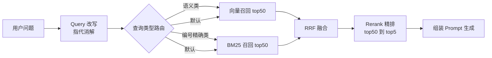
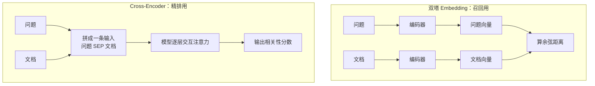

# 混合检索：BM25 + 向量 + RRF + Rerank

> "换个更好的 Embedding 模型"是最常见也最无效的优化动作。真正把召回率从 60% 拉到 90% 的，通常是加上关键词检索、把两路结果用 RRF 融合、再挂一层精排。这一篇讲这条链路上每个环节的选型和参数。

## 单路召回是怎么失败的

### 纯向量：搜不准编号和专有名词

用户问：

```txt
GJ-2023-017 号文件第四条是怎么规定的？
```

向量检索会把 `GJ-2023-017` 编码成一串"看起来像文件编号"的语义，于是召回 `GJ-2021-004`、`GJ-2023-019` 这些高度相似的段落，正确的那一条排在第 12 位。原因是 Embedding 表达的是**语义相近**，而编号之间的语义几乎完全相同，区别只在字符层面。

同类失败还有：人名、系统名、型号、错误码、金额、日期。凡是"改一个字符就是另一个东西"的内容，向量都不擅长。

### 纯 BM25：搜不到同义表达

用户问：

```txt
出差住宿能报多少？
```

文档原文写的是：

```txt
第十二条 差旅住宿费限额标准：一类城市每人每晚不超过 500 元……
```

分词后查询词是 `出差 / 住宿 / 报`，文档词是 `差旅 / 住宿费 / 限额 / 标准`。只有"住宿"这一个词部分命中，BM25 分数很低，可能根本进不了 top50。用户用的是口语，文档用的是书面语，字面不重合。

### 两路的能力边界

| 场景 | 向量检索 | BM25 |
|---|---|---|
| 同义、近义、口语化提问 | 强 | 弱 |
| 长句、需要理解意图 | 强 | 中 |
| 精确编号、型号、错误码 | 弱 | 强 |
| 专有名词、生僻词 | 弱（可能没在训练语料里） | 强 |
| 引号包裹的精确短语 | 无法保证 | 强 |
| 拼写变体、缩写 | 中 | 弱 |
| 冷启动、没有标注数据 | 直接可用 | 直接可用 |

**生产推荐：** 企业制度库、政策法规库这类既有大量编号又有大量口语提问的场景，混合检索不是优化项而是默认配置。单路方案唯一合理的场景是原型验证。

整条检索链路：



---

## 向量检索

### 相似度度量怎么选

| 度量 | 含义 | pgvector 运算符 | 需要归一化 | 什么时候用 |
|---|---|---|---|---|
| 余弦距离 | 只看方向，忽略长度 | `<=>` | 不必，运算符内部已除模长 | 文本检索默认选它 |
| 负内积 | 方向和长度都算 | `<#>` | 需要，向量已归一化时等价于余弦 | 模型输出已归一化，且想省一次除法 |
| 欧氏距离 | 空间直线距离 | `<->` | 需要 | 图像特征、坐标类向量 |
| 曼哈顿距离 | 各维绝对差之和 | `<+>` | 需要 | 稀疏、高维离散特征 |

**踩坑：** `<#>` 返回的是**负**内积，所以 `ORDER BY embedding <#> :q` 升序排出来才是最相似的；如果你按"分数越大越相似"的直觉写成 `DESC`，结果会完全反过来，而且不报错。

余弦距离转相似度：`similarity = 1 - distance`，取值 0～1，这个值才是能设阈值的东西。

```sql
SELECT id, raw_content,
       1 - (embedding <=> :query_vec) AS similarity   -- 转成 0~1 的相似度
FROM document_chunks
WHERE kb_id = ANY(:allowed_kb_ids) AND is_active
ORDER BY embedding <=> :query_vec                     -- 用距离排序，索引才生效
LIMIT 50;
```

::: warning ORDER BY 必须用距离表达式本身
写成 `ORDER BY similarity DESC` 时，PostgreSQL 排序的是计算后的列，向量索引用不上，直接退化成全表扫描。这是 pgvector 最常见的性能事故。
:::

### 索引：HNSW vs IVFFlat

| 维度 | HNSW | IVFFlat |
|---|---|---|
| 原理 | 多层邻居图，逐层跳转靠近 | 先聚类成若干簇，只搜最近的几个簇 |
| 构建时间 | 慢，百万级可达数十分钟 | 快，通常是 HNSW 的十分之一 |
| 内存占用 | 高，图结构常驻 | 低 |
| 查询速度 | 快且稳定 | 中等，簇不均时波动大 |
| 召回率 | 高，默认参数即可接受 | 需要调 `probes` 才追得上 |
| 增量写入 | 友好，插入即可用 | 不友好，数据分布变化后需重建 |
| 关键参数 | `m`、`ef_construction`、查询期 `ef_search` | `lists`、查询期 `probes` |

```sql
-- HNSW：m 是每个节点的邻居数，ef_construction 是建图时的候选集大小
CREATE INDEX idx_chunk_hnsw ON document_chunks
    USING hnsw (embedding vector_cosine_ops) WITH (m = 16, ef_construction = 64);

-- IVFFlat：lists 建议取 rows/1000（百万级以内）或 sqrt(rows)（更大规模）
CREATE INDEX idx_chunk_ivf ON document_chunks
    USING ivfflat (embedding vector_cosine_ops) WITH (lists = 200);
```

查询期参数是每个会话设置的，直接决定召回率与延迟的平衡：

```sql
SET LOCAL hnsw.ef_search = 100;    -- 默认 40。越大越准越慢，取值应 >= 目标 top_k
SET LOCAL ivfflat.probes = 10;     -- 默认 1，只搜一个簇，召回率会很难看
```

| 参数 | 调大的效果 | 建议起点 |
|---|---|---|
| `m` | 图更密，召回率升，索引体积和构建时间升 | 16，高维或高召回要求用 24～32 |
| `ef_construction` | 建图质量升，构建时间线性升 | 64，追求质量用 128～200 |
| `ef_search` | 召回率升，查询延迟升 | 至少等于 `top_k`，混合检索取 100 |
| `lists` | 簇更多，单簇更小更快，但召回更依赖 probes | 行数 / 1000 |
| `probes` | 召回率升，延迟线性升 | `sqrt(lists)` 起步 |

**生产推荐：** 十万到千万级 chunk、写入持续发生的知识库，用 HNSW，`m=16`、`ef_construction=64`、`ef_search=100`。IVFFlat 只在"内存紧张 + 数据一次性灌完 + 可接受召回折损"时选。

### 过滤条件与向量索引会互相拖累

这是 pgvector 上最隐蔽的一类问题。带上 `WHERE kb_id = 3 AND is_active` 之后，规划器有两种走法：

```txt
post-filter（先近似搜再过滤）：
  从 HNSW 索引里取出全局最近的 N 个 → 再筛掉不满足条件的
  → 结果可能只剩 3 条，甚至 0 条，但你要的是 50 条

pre-filter（先过滤再精确算距离）：
  按 kb_id 索引取出该库全部行 → 逐行算距离排序
  → 结果完全正确，但库里有 50 万行时就是一次全库暴力计算
```

**踩坑：** 过滤性很强的条件（比如只查一个小知识库）配 HNSW，很容易出现"明明有数据却召回不足"。表现是 `LIMIT 50` 只返回十几条。这不是数据问题，是索引扫描在过滤前就结束了。

四种解法，按推荐顺序：

| 方案 | 做法 | 代价 | 适用 |
|---|---|---|---|
| 迭代扫描 | pgvector 0.8+ 的 `hnsw.iterative_scan = relaxed_order`，索引扫描不够就继续扫 | 延迟略升 | **首选**，版本够就开 |
| 部分索引 | 高频过滤值单独建索引：`WHERE is_active` | 索引数量增加 | 过滤条件枚举值少且固定 |
| 表分区 | 按 `kb_id` 做 LIST/HASH 分区，每个分区独立向量索引 | 运维复杂度上升 | 知识库数量可控、单库数据量大 |
| 放大候选 | `ef_search` 调到 `top_k` 的 5～10 倍，靠冗余抵消过滤损耗 | 延迟上升，不保证一定够 | 兜底手段 |

```sql
-- 首选方案：开启迭代扫描后，过滤条件再严格也能取满 LIMIT
SET LOCAL hnsw.iterative_scan = relaxed_order;
SET LOCAL hnsw.max_scan_tuples = 20000;     -- 上限保护，防止极端情况扫太久

-- 备选方案：为常驻过滤条件建部分索引
CREATE INDEX idx_chunk_hnsw_active ON document_chunks
    USING hnsw (embedding vector_cosine_ops) WHERE is_active;
```

::: tip 换成专用向量库会怎样
Qdrant、Milvus 这类专用向量库把"带过滤的 ANN 检索"做在了引擎内部：它们在图上遍历时就检查 payload 条件，属于原生 pre-filter，不存在上面这个取不满的问题。代价是多一个需要独立运维、独立备份、独立扩容的组件，而且元数据和业务库分离，事务一致性要自己保证。**取舍标准：** chunk 量在千万级以内、团队已经在用 PostgreSQL，就留在 pgvector；上亿向量或需要多副本水平扩展，再上专用向量库。
:::

| 能力 | pgvector | Qdrant | Elasticsearch |
|---|---|---|---|
| 带条件的 ANN | 需调参或分区 | 原生 pre-filter | 原生，且能和 BM25 同引擎 |
| 与业务数据同事务 | 是，同一个库 | 否 | 否 |
| 关键词检索 | 有，但不是 BM25 | 有稀疏向量，中文需自备分词 | 最强，成熟的中文分词生态 |
| 运维成本 | 最低，复用现有 PG | 中 | 高，集群和 JVM 都要照看 |
| 单机可承载量级 | 千万级 chunk | 亿级 | 亿级 |

---

## 关键词检索

### BM25 的工程解释

BM25 给"查询词命中文档"这件事打分，三个直觉就够用：

```txt
1. 词越稀有越值钱          → IDF：全库都出现的"规定""管理"几乎不加分
2. 一个词命中越多次越好，但收益递减 → TF 饱和：出现 20 次和出现 5 次差别不大
3. 长文档天然更容易命中，要打折  → 长度归一化：否则最长的文档永远排第一
```

第二和第三点就是 BM25 相对 TF-IDF 的改良，对应两个参数：

| 参数 | 控制什么 | 默认 | 调整方向 |
|---|---|---|---|
| `k1` | 词频饱和的速度 | 1.2 | 短 chunk 场景可降到 0.8～1.0，避免重复词刷分 |
| `b` | 长度归一化强度，0 表示不归一化 | 0.75 | chunk 长度均匀时可降到 0.3～0.5 |

**为什么长度归一化对 RAG 很重要：** 切分后的 chunk 长度参差不齐，一个 1500 字的长 chunk 命中 5 个词，未必比一个 200 字的短 chunk 命中 3 个词更相关。不归一化的话，长 chunk 会霸占整个结果页。

### Elasticsearch 实现

```json
PUT /kb_chunks
{
  "settings": { "index": { "similarity": { "default": { "type": "BM25", "k1": 1.0, "b": 0.5 } } } },
  "mappings": {
    "properties": {
      "chunk_id":  { "type": "long" },
      "kb_id":     { "type": "long" },
      "is_active": { "type": "boolean" },
      "clause_no": { "type": "keyword" },
      "content": {
        "type": "text",
        "analyzer": "ik_max_word",          // 建索引用细粒度，切出更多词
        "search_analyzer": "ik_smart",      // 查询用粗粒度，避免过度切碎
        "fields": { "raw": { "type": "keyword" } }   // 精确短语匹配用
      }
    }
  }
}
```

```python
async def bm25_search(es, query: str, allowed_kb_ids: list[int], top_k: int = 50):
    body = {
        "size": top_k,
        "query": {
            "bool": {
                # filter 不参与打分，性能比 must 好，权限和状态都放这里
                "filter": [
                    {"terms": {"kb_id": allowed_kb_ids}},
                    {"term": {"is_active": True}},
                ],
                "should": [
                    {"match": {"content": {"query": query, "boost": 1.0}}},
                    # 精确短语额外加权，编号类查询靠这条命中
                    {"match_phrase": {"content": {"query": query, "boost": 2.0}}},
                ],
                "minimum_should_match": 1,
            }
        },
        "_source": ["chunk_id", "kb_id"],
    }
    resp = await es.search(index="kb_chunks", body=body)
    return [(h["_source"]["chunk_id"], h["_score"]) for h in resp["hits"]["hits"]]
```

**踩坑：** 中文分词器不认识业务词汇。`GJ-2023-017` 会被切成 `gj / 2023 / 017`，"事业部"可能被切成"事业 / 部"。必须维护自定义词典，把文件编号前缀、部门名、系统名、产品名加进去，并在文档入库和查询两侧都生效。词典更新后要重建索引，否则新词只在查询侧生效，命中不了旧数据。

### PostgreSQL 原生全文检索够用吗

如果不想引入 Elasticsearch，PostgreSQL 自带 `tsvector` 也能做关键词检索，但要清楚边界。

```sql
-- 中文需要额外分词扩展（zhparser / pg_bigm 一类），默认配置只按空格切
CREATE EXTENSION IF NOT EXISTS zhparser;
CREATE TEXT SEARCH CONFIGURATION chinese (PARSER = zhparser);
ALTER TEXT SEARCH CONFIGURATION chinese ADD MAPPING FOR n,v,a,i,e,l WITH simple;

-- 入库时生成检索列（可用生成列自动维护）
UPDATE document_chunks SET tsv = to_tsvector('chinese', raw_content) WHERE tsv IS NULL;

SELECT id, ts_rank(tsv, q) AS score
FROM document_chunks, to_tsquery('chinese', :query) q
WHERE kb_id = ANY(:allowed_kb_ids) AND is_active AND tsv @@ q
ORDER BY score DESC LIMIT 50;
```

| 能力 | PostgreSQL 全文检索 | Elasticsearch |
|---|---|---|
| 打分算法 | `ts_rank` 基于词频与位置，**不是 BM25** | 标准 BM25，参数可调 |
| 中文分词 | 依赖扩展，托管数据库常不允许安装 | ik 生态成熟，词典热更新 |
| 同义词、拼音、纠错 | 基本没有 | 内置分析器链 |
| 高亮 | `ts_headline`，能力较弱 | 强 |
| 与向量同库 JOIN | 天然同库，一条 SQL 搞定 | 需跨系统合并 |
| 运维成本 | 几乎为零 | 需要独立集群 |

**适用场景：** chunk 量在百万级以内、查询以"编号 + 短语精确匹配"为主、团队不想多运维一个集群，PostgreSQL 全文检索够用，而且能和向量检索写在同一条 SQL 里。对分词质量、同义词、纠错有要求时上 Elasticsearch。

::: details 同库两路的写法
两路都在 PostgreSQL 时可以用 CTE 一次查完，省一次网络往返：

```sql
WITH vec AS (
  SELECT id, row_number() OVER (ORDER BY embedding <=> :q_vec) AS rnk
  FROM document_chunks WHERE kb_id = ANY(:kbs) AND is_active
  ORDER BY embedding <=> :q_vec LIMIT 50
), kw AS (
  SELECT id, row_number() OVER (ORDER BY ts_rank(tsv, q) DESC) AS rnk
  FROM document_chunks, to_tsquery('chinese', :q_text) q
  WHERE kb_id = ANY(:kbs) AND is_active AND tsv @@ q LIMIT 50
)
SELECT COALESCE(v.id, k.id) AS id,
       1.0/(60 + COALESCE(v.rnk, 1000)) + 1.0/(60 + COALESCE(k.rnk, 1000)) AS rrf
FROM vec v FULL OUTER JOIN kw k ON v.id = k.id
ORDER BY rrf DESC LIMIT 20;      -- RRF 直接在 SQL 里算
```
:::

---

## 融合：为什么不能把两路分数直接相加

同一个问题，两路给出的分数长这样：

| chunk | 向量相似度 | BM25 分数 |
|---|---|---|
| A | 0.86 | 2.1 |
| B | 0.83 | 18.7 |
| C | 0.81 | 0（未命中） |

直接相加，B 的 18.7 会淹没一切，排序完全由 BM25 决定。两个问题叠在一起：

- **量纲不同**：余弦相似度有上界 1，实际有效区间常常只有 0.7～0.9；BM25 没有上界，取值可能是 2 也可能是 40。
- **分布不同**：BM25 分数依赖查询词的稀有度，问一个生僻编号可能得 30 分，问一句大白话可能只有 3 分。同一个阈值在不同查询上没有可比性。

先归一化再加权可以缓解，但归一化本身要选方法（min-max 受极值影响、z-score 需要分布假设），而且每加一路检索就要重新调权重。

### RRF：只看排名，不看分数

```txt
score(d) = Σ  1 / (k + rank_i(d))
          i∈各路检索

rank_i(d)：文档 d 在第 i 路结果中的排名，从 1 开始
k：常数，惯例取 60；文档没出现在某一路时，该项直接不计入
```

**k 取 60 的来由：** 这是 RRF 原始论文在信息检索基准上试出来的经验值，作用是压制头部排名的权重差。`k=0` 时第 1 名得 1.0、第 2 名得 0.5，差了一倍；`k=60` 时两者是 0.0164 和 0.0161，差距不到 2%。这意味着"能被某一路排进前列"比"具体排第几"更重要，正好契合两路各有盲区的现实。k 调小会更信任头部结果，调大会更平均。

用排名而不用分数带来三个好处：

| 好处 | 说明 |
|---|---|
| 免归一化 | 排名天然同量纲，加第三路（比如稀疏向量）不用重新调参 |
| 抗异常分 | 某一路给出离群高分时不会绑架整体排序 |
| 可解释 | 出问题时能直接说"它在向量路排第 3、关键词路没命中" |

```python
from dataclasses import dataclass, field


@dataclass
class Hit:
    chunk_id: int
    score: float = 0.0
    ranks: dict[str, int] = field(default_factory=dict)   # 每路排名，排障时非常有用


def rrf_fuse(
    channels: dict[str, list[int]],       # {"vector": [id, ...], "bm25": [id, ...]}，已按相关性排序
    weights: dict[str, float] | None = None,
    k: int = 60,
    top_k: int = 20,
) -> list[Hit]:
    """Reciprocal Rank Fusion。channels 的值是 chunk_id 列表，顺序即排名"""
    weights = weights or {}
    merged: dict[int, Hit] = {}

    for name, ids in channels.items():
        w = weights.get(name, 1.0)        # 需要偏向某一路时给权重，默认等权
        for rank, cid in enumerate(ids, start=1):
            hit = merged.setdefault(cid, Hit(chunk_id=cid))
            hit.score += w / (k + rank)   # 核心公式
            hit.ranks[name] = rank

    return sorted(merged.values(), key=lambda h: h.score, reverse=True)[:top_k]
```

对着前面的例子跑一遍：向量路顺序是 A、B、C，关键词路顺序是 B、A。

```txt
A: 1/(60+1) + 1/(60+2) = 0.01639 + 0.01613 = 0.03252
B: 1/(60+2) + 1/(60+1) = 0.01613 + 0.01639 = 0.03252
C: 1/(60+3)            = 0.01587
```

A 和 B 并列第一，C 因为只被一路召回而排在后面。**两路都认可的结果自动上浮**，这是 RRF 最有价值的性质。

### 和加权分数融合的对比

| 维度 | RRF | 加权归一化融合 |
|---|---|---|
| 需要归一化 | 不需要 | 需要，且要选方法 |
| 参数量 | 一个 k，几乎不用调 | 每路一个权重 + 归一化参数 |
| 新增一路检索 | 直接加进字典 | 全部权重重调 |
| 保留分数信息 | 丢失，只剩序 | 保留，能表达"好一点点" |
| 阈值可用性 | 融合分不能直接当置信度 | 可以设阈值 |
| 调优上限 | 略低 | 有标注数据时更高 |

**生产推荐：** 默认用 RRF，`k=60`，权重按查询类型微调（编号类给 BM25 加权到 1.5）。只有在你已经有几百条以上标注数据、能离线验证权重收益时，才考虑加权分数融合。

::: warning 融合分不能当置信度用
RRF 分数只表达相对顺序，`0.0325` 这个数字不代表"三成置信"。判断"要不要拒答"必须回看原始的向量相似度或精排分数，不能用 RRF 分数设阈值。这一点在[引用溯源与拒答](./rag-citation)里会展开。
:::

---

## Rerank 精排

### 双塔和 Cross-Encoder 的本质区别



区别只有一句话：**双塔的文档向量可以离线算好，Cross-Encoder 必须问题和文档一起过一遍模型。**

| 维度 | 双塔 Embedding | Cross-Encoder Rerank |
|---|---|---|
| 问题与文档是否交互 | 不交互，各自编码后比距离 | 每一层都交互 |
| 能否预计算 | 能，入库时算好 | 不能，每个候选都要现算 |
| 单次成本 | 一次向量比对，微秒级 | 一次模型前向，毫秒级 |
| 处理 50 个候选 | 索引一次查询，约 10ms | 50 次前向，约 100～400ms |
| 精度 | 中 | 高，能捕捉"否定""条件""主体"这类细节 |
| 适合位置 | 从百万里筛出几十个 | 从几十个里排出几个 |

Cross-Encoder 更准的原因很具体：双塔编码文档时并不知道用户会问什么，只能压出一个"平均语义"；而精排模型能看到问题和文档的逐词对应关系，所以能区分"差旅住宿标准"和"差旅住宿标准**不适用于**外派人员"这种关键差异。

### 漏斗设计与延迟预算

```txt
两路各召回 50  →  RRF 融合去重后约 60～80  →  截断到 30 送精排  →  取 top5 进 Prompt
```

| 环节 | 典型耗时 | 说明 |
|---|---|---|
| Query 改写（小模型或规则） | 0～300ms | 走规则则接近 0 |
| Embedding 查询向量 | 20～80ms | 一次 API 调用，可缓存热门查询 |
| 向量召回 top50 | 10～30ms | HNSW，`ef_search=100` |
| BM25 召回 top50 | 10～40ms | 与向量并发执行，不叠加 |
| RRF 融合 | < 1ms | 纯内存排序 |
| Rerank 30 条 | 100～400ms | 最大的一块，取决于部署方式 |
| 首 token 生成 | 300～1500ms | 与检索无关但共享用户耐心 |

**生产推荐：** 检索环节整体预算控制在 600ms 以内，其中精排不超过 300ms。做法是并发跑两路、精排候选数压到 20～30、精排服务和应用同机房部署。

### 方案选型

| 方案 | 延迟（30 候选） | 成本 | 数据出域 | 适用 |
|---|---|---|---|---|
| 开源 Reranker（bge-reranker 一类）+ GPU | 60～150ms | 一张卡的固定成本 | 不出域 | 政务、内网，量大 |
| 同上，纯 CPU 部署 | 400ms～2s | 低 | 不出域 | 低并发内部工具 |
| 商业 Rerank API | 100～300ms | 按次计费 | 出域 | 公网产品，量不大 |
| 让大模型当排序器 | 1～3s | 最贵 | 视模型 | 离线评测、构造训练数据 |
| 不上精排，靠 RRF | 0 | 0 | — | 见下 |

```python
import asyncio
from FlagEmbedding import FlagReranker

# 本地部署：进程启动时加载一次，不要每次请求都 new
_reranker = FlagReranker("BAAI/bge-reranker-v2-m3", use_fp16=True)


async def rerank(query: str, candidates: list[dict], top_n: int = 5) -> list[dict]:
    """candidates 每项含 chunk_id 与 content。返回按精排分降序的 top_n"""
    if len(candidates) <= 1:
        return candidates
    pairs = [[query, c["content"]] for c in candidates]
    # 同步模型放线程池，别阻塞事件循环
    scores = await asyncio.to_thread(_reranker.compute_score, pairs, normalize=True)
    for c, s in zip(candidates, scores):
        c["rerank_score"] = float(s)      # 保留分数，拒答判定要用它
    return sorted(candidates, key=lambda c: c["rerank_score"], reverse=True)[:top_n]
```

**适用场景：** 什么时候可以不上精排——单知识库且文档量小于几千 chunk、查询模式高度固定（比如只查编号）、对延迟极敏感的场景（语音交互），或者 RRF 后 top3 的正确率已经达标。判断依据是评测数据，不是感觉：如果 `hit@3` 和 `hit@10` 差距很小，说明召回排序已经够好，精排收益有限。

**踩坑：** 精排模型也有输入长度上限（常见 512 token）。超长 chunk 会被截断，截掉的正好可能是答案所在的后半段。做法是精排时只送 chunk 的前 400 字，或者对长 chunk 做滑窗取最高分。

---

## Query 侧优化

检索质量的另一半在输入侧。用户的原始问题往往不适合直接拿去检索。

| 手段 | 解决什么 | 代价 | 建议 |
|---|---|---|---|
| Query Rewrite | 口语、错别字、省略 | 一次小模型调用，200～500ms | 常开，可用小模型 |
| 指代消解 | 多轮对话里的"它""这个" | 同上，可与改写合并 | 多轮场景必做 |
| Multi-Query | 单一表述覆盖不全 | N 倍检索开销 | 复杂问题按需触发 |
| HyDE | 问题和文档表述差异大 | 一次生成调用，较贵 | 专业领域、问题很短时有效 |
| 查询类型路由 | 不同问题该走不同策略 | 几乎为零（规则） | **性价比最高，优先做** |

### 改写与指代消解

多轮对话里最典型的失败：

```txt
用户：差旅住宿费标准是多少？
助手：一类城市每人每晚不超过 500 元……
用户：它的报销流程呢？          ← 直接拿这句去检索，"它"没有任何检索价值
```

必须先把上文补进查询：

```python
REWRITE_PROMPT = """把用户的最新问题改写成一句可独立检索的查询。
规则：
1. 用上文补全代词和省略的主语，不要引入上文没有的信息。
2. 保留原文中的编号、专有名词、数字，一个字符都不要改。
3. 去掉寒暄和语气词，只输出改写后的查询，不要解释。

对话历史：
{history}
最新问题：{question}
改写结果："""


async def rewrite_query(history: list[dict], question: str) -> str:
    # 单轮且不含代词时直接跳过，省一次调用
    if not history and not any(p in question for p in ("它", "这个", "那个", "他们", "此")):
        return question
    text = "\n".join(f"{m['role']}: {m['content']}" for m in history[-4:])   # 只取最近两轮
    try:
        out = await small_llm.ainvoke(REWRITE_PROMPT.format(history=text, question=question))
        new_q = out.content.strip()
        # 防御：改写结果过短或过长都不可信，回退原问题
        return new_q if 2 <= len(new_q) <= 200 else question
    except Exception:
        return question       # 改写是增强项，失败绝不能阻断检索
```

**踩坑：** 改写模型很爱"顺手改错"用户的编号，把 `GJ-2023-017` 写成 `GJ2023017`。所以 Prompt 里要显式要求保留原字符，并且在代码里做一次校验：原问题中的数字与编号串必须仍然出现在改写结果中，否则丢弃改写结果。

### 按查询类型路由

不同问题该走不同策略，这个判断用规则就能做得很好，不必上模型。

```python
import re

CODE_RE = re.compile(r"[A-Za-z]{2,}[-_]?\d{2,}|第[一二三四五六七八九十百\d]+条|\d{4}年\d+号")
POLICY_WORDS = ("规定", "办法", "条例", "制度", "标准", "细则", "通知")


def route_query(question: str) -> dict:
    """返回检索策略：两路权重、是否精排、过滤条件"""
    if CODE_RE.search(question):
        # 精确编号类：关键词路加权，且必须开启精确短语匹配
        return {"weights": {"bm25": 1.6, "vector": 1.0}, "phrase_boost": True,
                "rerank": True, "top_k": 30}
    if len(question) <= 6:
        # 极短查询语义信息不足，靠关键词更稳
        return {"weights": {"bm25": 1.3, "vector": 1.0}, "rerank": True, "top_k": 50}
    if any(w in question for w in POLICY_WORDS):
        # 政策类：语义为主，并强制过滤失效文件
        return {"weights": {"bm25": 1.0, "vector": 1.2}, "require_effective": True,
                "rerank": True, "top_k": 50}
    return {"weights": {"bm25": 1.0, "vector": 1.0}, "rerank": True, "top_k": 50}
```

### Multi-Query 与 HyDE

- **Multi-Query**：让模型把一个问题拆成 2～3 个检索式，分别检索后取并集再融合。适合"报销和审批分别怎么做"这类复合问题。代价是检索次数翻倍，所以要设触发条件（问题里含"和""以及""分别"，或长度超过 30 字），并且**原问题本身一定要保留在检索式列表里**——它通常是最可靠的那一个。
- **HyDE**：先让模型凭自身知识"假装"写一段答案，再拿这段假答案去做向量检索。原理是让查询和文档在同一种文体上对齐——用户问"能报多少"，假答案会写成"住宿费限额为……元"，与制度原文的表述更接近。**适用场景：** 问题极短、领域文体固定；**不适用：** 模型对该领域一无所知时，假答案会把检索带向完全错误的方向。

---

## 完整实现：并发两路 + 融合 + 精排

关键点全在容错上：两路并发、各自超时、单路失败降级为单路可用、精排失败退回融合结果。

```python
import asyncio
import logging

log = logging.getLogger(__name__)
VECTOR_TIMEOUT = 1.5      # 秒
BM25_TIMEOUT = 1.0
RERANK_TIMEOUT = 1.0


async def hybrid_search(
    session, es, user, question: str, history: list[dict] | None = None, top_n: int = 5,
) -> dict:
    allowed = await resolve_allowed_kbs(session, user)     # 权限下推，见 ./rag-pipeline
    if not allowed:
        return {"hits": [], "reason": "no_permission"}

    query = await rewrite_query(history or [], question)   # 改写与指代消解
    plan = route_query(query)                              # 策略路由

    async def run_vector() -> list[int]:
        vec = await embed_query(query)                     # 查询向量，可加缓存
        rows = await vector_search(session, vec, allowed, plan["top_k"],
                                   require_effective=plan.get("require_effective", False))
        return [r.chunk_id for r in rows]

    async def run_bm25() -> list[int]:
        return [cid for cid, _ in await bm25_search(es, query, allowed, plan["top_k"])]

    # 两路并发，return_exceptions 保证一路挂了另一路仍然返回
    vec_res, kw_res = await asyncio.gather(
        asyncio.wait_for(run_vector(), VECTOR_TIMEOUT),
        asyncio.wait_for(run_bm25(), BM25_TIMEOUT),
        return_exceptions=True,
    )
```

```python
    channels: dict[str, list[int]] = {}
    degraded: list[str] = []

    if isinstance(vec_res, Exception):
        degraded.append("vector")
        log.warning("向量路失败，降级为纯关键词: %s", vec_res)
    else:
        channels["vector"] = vec_res

    if isinstance(kw_res, Exception):
        degraded.append("bm25")
        log.warning("关键词路失败，降级为纯向量: %s", kw_res)
    else:
        channels["bm25"] = kw_res

    if not channels:
        return {"hits": [], "reason": "all_channels_failed", "degraded": degraded}

    fused = rrf_fuse(channels, weights=plan["weights"], top_k=30)
    rows = await load_chunks(session, [h.chunk_id for h in fused])   # 一次性回表取正文
    by_id = {r["chunk_id"]: r for r in rows}
    candidates = [{**by_id[h.chunk_id], "rrf_score": h.score, "ranks": h.ranks}
                  for h in fused if h.chunk_id in by_id]

    if plan["rerank"] and len(candidates) > top_n:
        try:
            candidates = await asyncio.wait_for(rerank(query, candidates, top_n), RERANK_TIMEOUT)
        except Exception as e:
            degraded.append("rerank")
            log.warning("精排失败，退回 RRF 顺序: %s", e)
            candidates = candidates[:top_n]      # 降级不等于报错，融合顺序仍然可用
    else:
        candidates = candidates[:top_n]

    return {"hits": candidates, "query": query, "rewritten": query != question,
            "degraded": degraded, "plan": plan}
```

::: warning 单路降级要记录、要告警，但不要对用户报错
关键词路挂了，检索质量下降但仍然可用；两路都挂了才是故障。把 `degraded` 字段一路带到日志和响应里，运维能看到降级率，也方便事后解释"那天为什么答得不准"。降级到什么程度该拒答，见[拒答与降级](./rag-citation)。
:::

---

## 调参与效果归因

召回率上不去时，按顺序逐层排除，不要在最后一层反复调 Prompt。

| 层 | 检查方法 | 典型症状与对策 |
|---|---|---|
| 1 切分 | 用问题的标准答案去全库精确匹配，看它落在哪个 chunk | 答案横跨两个 chunk → 加大 chunk 或改结构切分。见 [./rag-pipeline](./rag-pipeline) |
| 2 单路召回 | 分别看向量路和关键词路的 `hit@50` | 向量路差 → 换模型或补标题前缀；关键词路差 → 查分词与自定义词典 |
| 3 融合 | 看正确 chunk 在两路各自的排名 | 一路排 3 一路没命中，融合后却掉出 top10 → 检查权重是否设反 |
| 4 精排 | 对比精排前后的 `hit@5` | 精排后反而变差 → 候选被截断、或模型不适配中文领域 |
| 5 生成 | 把正确证据手工塞进 Prompt 再问一次 | 塞对了还答错 → 是生成或 Prompt 问题，与检索无关 |

第 5 步是最有价值的一次实验：它能一刀切开"检索没找到"和"找到了但没用好"这两类完全不同的问题。

常用的四个指标，都要按 `k` 分开看：

| 指标 | 定义 | 用来判断 |
|---|---|---|
| `recall@k` | 前 k 条里包含正确证据的比例 | 召回层够不够 |
| `hit@k` | 至少命中一条正确证据的查询占比 | 用户视角的可用性 |
| `MRR` | 第一条正确证据排名的倒数均值 | 排序质量 |
| `nDCG@k` | 带位置折损的相关性累积 | 多条证据都重要时 |

**生产推荐：** 先固定一套 50～100 条的评测集（真实用户问题 + 人工标注的正确 chunk id），每次调参都跑一遍，只认数字不认感觉。评测集怎么建、指标怎么落地，见[效果评测](./agent-eval)。

::: details 一个高频误区：召回数量越多越好
把 `top_k` 从 50 提到 200，`recall@200` 当然更高，但送进精排的候选变多、延迟上升，而且精排模型本身也会犯错，噪声候选变多会挤掉正确答案。实践中 `top_k=50`、精排候选 20～30、最终 top5 是一个稳定的组合。
:::

---

## 面试高频问题

### 1. 为什么要做混合检索，只用向量不行吗？

- 向量检索的失效点很明确：编号、型号、错误码、生僻专有名词，这类内容"改一个字符就是另一个东西"，而语义几乎相同。
- BM25 的失效点是同义表达：用户说"出差住宿能报多少"，文档写"差旅住宿费限额标准"，字面几乎不重合。
- 两者的错误不相关，这是混合的价值来源——一路的盲区是另一路的强项。
- 成本很低：两路可以并发，延迟不叠加；PostgreSQL 场景还能一条 SQL 查完。
- 举例说明比讲原理有效，面试时直接给上面两个具体查询。

### 2. RRF 是什么，为什么不直接把分数加起来？

- 直接相加的两个硬伤：量纲不同（余弦有上界、BM25 无上界）、分布随查询漂移（生僻词查询天然高分）。
- RRF 只用排名：`score = Σ 1/(k + rank)`，某一路没命中就不计入该项。
- `k=60` 是经验值，作用是压平头部名次的权重差，让"被某一路排进前列"比"具体第几名"更重要。
- 好处：免归一化、抗离群分、加第三路检索不用重调参数、可解释性好。
- 必须补一句：RRF 分数不能当置信度，拒答阈值要回看原始相似度或精排分。

### 3. Rerank 为什么比 Embedding 准，代价是什么？

- 双塔 Embedding 分别编码问题和文档，文档向量可离线预计算，但编码文档时并不知道会被问什么，只能压出平均语义。
- Cross-Encoder 把问题和文档拼成一条输入，逐层交互注意力，能捕捉否定、条件、主体这类细节差异。
- 代价是无法预计算：N 个候选就要 N 次前向，30 条约 100～400ms，所以只能放在漏斗末端。
- 漏斗：两路各 50 → 融合去重 → 截到 20～30 → 精排出 top5。
- 可以不上精排的情况：库很小、查询模式固定、延迟极敏感，或评测显示 `hit@3` 与 `hit@10` 差距很小。
- 别忘了精排模型也有输入上限，长 chunk 要截断或滑窗。

### 4. HNSW 和 IVFFlat 怎么选，参数怎么调？

- HNSW 是邻居图，构建慢、内存高，但查询快且召回稳，支持增量写入；IVFFlat 是聚类倒排，构建快内存低，但召回依赖 `probes`，数据分布变化后要重建。
- 有持续写入的知识库一律选 HNSW。
- 参数：`m=16`、`ef_construction=64` 建索引；查询期 `ef_search` 至少等于 `top_k`，混合检索取 100。
- IVFFlat 的 `lists` 取行数除以 1000，`probes` 从 `sqrt(lists)` 起步。
- 补一个易错点：`ORDER BY` 必须写距离表达式，写成 `ORDER BY (1 - distance) DESC` 会让索引失效。

### 5. 加了元数据过滤条件后，向量召回变少了，为什么？

- 这是 ANN 索引的 post-filter 现象：索引先取全局最近的 N 个，再用 `WHERE` 筛，过滤性强时剩不下几条，`LIMIT 50` 只返回十几条。
- 反过来走 pre-filter 则可能退化成对整个子集暴力算距离，正确但慢。
- 解法按优先级：开启 pgvector 的迭代扫描、为常驻条件建部分索引、按 `kb_id` 分区、放大 `ef_search` 兜底。
- 专用向量库在图遍历时就检查 payload，属于原生 pre-filter，没有这个问题，代价是多一个组件和跨库一致性。
- 权限过滤必须留在 SQL 里，不能因为这个问题改成"查完再过滤"——那会引入更严重的召回污染和数据泄露。

### 6. 多轮对话里检索不准，怎么办？

- 根因是最后一句话往往不含检索信息量，"它的报销流程呢"里没有主语。
- 做指代消解与查询改写：用最近两轮历史补全主语，只输出可独立检索的查询。
- 改写必须加两条防御：Prompt 里要求原样保留编号与数字，代码里校验编号仍然存在，否则丢弃改写结果。
- 改写失败、超时都要回退原问题，它是增强项而不是必经环节。
- 单轮且不含代词的问题跳过改写，省一次调用和几百毫秒。

### 7. 召回率上不去，你怎么定位？

- 按"切分 → 单路召回 → 融合 → 精排 → 生成"逐层查，每层都有独立的检查手段。
- 先做最关键的一次实验：把正确证据手工塞进 Prompt 再问一次。答对了说明是检索问题，还答错说明是生成或 Prompt 问题。
- 切分层：用标准答案全库精确匹配，看它是否横跨多个 chunk。
- 单路层：分别统计两路的 `hit@50`，向量差就换模型或补标题前缀，关键词差就查分词词典。
- 融合层：看正确 chunk 在各路的排名，确认权重方向没设反。
- 所有结论都建立在固定评测集上，指标看 `recall@k`、`hit@k`、`MRR`、`nDCG@k`。

---

## 接下来读什么

- [RAG 入库链路](./rag-pipeline)：切分、元数据和权限下推决定了本文能检索到什么。
- [引用溯源、拒答与降级](./rag-citation)：检索结果怎么变成可核对的答案，以及什么时候该拒答。
- [效果评测](./agent-eval)：本文所有参数最终都要靠评测集定。
- [Redis 深入](./redis-deep)：查询向量与热门问题结果的缓存策略。
- [Text2SQL](./agent-text2sql)：结构化数据的问答走的是另一条路，和文档检索互补。


