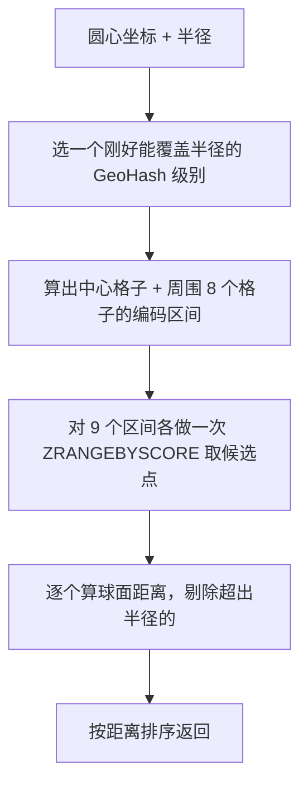

# Redis 实战：五个业务场景

> [Redis 深入](/guide/redis-deep) 讲的是「Redis 有什么」：五种数据结构、过期与淘汰策略、缓存穿透雪崩击穿那一套。这篇讲「拿它解决什么」——计数限流、关注关系、排行榜、附近的门店、分布式锁，以及每个方案在数据量涨上来之后会先崩在哪里。

## Node 侧怎么接

三条路，能力差得很远：

| 方案 | 能做什么 | 适合 |
|---|---|---|
| `ioredis` | 全部命令、Pipeline、Lua、Cluster / Sentinel、`defineCommand` 把脚本封成方法 | 业务要用 ZSET / GEO / Lua，也就是这篇讲的全部场景 |
| `node-redis` | 全部命令。官方维护，新协议跟进快，API 是 camelCase + 参数对象，要显式 `await connect()` | 想用官方包的项目 |
| `@nestjs/cache-manager` | 只有 `get` / `set` / `del` / `wrap`，外加一个 `CacheInterceptor` | 纯粹给接口响应做键值缓存 |

前两个选哪个都行，**但一个项目只选一个**，两套客户端并存等于两套连接池、两套重连策略、两份类型定义。ioredis 的迭代比早年慢，胜在 Cluster 支持和 Lua 封装最成熟；node-redis 是官方在维护的那个。下面统一用 ioredis。

### cache-manager 的天花板在哪

`@nestjs/cache-manager` 是**缓存抽象层**，不是 Redis 客户端。它的目标是让你在「内存缓存」和「Redis 缓存」之间无痛切换，所以接口收窄到了两种存储的公共部分——只有键值读写和过期时间。代价是：

| 用不了的东西 | 后果 |
|---|---|
| ZSET / SET / HASH / GEO | 排行榜、关注关系、附近搜索一个都做不了 |
| Lua 脚本 | 「读-判断-写」的原子操作做不了，限流和锁都不安全 |
| Pipeline / MULTI、`SCAN` / `TTL` 等运维命令 | 批量只能一条条发；线上排查时抓不到手 |

它自带的 `CacheInterceptor` 按请求 URL 缓存返回值，看着方便，但真实接口的缓存 key 还要带上用户身份、租户、语言，粒度控制不住就会串号——自己写一个 Interceptor 拼 key 也就二十行（见 [Interceptor 与 RxJS](/guide/nestjs-rxjs-interceptor)）。

> **判断标准一句话：只要业务超出「按 key 存取一段 JSON」，就直接用 ioredis。**

---

## 把 Redis 客户端做成 Provider

连接是昂贵的共享资源，全应用只该有一个实例，天生属于 `forRoot` 那一类：

```typescript
export const REDIS_CLIENT = Symbol('REDIS_CLIENT')

@Global()
@Module({
  providers: [{
    provide: REDIS_CLIENT,
    inject: [ConfigService],
    useFactory: (config: ConfigService) => {
      const client = new Redis({
        host: config.getOrThrow<string>('REDIS_HOST'),
        port: config.get<number>('REDIS_PORT', 6379),
        db: config.get<number>('REDIS_DB', 0),
        keyPrefix: config.get<string>('REDIS_PREFIX', ''),  // 多环境共用实例时的隔离手段
        maxRetriesPerRequest: 3,        // 默认 20，会让故障期间的请求堆着不返回
      })
      client.on('error', (err) => Logger.error(`Redis: ${err.message}`, 'RedisModule'))
      return client
    },
  }],
  exports: [REDIS_CLIENT],
})
export class RedisModule implements OnApplicationShutdown {
  constructor(@Inject(REDIS_CLIENT) private readonly client: Redis) {}

  async onApplicationShutdown() {
    await this.client.quit()      // 等在途命令回来再断开，比 disconnect() 干净
  }
}
```

| 决定 | 理由 |
|---|---|
| token 用 `Symbol` 不用裸字符串 | 字符串会和第三方库撞名且静默覆盖，见 [依赖注入](/guide/nestjs-di) |
| 加 `@Global()` | Redis 是横切基础设施、全应用唯一。业务模块不要这么干 |
| 实现 `onApplicationShutdown` | 不关连接会在服务端留下一批半死连接。别忘了 `app.enableShutdownHooks()` |
| `db` 只在单机有效 | Cluster 只有 db 0，隔离靠 `keyPrefix` 或独立实例 |

要让调用方自己传配置（一个连缓存、一个连消息队列），写成 `forRootAsync`，见 [动态模块与配置管理](/guide/nestjs-dynamic-module)。

> ⚠️ 不要在 Service 里 `new Redis()`。每个实例一个连接，请求级创建会在几分钟内打满服务端 `maxclients`。

再往上包一层通用 `RedisService` 是可选的：包薄了只是转发，包厚了等于自己维护一份客户端 API。更实用的是**按业务包**——`RateLimitService`、`RankingService`、`LockService` 各自注入客户端，对外只暴露业务语义的方法。下面五个场景都这么组织。

---

## 场景一：计数器与限流

### INCR 为什么天然并发安全

Redis 执行命令是单线程的，一条命令的「读取旧值 → 加一 → 写回」在服务端不可分割，不存在两个客户端同时读到 `100` 然后都写 `101` 的问题。这正是应用层做不到的事：Node 里 `count++` 跨越 `await` 就可能被别的请求插进来。

```typescript
const views = await redis.incr(`article:${id}:views`)   // 返回自增后的新值
await redis.incrby(`user:${uid}:credit`, 5)             // 加指定值
await redis.hincrby(`article:${id}:stat`, 'likes', 1)   // 一篇文章多个计数放一个 HASH，省 key
```

### INCR + EXPIRE 之间的那道缝

计数器几乎都要过期（每分钟限流、每天签到），于是就有了这段随处可见的代码：

```typescript
const count = await redis.incr(key)
if (count === 1) await redis.expire(key, 60)   // 第一次创建时才设过期
```

**两条命令之间进程挂掉，这个 key 就永不过期。** `INCR` 已经把 key 建出来了，`EXPIRE` 没发出去，之后它永远 `TTL = -1`：限流计数只增不减，这个用户从此被永久封禁；如果 key 里带了用户 ID，还会随用户数无限堆积成内存泄漏。发布重启、OOM、连接超时都会踩到，概率不高但每次都是脏数据。

三种解法：

| 解法 | 写法 | 代价 |
|---|---|---|
| 先占位 | `SET key 0 NX EX 60` 再 `INCR` | 两次往返；但 `SET NX EX` 本身原子，崩在中间只是留下一个带 TTL 的 0，会自然过期 |
| Lua 脚本 | 自增和续期在一个脚本里 | 一次往返、真原子，**推荐** |
| 判断返回值 | 上面那段代码 | 零成本，但保留了那道缝 |

Lua 版本，一次往返搞定：

```typescript
// 返回自增后的值；只在 key 刚创建时设 TTL，不覆盖已有的过期时间
const INCR_WITH_TTL = `
  local n = redis.call('INCR', KEYS[1])
  if n == 1 then redis.call('EXPIRE', KEYS[1], ARGV[1]) end
  return n
`
redis.defineCommand('incrWithTtl', { numberOfKeys: 1, lua: INCR_WITH_TTL })
const count = await (redis as any).incrWithTtl(key, 60)
```

`defineCommand` 会自动走 `EVALSHA` 缓存脚本，只在服务端没有脚本时才回退到 `EVAL` 传全文，比每次 `eval` 一大段字符串省带宽。Lua 脚本在 Redis 里是原子的，执行期间不会有其他命令插进来——代价是**脚本必须短**，里面写循环遍历十万个成员会把整个实例卡住。

### 固定窗口 vs 滑动窗口

固定窗口就是把时间戳切片写进 key：

```typescript
const key = `rate:${uid}:${Math.floor(Date.now() / 60_000)}`   // 每分钟一个 key
const count = await incrWithTtl(key, 120)                       // TTL 略大于窗口
if (count > 100) throw new HttpException('请求过于频繁', 429)
```

便宜、内存占用固定（一个用户一个 key、一个整数），但有**边界突刺**：限流 100 次/分钟，用户在 12:00:59 打 100 次、12:01:00 又打 100 次，跨过窗口边界的这 1 秒里实际通过了 200 次，是配额的两倍。对下游的保护在最坏情况下失效一半。

滑动窗口把每次请求的时间戳存进 ZSET，判断的是「最近 60 秒内」而不是「本分钟内」。「删旧 → 计数 → 判断 → 写入」四步必须原子，否则并发下所有人都读到未超限：

```typescript
const SLIDING_WINDOW = `
  local now = tonumber(ARGV[1])
  redis.call('ZREMRANGEBYSCORE', KEYS[1], 0, now - tonumber(ARGV[2]))   -- 清掉窗口外的
  if redis.call('ZCARD', KEYS[1]) >= tonumber(ARGV[3]) then return 0 end
  redis.call('ZADD', KEYS[1], now, ARGV[4])
  redis.call('PEXPIRE', KEYS[1], ARGV[2])
  return 1
`
redis.defineCommand('slidingWindow', { numberOfKeys: 1, lua: SLIDING_WINDOW })

/** 窗口 windowMs 毫秒内最多 limit 次 */
async allow(scope: string, limit: number, windowMs: number): Promise<boolean> {
  const now = Date.now()
  const member = `${now}-${randomUUID()}`     // 同毫秒的并发请求不能互相覆盖
  return await (this.redis as any).slidingWindow(
    `rate:sliding:${scope}`, now, windowMs, limit, member,
  ) === 1
}
```

两个容易写错的点：

- **时间戳从客户端传进去，不要在脚本里调 `TIME`。** 一是保证主从复制和 AOF 重放的结果一致，二是多个应用实例用同一套时钟口径（真要防时钟漂移就上 NTP）。
- **member 必须唯一。** 直接用 `now` 做 member，同一毫秒的两个请求会被 ZSET 当成同一个成员覆盖掉，配额白送一次。

滑动窗口的代价是**内存跟请求量成正比**：限流 1000 次/分钟意味着峰值时每个用户的 ZSET 里躺着 1000 个成员。用户量大时只给核心接口开。

| 算法 | 内存 | 边界突刺 | 允许突发 |
|---|---|---|---|
| 固定窗口 | 一个整数 | 有，最坏 2 倍 | 窗口内可以瞬间用完 |
| 滑动窗口 | 与 limit 成正比 | 无 | 窗口内可以瞬间用完 |
| 令牌桶 | 两个字段 | 无 | 由桶容量精确控制 |

令牌桶用一个 HASH 存「剩余令牌数 + 上次补充时间」，取令牌时按经过的时间懒补充，同样要 Lua 保证原子——它比滑动窗口更省内存，而且能用「桶容量」显式表达「允许多大突发」，代价是多两个可调参数。做网关级限流优先考虑它，做业务接口限流滑动窗口够用。

---

## 场景二：关注关系

### 为什么要存两份

一个用户的关注关系有两个查询方向，`SET` 只能满足一个：

```bash
SADD following:1001 2002 2003      # 我关注的人
SADD followers:2002 1001           # 关注我的人（反向索引）
```

「我关注了谁」和「谁关注了我」都是首页必查的接口，都要 O(1) 判断、O(N) 取列表。只存 `following` 的话，查粉丝列表就得扫全库所有用户的 following 集合——这是**空间换时间**，跟前端为了避免每次 `array.find` 而额外维护一个 `byId` 映射是同一个动作。

有了这两个集合，高频需求都是单命令：`SISMEMBER following:1001 2002` 判断是否已关注（渲染关注按钮），`SCARD` 取关注数和粉丝数，`SINTER following:1001 followers:1001` 是互相关注（我关注的 ∩ 关注我的），`SINTER following:1001 following:2002` 是共同关注（两人 following 的交集）。

> `SINTER` 的复杂度是 O(N×M)，N 是最小集合的大小。拿大 V 的集合去求交集会阻塞实例，**参数里至少有一方是普通用户时才直接算**；两个大集合只要数量就用 `SINTERCARD`，要列表就走离线计算。

### 写入必须两个集合一起改

关注这个动作要同时写 `following:A` 和 `followers:B`。只成功一半就是数据不一致：A 的关注列表里有 B，B 的粉丝列表里没有 A。

```typescript
// MULTI：两条命令打包发送，服务端连续执行，中间不会插进别的命令
await this.redis.multi()
  .sadd(`following:${me}`, target)
  .sadd(`followers:${target}`, me)
  .exec()
```

需要「先判断再写」（比如已关注就不重复计数）就得换 Lua，因为 `MULTI` 里拿不到中间结果做分支：

```typescript
const FOLLOW = `
  if redis.call('SISMEMBER', KEYS[1], ARGV[2]) == 1 then return 0 end
  redis.call('SADD', KEYS[1], ARGV[2])
  redis.call('SADD', KEYS[2], ARGV[1])
  return 1
`
// KEYS[1]=following:me  KEYS[2]=followers:target  ARGV[1]=me  ARGV[2]=target
```

> ⚠️ **Cluster 模式下这两句都会报 `CROSSSLOT`。** `following:1001` 和 `followers:2002` 按 key 算槽位，必然落在不同节点，而 `MULTI` 和 Lua 都要求所有 key 在同一个槽。hash tag 也救不了——两个 key 天生属于两个用户。集群下的现实做法是：拆成两次独立写入，失败的那次进重试队列，再配一个对账任务定期用 MySQL 的关系表校正 Redis。这也是下面那条纪律的由来。

### 数据量大了会崩在哪：big key

一个大 V 有一千万粉丝，`followers:{大V}` 就是一个装着一千万成员的 SET。这类 key 叫 **big key**，危害是四方面的：

| 危害 | 机制 |
|---|---|
| 阻塞整个实例 | Redis 单线程。`SMEMBERS` 一次序列化一千万个成员，几百毫秒内所有客户端都在排队 |
| 网络打满 | 一次响应几百 MB，把带宽和客户端内存一起吃掉 |
| 删除也阻塞 | `DEL` 大 key 要同步释放全部内存，用 `UNLINK` 交给后台线程 |
| 迁移困难 | Cluster 扩缩容按 key 迁移，单个 key 不可拆分，迁移期间源节点阻塞 |

两个应对方向：**分片**成 `followers:{uid}:{n}`，按 `crc32(memberId) % 64` 决定成员进哪一片，判断是否关注只查对应那一片、取粉丝数就是 64 片的 `SCARD` 之和（Pipeline 一次发完），代价是所有集合运算都得自己在应用层合并；或者**只存热数据**——粉丝列表本来就是分页展示的，没有任何接口需要「一次拿到一千万个粉丝」，把它交给 MySQL 分页查询，Redis 只留最近 N 个粉丝和计数。

### 一条纪律：关系的真源在 MySQL

关注关系是**要审计、要恢复、要参与联表查询**的业务数据，真源必须是 MySQL 的 `user_follows(follower_id, followee_id)` 表，唯一索引建在 `(follower_id, followee_id)` 上防重复关注（为什么不靠代码判重，见 [MySQL 表结构设计](/guide/mysql-table-design)）。Redis 在这里只有两个角色：**加速判断**（是否已关注、关注数）和**加速集合运算**（互相关注、共同关注）。落地成三条规则：

```txt
1. 写：先写 MySQL 事务，成功后再更新 Redis。Redis 更新失败只记日志，不回滚业务
2. 读：Redis 里没有这个 key，就回源 MySQL 重建后再写回（关系版的 Cache Aside）
3. 计数：展示用的粉丝数从 Redis 取，涉及金额、评级、结算的场景一律 COUNT MySQL
```

第 2 条要注意判空：`EXISTS followers:1001` 返回 0 有两种含义——「还没缓存」和「真的没有粉丝」。分不清就会让零粉丝用户每次请求都回源。加一个 `followers:1001:loaded` 标记位，或者约定集合里始终塞一个哨兵成员。

---

## 场景三：排行榜

排行榜是 ZSET 的主场。数据库加一个 `hot_score` 字段然后 `ORDER BY` 也能做，但热度是每秒都在变的临时数据，写 MySQL 意味着高频更新同一行、行锁争抢、索引页频繁分裂——用 Redis 不只是快，是**不该让这种数据进磁盘**。

### 六个命令覆盖全部需求

```bash
ZADD    rank:study 0 alice              # 加入榜单（分数 0）
ZADD    rank:study GT 120 alice         # GT：只在新分数更大时才更新，适合「最高分」榜
ZINCRBY rank:study 30 alice             # 累加 30，返回累加后的分数
ZRANGE  rank:study 0 9 REV WITHSCORES   # 前 10 名，带分数
ZREVRANK rank:study alice               # alice 的排名，0 开始
ZSCORE  rank:study alice                # alice 的分数
ZCARD   rank:study                      # 上榜总人数
```

> `ZRANGE ... REV` 是 Redis 6.2 起的写法，取代了老的 `ZREVRANGE`（仍能用，但新代码别写）。`ZREVRANK` 没有被取代，照常用。`ZRANGE` 默认升序，忘了加 `REV` 就会把垫底的当冠军，这是排行榜最常见的低级 bug。

### 周榜月榜年榜：把时间维度写进 key

不要建一张榜然后定时清空——清空的瞬间没有榜可看，而且历史数据直接丢了。正确做法是**一个周期一个 key**：

```txt
rank:study:d:2026-09-02     日榜   TTL 40 天
rank:study:w:2026-W36       周榜   TTL 90 天
rank:study:m:2026-09        月榜   TTL 400 天
rank:study:y:2026           年榜   不设 TTL，或者到期前归档
```

```typescript
private keyOf(period: 'd' | 'w' | 'm' | 'y', at = dayjs()) {
  const fmt = { d: 'YYYY-MM-DD', w: 'GGGG-[W]WW', m: 'YYYY-MM', y: 'YYYY' }[period]
  return `rank:study:${period}:${at.format(fmt)}`
}

async addStudyTime(userId: string, minutes: number) {
  const p = this.redis.pipeline()
  for (const [period, ttl] of [['d', 40], ['w', 90], ['m', 400]] as const) {
    const key = this.keyOf(period)
    p.zincrby(key, minutes, userId)
    p.expire(key, ttl * 86400, 'NX')   // NX：只在还没有 TTL 时设置，不会被反复延长
  }
  await p.exec()
}
```

**TTL 自动淘汰比定时清理省心得多**：不用写清理任务，不用担心任务挂了导致内存涨，key 过期即消失。三个要点：

- `EXPIRE key ttl NX` 是 Redis 7.0 加的参数（只在还没有 TTL 时设置）。低版本无条件 `EXPIRE` 会把过期时间不断往后推、等于永不过期，要先判断 `TTL < 0`。`ZINCRBY` 本身不会重置 TTL，所以 TTL 只需在创建时设一次。
- 周榜 key 用 ISO 周（`dayjs` 里是 `GGGG-[W]WW`，**不是** `YYYY-[W]WW`）。跨年那一周属于哪一年，ISO 和自然年的答案不同，用错格式会在每年 1 月 1 日前后造出两个错榜。

### ZUNIONSTORE：把日榜合成周榜

```bash
# 把 7 个日榜合并成周榜，分数相加
ZUNIONSTORE rank:study:w:2026-W36 7 rank:study:d:2026-08-31 ... rank:study:d:2026-09-06
```

两个可选参数决定合并语义：

| 参数 | 作用 |
|---|---|
| `WEIGHTS w1 w2 ...` | 每个源集合的分数先乘以对应权重再参与聚合，个数必须和 `numkeys` 一致 |
| `AGGREGATE SUM｜MIN｜MAX` | 同一成员在多个集合中出现时怎么合并，默认 `SUM` |

`WEIGHTS` 是做「热度榜」的关键——越近的日子权重越高，昨天的行为不该和一周前等价：

```typescript
// 近 7 天加权热榜：今天 1.0，往前每天衰减 0.8
const days = [...Array(7)].map((_, i) => this.keyOf('d', dayjs().subtract(i, 'day')))
const weights = days.map((_, i) => 0.8 ** i)
await this.redis.zunionstore('rank:study:hot', days.length, ...days, 'WEIGHTS', ...weights)
await this.redis.expire('rank:study:hot', 3600)     // 合并结果是派生数据，短 TTL
```

`AGGREGATE MAX` 的用途是「取历史最好成绩」而不是累计，`MIN` 常用来做「最快完成时间」榜。

> ⚠️ 合成周榜时，要合并的 key 列表**自己按日期算出来**，不要用 `KEYS rank:study:d:*` 去扫。`KEYS` 会遍历整个键空间并阻塞实例，而且模式匹配还会把别的周的日榜一起捞进来。日期是你自己造的，没有理由去问 Redis。

### 同分怎么排：把时间戳压进分数

ZSET 在分数相同时按成员名的**字典序**排列，于是同为 500 分时 `alice` 永远压着 `zoe`。业务上通常要「先达到这个分数的排前面」。

解法是把时间戳编进分数的低位，让「分数」和「先后」共用一个 double：

```txt
score = 业务分数 × 2^31 + (2^31 - 1 - 秒级时间戳)
```

后半部分用时间戳的**补数**，所以时间越早这一段越大，在降序榜里就越靠前；业务分数在高位，永远压倒时间因素。取回真实分数时 `Math.floor(score / 2 ** 31)`。

精度上限必须算清楚：**ZSET 的 score 是 IEEE 754 双精度浮点，只有 53 位整数是精确的。** 时间戳占 31 位（秒级 Unix 时间戳到 2038 年都在这个范围内），留给业务分数的就是 53 − 31 = 22 位，也就是**分数上限约 419 万**，超过之后低位会被静默截断、同分排序失效。

分数会更大就压缩时间精度：把「秒级 Unix 时间戳」换成「距项目上线的分钟数」，26 位能表示 100 多年，业务分数就有 27 位（约 1.3 亿）可用。

代价要认：编码后的分数**不能再用 `ZINCRBY` 累加**（低位的时间戳会一起被加），必须改成 Lua 里「读出旧分数 → 解出业务分数 → 加值 → 重新编码 → `ZADD`」。所以这个技巧只在「同分很常见且用户会投诉排序」时才值得上，比如答题竞赛、抢购资格。日常的阅读量、时长榜同分无所谓，别提前上复杂度。

### 分页取榜与「我的排名」

```typescript
async getPage(period: 'd' | 'w' | 'm' | 'y', page: number, size = 20) {
  const key = this.keyOf(period)
  const start = (page - 1) * size
  const [rows, total] = await Promise.all([
    this.redis.zrange(key, start, start + size - 1, 'REV', 'WITHSCORES'),
    this.redis.zcard(key),
  ])
  const list = []       // ioredis 返回扁平数组 [member, score, member, score, ...]
  for (let i = 0; i < rows.length; i += 2) {
    list.push({ userId: rows[i], score: Number(rows[i + 1]), rank: start + i / 2 + 1 })
  }
  return { list, total }
}

/** 榜单页脚常驻的「我的排名」，两条命令一次往返 */
async getMine(period: 'd' | 'w' | 'm' | 'y', userId: string) {
  const key = this.keyOf(period)
  const [[, rank], [, score]] = await this.redis
    .pipeline().zrevrank(key, userId).zscore(key, userId).exec()
  return rank === null
    ? { rank: null, score: 0, hint: '本期还未上榜' }    // 没参与过，不是第 1 名
    : { rank: (rank as number) + 1, score: Number(score) }
}
```

三个细节：排名从 0 开始，展示要 +1；`ZREVRANK` 对不存在的成员返回 `null`，当成 0 处理就会把没参与的用户显示成第一名；`ZRANGE` 的深分页不像 MySQL 的 `LIMIT 1000000, 20` 那么可怕（跳表能按 rank 定位，O(log N + M)），但接口上限制到前 1000 名就够。拿到 ID 列表后批量查昵称头像要用 `WHERE id IN (...)` 一次取回，别在循环里逐个查库。

### 榜单要不要落库

要，但只落**周期结束时的最终结果**。跑一个定时任务在每周一、每月 1 号凌晨把上一期的前 N 名写进 `ranking_snapshots` 表（定时任务怎么写见 [后台任务](/guide/background-worker)），理由有三条：Redis 的持久化不等于可靠，历史榜单要参与结算和申诉时得有事务保证，产品迟早会要「往期榜单」页面。进行中的实时榜不用落库，它每秒都在变。

---

## 场景四：地理位置

「附近的门店」「附近的骑手」「附近的人」都是同一个操作：给一个坐标和半径，返回范围内的成员并按距离排序。

```bash
GEOADD  geo:store:shanghai 121.4737 31.2304 store:1001    # 注意顺序：经度 在前，纬度 在后
GEODIST geo:store:shanghai store:1001 store:1002 km       # 两点距离，单位 m/km/mi/ft
GEOPOS  geo:store:shanghai store:1001                     # 取回坐标
GEOSEARCH geo:store:shanghai FROMLONLAT 121.47 31.23 BYRADIUS 3 km ASC COUNT 20 WITHDIST
```

> ⚠️ `GEOADD` 的参数是「经度 纬度」，和中文习惯说的「纬度经度」相反，也和大多数地图 SDK 的 `[lat, lng]` 相反。传反了不会报错（除非纬度超过 ±85.05），只会算出一个太平洋上的位置。这是这个场景里最高频的 bug，写个 `toGeoArgs()` 封装一次比每处小心更靠得住。

`GEOSEARCH` 是 Redis 6.2 引入的，取代了 `GEORADIUS` / `GEORADIUSBYMEMBER`（后两个已标记废弃，新代码不要用）。它比旧命令多了两个能力：`FROMMEMBER` 直接以某个成员为圆心，`BYBOX` 按矩形而不是圆形搜索。

### 底层就是 ZSET

GEO 类型没有自己的存储结构，它就是一个 ZSET：**成员是位置名，分数是这个坐标的 GeoHash 整数编码**。所以 ZSET 的命令可以直接用在它上面——删一个位置是 `ZREM`（没有 `GEODEL` 这种命令），数一共多少个位置是 `ZCARD`，列出全部位置名是 `ZRANGE key 0 -1`。

GeoHash 的原理是**降维**：把经度区间 `[-180, 180]` 和纬度区间 `[-90, 90]` 反复二分，每次记录目标落在左半还是右半（0 或 1），再把两个方向的比特交错拼在一起，二维坐标就变成了一个一维整数。Redis 用 52 位，精度约 0.6 米。

关键性质是**前缀相同即位置相近**：前 k 位相同意味着两个点落在同一个格子里，格子随 k 增大而变小。降到一维之后就能用 ZSET 的分数范围查询，这是 GEO 能建立在 ZSET 上的全部理由。

### 边界问题：为什么要查九宫格

反过来不成立：**位置相近的两个点，前缀可能差很大。** 两个点隔着 10 米，但正好一个在格子边界左边、一个在右边，那它们在第一次二分时就分道扬镳了，一维编码相隔极远。

所以「按前缀查一个格子」会漏掉贴着边界的邻居。标准解法是**九宫格**——先算出能覆盖搜索半径的格子级别，再连同它周围 8 个格子一起查，最后对候选点逐个算真实球面距离过滤：



这套逻辑 `GEOSEARCH` 内部已经做完了，你不需要自己拼。理解它的价值在于知道**成本从哪来**：一次搜索是 9 段范围扫描加上候选集的距离计算，半径越大候选越多，所以 `COUNT` 不是可选的优化项而是必需的保护。

### 附近的门店：完整实现

```typescript
private key(city: string) { return `geo:store:${city}` }   // 按城市分 key，避免全国一个 big key

async upsert(city: string, storeId: string, lng: number, lat: number) {
  await this.redis.geoadd(this.key(city), lng, lat, storeId)   // 同名成员是更新，不是追加
}

/** 分页取附近门店：GEOSEARCH 没有 OFFSET，所以先把结果落到临时 ZSET 再翻页 */
async search(city: string, lng: number, lat: number, radiusKm: number, page = 1, size = 20) {
  // 圆心截断到 4 位小数（约 11 米）再做 cache key，否则用户走两步就换一个 key
  const cacheKey = `geo:result:${city}:${lng.toFixed(4)}:${lat.toFixed(4)}:${radiusKm}`
  if (!(await this.redis.exists(cacheKey))) {
    // STOREDIST：临时 ZSET 里存的分数就是距离（km），于是 ZRANGE 天然按距离升序
    await this.redis.geosearchstore(
      cacheKey, this.key(city),
      'FROMLONLAT', lng, lat, 'BYRADIUS', radiusKm, 'km', 'ASC', 'COUNT', 500, 'STOREDIST',
    )
    await this.redis.expire(cacheKey, 60)
  }
  const start = (page - 1) * size
  const rows = await this.redis.zrange(cacheKey, start, start + size - 1, 'WITHSCORES')
  const out = []
  for (let i = 0; i < rows.length; i += 2) {
    out.push({ storeId: rows[i], distanceKm: Number(rows[i + 1]) })
  }
  return out
}
```

| 决定 | 理由 |
|---|---|
| 按城市分 key | 全国门店塞一个 key 就是 big key，搜索的候选集也大得多 |
| `GEOSEARCHSTORE` + 临时 ZSET | `GEOSEARCH` 只有 `COUNT` 没有 `OFFSET`，翻页只能靠一个结果快照 |
| `STOREDIST` | 分数直接是距离，翻页顺序天然正确，不用二次排序 |

骑手这类高频移动的位置直接 `GEOADD` 覆盖即可，但要注意心跳频率——一万个骑手每 3 秒上报一次就是每秒三千次写入，这时候要在应用层攒批走 Pipeline，而不是一条条发。

### 什么时候该换掉 Redis GEO

Redis GEO 只解决一件事：**给定圆心和半径，找出范围内的点。** 一旦需求越过这条线就该换存储：

| 需求 | Redis GEO | 该用什么 |
|---|---|---|
| 附近 3 公里的门店 | 合适 | — |
| 用户是否在某个多边形配送范围内 | 做不到 | PostGIS 的 `ST_Contains` |
| 「营业中 + 评分 4.5 以上 + 3 公里内」多条件组合 | 只能先取全部候选再在应用层过滤 | PostGIS，或 Elasticsearch 的 geo 查询 |
| 沿路径搜索、面积计算、坐标系转换 | 做不到 | PostGIS |
| 位置数据要持久、要事务、要联表 | 不该放 Redis | PostGIS 或 MongoDB 的 `2dsphere` 索引（见 [MongoDB 与 Mongoose](/guide/mongodb-mongoose)） |

判断标准：**位置只是一个筛选条件时用 Redis，位置本身是业务模型时用专业的空间数据库。**

---

## 场景五：分布式锁

> 锁的作用范围、数据库锁的选择，以及过期持有者与 fencing token 的边界，见 [锁机制与并发控制](./locking)。

### 唯一正确的加锁写法

```typescript
const token = randomUUID()
const ok = await redis.set(`lock:order:${orderId}`, token, 'PX', 10_000, 'NX')
if (ok !== 'OK') throw new ConflictException('操作正在处理中，请稍后重试')
```

`SET key value NX PX ttl` 一条命令同时完成三件事：不存在才写（互斥）、写入随机 token（归属标记）、设置过期（防死锁）。

老教程里的 `SETNX` 加 `EXPIRE` 是**两条命令**，中间那道缝和前面计数器遇到的是同一个问题，但后果严重得多：`SETNX` 成功、进程在 `EXPIRE` 之前挂掉，这把锁就被永久持有，而且没有任何人能释放它——业务彻底卡死，只能人工上去 `DEL`。`SETNX` + `EXPIRE` 在任何场景下都没有存在理由，看到就改。

### value 为什么必须是唯一随机值

```txt
1. 进程 A 加锁，TTL 10 秒；A 的业务实际跑了 12 秒（GC 停顿、下游超时都会导致）
2. 第 10 秒锁自动过期，进程 B 拿到锁开始干活
3. 第 12 秒 A 干完了，执行 DEL key —— 删掉的是 B 的锁
4. 进程 C 立刻拿到锁，B 和 C 同时在临界区
```

一次误删会引发连锁的互斥失效。所以释放锁必须是「**先比对 value 再删**」，而这两步又必须原子，只能用 Lua：

```typescript
const UNLOCK = `
  if redis.call('GET', KEYS[1]) == ARGV[1] then
    return redis.call('DEL', KEYS[1])
  end
  return 0
`
await redis.eval(UNLOCK, 1, key, token)    // 返回 0 说明锁已经不是自己的了，要告警
```

释放时返回 0 是个重要信号：说明业务执行时间已经超过了锁的 TTL，临界区可能被并发进入过。**这种情况必须打日志或上报监控**，不能静默忽略。

### 锁过期但业务没跑完：看门狗

治本的办法有两个方向，先选简单的：**把 TTL 设成业务耗时上限的两三倍**，配合超时控制让业务不可能跑那么久。绝大多数场景到这里就够了。

确实无法预估耗时（批量导入、大文件处理）才上**看门狗**——后台定时续期，续期同样要校验归属：

```typescript
const RENEW = `
  if redis.call('GET', KEYS[1]) == ARGV[1] then
    return redis.call('PEXPIRE', KEYS[1], ARGV[2])
  end
  return 0
`

async withLock<T>(key: string, ttlMs: number, fn: () => Promise<T>): Promise<T> {
  const token = randomUUID()
  if (await this.redis.set(key, token, 'PX', ttlMs, 'NX') !== 'OK') {
    throw new ConflictException('资源正被占用')
  }
  // 每 1/3 TTL 续期一次，留出两次失败的容错空间
  const timer = setInterval(async () => {
    const renewed = await this.redis.eval(RENEW, 1, key, token, ttlMs)
    if (renewed === 0) clearInterval(timer)      // 锁已丢失，别再续了
  }, Math.floor(ttlMs / 3))

  try {
    return await fn()
  } finally {
    clearInterval(timer)                          // 必须先停定时器
    await this.redis.eval(UNLOCK, 1, key, token)
  }
}
```

> ⚠️ 看门狗最容易漏的是 `clearInterval` 放在 `finally` 里。写在 `try` 末尾的话，业务抛异常就会留下一个永远在续期的定时器，锁再也不会过期——把死锁从「最多 TTL 秒」变成了「直到进程重启」。
>
> 更严格的实现还要在续期失败时**主动中断业务**（比如置一个 `AbortSignal`）。因为锁已经不属于你了，继续写数据就是在破坏互斥。

Redlock 是官方提出的多实例加锁算法（向 N 个独立 Redis 节点申请，过半成功才算持有）。它在分布式系统圈子里有过一场著名争论，核心分歧是「基于时间的租约能否替代 fencing token」，结论没有共识。**普通业务不要上 Redlock**：它把运维复杂度抬高了一个量级，换来的正确性提升仍然不足以支撑「绝对不能出错」的场景。

### 结论：Redis 锁是「大多数时候正确」的锁

它会在这些时刻失效：

| 失效场景 | 机制 |
|---|---|
| 主从切换 | 主节点写入锁后还没复制到从节点就宕机，新主上没有这把锁，两个进程同时持有 |
| 进程停顿 | GC 或系统调度让持有者暂停超过 TTL，锁被别人拿走而它自己不知道 |
| 时钟漂移 | 节点时间跳变影响 TTL 计算 |

所以它的正确定位是**性能优化和协调手段**：把 99.9% 的并发挡在数据库之外，减少无效的行锁争抢和重复计算。

**要求绝对正确的地方，正确性必须建立在数据所在的系统上**——扣库存用 `UPDATE ... WHERE stock > 0` 的条件更新，防重复创建用唯一索引，状态流转用 `WHERE status = '旧状态'`。这些手段和它们的取舍见 [并发、事务与一致性](/guide/concurrency-transaction)。

一句判断：**如果去掉 Redis 锁，业务只是变慢，那用它没问题；如果去掉之后会产生错误数据，那说明你本该在数据库上做约束。**

---

## 生产纪律

| 规则 | 怎么做 | 为什么 |
|---|---|---|
| key 分层命名 | `业务:实体:id[:维度]`，如 `rank:study:w:2026-W36` | 冒号分层能在 GUI 工具里折叠成树；`--bigkeys`、监控按前缀聚合也靠它 |
| 所有 key 设 TTL | 只有配置、字典、真·常驻数据例外 | 忘设 TTL 的 key 会一直堆到触发淘汰策略，那时被踢掉的是谁不由你决定 |
| 禁用 `KEYS` | 改 `SCAN cursor MATCH ... COUNT 100` 游标遍历 | `KEYS` 遍历整个键空间且阻塞单线程，百万级 key 就是秒级卡顿。同理禁 `FLUSHALL` |
| 少用 O(N) 全量命令 | `SMEMBERS` / `HGETALL` / `ZRANGE 0 -1` 换成 `SSCAN` / `HSCAN` / 带范围的 `ZRANGE` | 这些命令在小 key 上无害，在 big key 上直接打挂实例 |
| 批量用 Pipeline | 100 次单命令 = 100 次 RTT；Pipeline 一次发完 | 内网 RTT 0.5ms 也架不住循环里 `await` |
| 删大 key 用 `UNLINK` | 语义同 `DEL`，内存释放交给后台线程 | `DEL` 一个千万成员的集合会阻塞几百毫秒 |
| 定期查 big key / hot key | `redis-cli --bigkeys`、`--hotkeys`、`MEMORY USAGE key`、`OBJECT ENCODING key` | big key 是慢查询的头号来源，hot key 会让单个分片过载 |
| 客户端复用 | 全应用一个 `Redis` 实例，`maxRetriesPerRequest` 调小 | 每个实例一个连接；默认重试次数会让故障期间的请求长时间挂着不返回 |

`Pipeline` / `MULTI` / `Lua` 三者不要混淆：

| | 减少 RTT | 原子 | 能写逻辑分支 |
|---|---|---|---|
| Pipeline | 是 | 否（中间可能插入别的客户端的命令） | 否 |
| `MULTI` / `EXEC` | 是 | 是 | 否（拿不到中间结果） |
| Lua | 是 | 是 | 是 |

### Redis 不是数据库

这是这篇所有场景背后的同一条底线。持久化不等于可靠：**RDB** 是定时快照，两次快照之间的写入在宕机时全部丢失；**AOF** 默认 `everysec` 刷盘，最坏丢一秒的数据，改成 `always` 性能大幅下降；**主从复制是异步的**，主节点确认写入成功后立刻宕机，这条写入就没了；**淘汰策略还会主动删数据**，内存到上限时 `allkeys-lru` 会把你以为长期存在的 key 悄悄踢掉。

对照这篇的五个场景：限流计数丢了只是少限一次，无所谓；关注关系、榜单结算、门店位置丢了就是业务事故——**这些数据的真源必须在 MySQL，Redis 里的那份要能随时从真源重建。**

判断某份数据能不能只放 Redis，问一句：**「这个 key 现在被删掉，业务能自动恢复吗？」** 能，就放；不能，就先落库。

---

## 面试问答

**1. ioredis、node-redis、@nestjs/cache-manager 怎么选？**

- cache-manager 是缓存抽象层，只有 get/set/del/wrap，ZSET、Lua、Pipeline 全都碰不到——业务一旦超出「按 key 存取一段 JSON」，就直接上 ioredis
- ioredis 和 node-redis 能力都全，选谁都行，但一个项目只选一个：两套客户端并存等于两套连接池、两套重连策略、两份类型定义
- 加分：能说出 cache-manager 自带的 CacheInterceptor 按请求 URL 缓存返回值，key 不带用户身份和租户时粒度控制不住会串号

**2. Cluster 模式下，关注关系的双向写入会遇到什么问题？**

- MULTI 和 Lua 都要求所有 key 在同一个槽，而 `following:1001` 和 `followers:2002` 按 key 算槽位必然落在不同节点，直接报 `CROSSSLOT`
- hash tag 也救不了：这两个 key 天生属于两个用户
- 现实做法是拆成两次独立写入，失败的那次进重试队列，再配一个对账任务定期用 MySQL 的关系表校正 Redis

**3. 周榜月榜为什么要一个周期一个 key，而不是定时清空一张榜？**

- 定时清空的瞬间没有榜可看，历史数据也直接丢了
- key 里带时间维度加 TTL 自动淘汰：不用写清理任务，不用担心任务挂了内存涨，key 过期即消失
- 别踩的坑：低版本无条件 EXPIRE 会把过期时间不断往后推、等于永不过期——要么用 Redis 7.0 的 `EXPIRE NX`，要么先判断 `TTL < 0`

**4. GEOADD 的经纬度传反了会怎样？**

- 不报错（除非纬度超出 ±85.05），只会算出一个太平洋上的位置，很难第一时间发现
- GEOADD 的参数是经度在前、纬度在后，和中文习惯说的「纬度经度」以及大多数地图 SDK 的 `[lat, lng]` 都相反，是这个场景最高频的 bug
- 封装一个 `toGeoArgs()` 统一转换，比每一处调用都小心更靠得住
- 相邻但跨格的点 GeoHash 前缀可能差很大，附近搜索要连周边格子一起查（九宫格）；多边形围栏和多条件组合查询该换 PostGIS 这类专业方案

**5. Pipeline、MULTI、Lua 到底差在哪？**

- Pipeline 只省 RTT，不保证原子，中间可能插进别的客户端的命令
- MULTI/EXEC 原子，但拿不到中间结果，做不了「先判断再写」的分支
- Lua 既原子又能写逻辑分支，代价是脚本必须短——脚本里循环遍历十万个成员会把单线程实例整个卡住
- 加分：能说出 `defineCommand` 会自动走 EVALSHA 缓存脚本，只在服务端没有脚本时才回退到 EVAL 传全文，比每次 eval 一大段字符串省带宽
- 分布式锁的释放是 Lua 的典型场景：`SET NX PX` 加随机 token，释放时用 Lua 校验 token 再删，超时靠看门狗续期；但主从切换和进程停顿仍会让互斥失效，正确性要靠数据库的唯一索引和条件更新兜底，Redis 锁只负责挡掉绝大部分并发

**6. 计数限流怎么实现才不会出事故？**

- `INCR` 之后 `EXPIRE` 是两条命令，客户端在中间挂掉，这个 key 就永不过期——用 Lua 把自增和设置过期做成原子操作
- 固定窗口有边界突刺：窗口切换点附近最坏能放过接近两倍的流量，核心接口用 ZSET 存时间戳做滑动窗口，代价是内存与 limit 成正比
- 加分：能说清两种方案的适用层级——固定窗口配大额度的粗粒度场景够用，滑动窗口留给少量核心接口

**7. 排行榜的同分排序和跨榜合并怎么做？**

- ZSET 同分按成员字典序排序，要「先到先排」就把时间戳的补数压进分数低位，让分数同时编码得分和先后
- 注意 score 是 double，只有 53 位整数精度，拼接位宽前先算清楚，不要把两个大整数直接乘起来
- 周榜月年榜靠 key 带时间维度加 TTL 淘汰，日榜合周榜用 `ZUNIONSTORE` 配 `WEIGHTS` 做时间衰减（旧榜权重低）

**8. 大 V 的粉丝集合直接放 Redis 会怎样？**

- 百万级成员的 SET 是典型 big key：读写出慢、DEL 阻塞实例、迁移困难，还可能拖垮整台节点
- Redis 只存热数据（首页前 N 页、计数器），完整关系以 MySQL 为真源，翻深页回源查库
- 别踩的坑：判断某份数据能不能只放 Redis，问一句「这个 key 现在被删掉，业务能自动恢复吗」——能就放，不能就先落库

